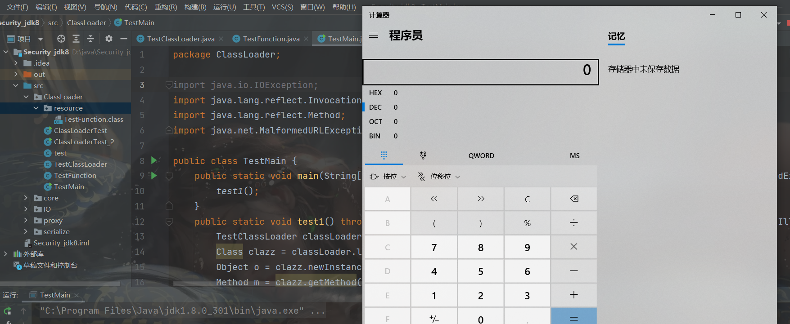
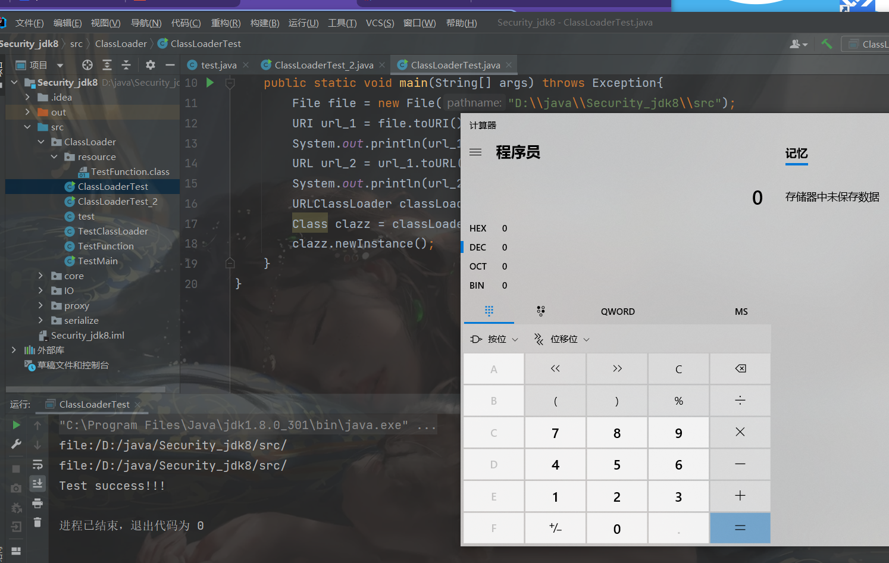

##  前言

记录自己学习的东西

##  简介

Java类加载器(Java Classloader)是Java运行时环境(Java Runtime Environment)的一部分，负责动态加载Java类编译的字节码到Java虚拟机(JVM)的内存空间中，用于加载系统、网络或者其他来源的类文件。Java源代码通过javac编译器编译成类文件，然后JVM来执行类文件中的字节码来执行程序。

##  java执行的流程


流程：

>java源码，通过javac编辑器将类文件编译为class文件，然后通过ClassLoader加载到JVM中，当然也要经过字节码效验器，最后就是我们的java虚拟机内存使用自身方法区中字节码二进制数据去引用堆区的Class对象

其中在类加载的过程中


- **第一步：Loading加载**

> 通过类的全限定名（包名 + 类名），获取到该类的.class文件的二进制字节流
>
> 将二进制字节流所代表的静态存储结构，转化为方法区运行时的数据结构
>
> 在`内存`中生成一个代表该类的`java.lang.Class`对象得到实例，作为方法区这个类的各种数据的访问入口

总结：`加载二进制数据到内存` —> `映射成jvm能识别的数据结构` —> `在内存中生成class实例`。

- **第二步：Linking链接**

链接是指将上面创建好的class类合并至Java虚拟机中，使之能够执行的过程，可分为`验证`、`准备`、`解析`三个阶段。

**① 验证（Verify）**

> 确保class文件中的字节流包含的信息，符合当前虚拟机的要求，保证这个被加载的class类的正确性，不会危害到虚拟机的安全。

**② 准备（Prepare）**

> 为类中的`静态字段`分配内存，并设置默认的初始值，比如int类型初始值是0。被final修饰的static字段不会设置，因为final在编译的时候就分配了

**③ 解析（Resolve）**

> 解析阶段的目的，是将常量池内的符号引用转换为直接引用的过程（将常量池内的符号引用解析成为实际引用）。如果符号引用指向一个未被加载的类，或者未被加载类的字段或方法，那么解析将触发这个类的加载（但未必触发这个类的链接以及初始化。）
>
> 事实上，解析器操作往往会伴随着 JVM 在执行完初始化之后再执行。 符号引用就是一组符号来描述所引用的目标。符号引用的字面量形式明确定义在《Java 虚拟机规范》的Class文件格式中。直接引用就是直接指向目标的指针、相对偏移量或一个间接定位到目标的句柄。
>
> 解析动作主要针对类、接口、字段、类方法、接口方法、方法类型等。对应常量池中的 CONSTANT_Class_info、CONSTANT_Fieldref_info、CONSTANT_Methodref_info等。

- **第三步：initialization初始化**

> 初始化就是执行类的构造器方法init()的过程。
>
> 这个方法不需要定义，是javac编译器自动收集类中所有类变量的赋值动作和静态代码块中的语句合并来的。
>
> 若该类具有父类，`jvm`会保证父类的`init`先执行，然后在执行子类的`init`。

##  类加载器分类

### 引导类加载器(BootstrapClassLoader)

也称根加载器，底层原生代码是C++语言编写，属于jvm一部分，不继承java.lang.ClassLoader类，也没有父加载器，主要负责加载核心java库(即JVM本身)，存储在`/jre/lib/rt.jar`目录当中。(同时处于安全考虑，BootstrapClassLoader只加载包名为java、javax、sun等开头的类)。

### 扩展类加载器(ExtensionsClassLoader)

扩展类加载器（ExtensionsClassLoader）是引导类加载器（BootstrapClassLoader）的子集，其核心目的是加载标准核心Java类的扩展，以便适配平台上运行的所有应用程序。

由sun.misc.Launcher$ExtClassLoader类实现，用来在/jre/lib/ext或者java.ext.dirs中指明的目录加载java的扩展库。Java虚拟机会提供一个扩展库目录，此加载器在目录里面查找并加载java类。

### 系统类加载器（AppClassLoader)

App类加载器/系统类加载器（AppClassLoader），由sun.misc.Launcher$AppClassLoader实现，一般通过(java.class.path或者Classpath环境变量)来加载Java类，就是classpath路径。通常我们是使用这个加载类来加载Java应用类，可以使用ClassLoader.getSystemClassLoader()来获取它。

### 自定义类加载器(UserDefineClassLoader)

通过继承java.lang.ClassLoader类的方式实现自己的类加载器，当然这儿有安全学习的地方。

##  双亲委派机制

我们需要使用该类的时候，才会将生成的class文件加载到内存当中生成class对象进行使用，且加载过程使用的是双亲委派模式，及把需要加载的类交由父加载器进行处理。


工作流程：

（1）如果一个`类加载器`接收到了`类加载`的请求，它自己不会先去加载，会把这个请求委托给`父类加载器`去执行。

（2）如果父类还存在父类加载器，则继续向上委托，一直委托到`根类加载器：Bootstrap ClassLoader`

（3）如果父类加载器可以完成加载任务，就返回成功结果，如果父类加载失败，就由子类自己去尝试加载，如果子类加载失败就会抛出`ClassNotFoundException`异常。

**沙箱安全机制**

假如我们自定义 String 类，但是在加载自定义 String 类的时候会率先使用引导类加载器加载，而引导类加载器在加载的过程中会先加载 JDK 自带的文件（rt.jar 包中的 javalangString.class），报错信息说没有 main 方法就是因为加载的 rt.jar 包中的 String 类。这样可以保证对 Java 核心源代码的保护，这就是沙箱安全机制。

## 第三方包加载方式：反向委派机制

在Java应用中存在着很多服务提供者接口（Service Provider Interface，SPI），这些接口允许第三方为它们提供实现，如常见的 SPI 有 JDBC、JNDI等，这些 SPI 的接口属于 Java 核心库，一般存在rt.jar包中，由Bootstrap类加载器加载。而Bootstrap类加载器无法直接加载SPI的实现类，同时由于双亲委派模式的存在，Bootstrap类加载器也无法反向委托AppClassLoader加载器SPI的实现类。在这种情况下，我们就需要一种特殊的类加载器来加载第三方的类库，而线程上下文类加载器（双亲委派模型的破坏者）。

rt.jar核心包是有Bootstrap类加载器加载的，其内包含SPI核心接口类，由于SPI中的类经常需要调用外部实现类的方法，而jdbc.jar包含外部实现类(jdbc.jar存在于classpath路径)无法通过Bootstrap类加载器加载，因此只能委派线程上下文类加载器把jdbc.jar中的实现类加载到内存以便SPI相关类使用。显然这种线程上下文类加载器的加载方式破坏了“双亲委派模型”，它在执行过程中抛弃双亲委派加载链模式，使程序可以逆向使用类加载器。

##  ClassLoader类核心方法

`ClassLoader`类有如下核心方法：

1. `loadClass`(加载指定的Java类)

2. `findClass`(查找指定的Java类)

3. `findLoadedClass`(查找JVM已经加载过的类)

4. `defineClass`(定义一个Java类，将字节码解析成虚拟机识别的Class对象。往往和findClass()方法配合使用。)

5. `resolveClass`(链接指定的Java类)

   

##  自定义类加载器

自定义类加载器的流程：

1、继承ClassLoader类

2、覆盖findClass()方法

3、在findClass()方法中调用defineClass()方法

直接上Demo

一个TestFunction类，用来执行命令

```java
package ClassLoader;

import java.io.IOException;

public class TestFunction {
    public void calc(){
        try {
            Runtime.getRuntime().exec("calc");
        } catch (IOException e) {
            e.printStackTrace();
        }
    }
}
```

利用`javac`将class文件放到resource中

自定义的ClassLoader类

```java
package ClassLoader;

import java.io.*;

public class TestClassLoader extends ClassLoader {
    @Override
    protected Class<?> findClass(String name) throws ClassNotFoundException {
        String fileName = "TestFunction.class";
        String classpath="./resource";
        File file = new File(classpath, fileName);
        try {
            FileInputStream fileInputStream = new FileInputStream(file);
            ByteArrayOutputStream byteArrayOutputStream = new ByteArrayOutputStream();
            int n = 0;
            try {
                while ((n = fileInputStream.read()) != -1) {
                    byteArrayOutputStream.write(n);
                }
            } catch (IOException e) {
                e.printStackTrace();
            }
            byte[] data = byteArrayOutputStream.toByteArray();
            fileInputStream.close();
            byteArrayOutputStream.close();
            return defineClass(name, data, 0, data.length);
        } catch (FileNotFoundException e) {
            e.printStackTrace();
        } catch (IOException e) {
            e.printStackTrace();
        }

        return super.findClass(name);
    }

}

```

TestMain类

```java
package ClassLoader;

import java.io.IOException;
import java.lang.reflect.InvocationTargetException;
import java.lang.reflect.Method;
import java.net.MalformedURLException;

public class TestMain {
    public static void main(String[] args) throws ClassNotFoundException, InvocationTargetException, NoSuchMethodException, IllegalAccessException, InstantiationException, MalformedURLException {
        test1();
    }
    public static void test1() throws ClassNotFoundException, NoSuchMethodException, InvocationTargetException, IllegalAccessException, InstantiationException {
        //定义一个加载器
        TestClassLoader classLoader = new TestClassLoader();
        //调用类加载器加载类，获取一个Class对象实例
        Class clazz = classLoader.loadClass("ClassLoader.TestFunction");
        //实例化，获取类对象
        Object o = clazz.newInstance();
        //调用函数
        Method m = clazz.getMethod("calc");
        //执行函数
        m.invoke(o);

    }
}

```



##  URLClassLoader

URLClassLoader类继承ClassLoader类，可以加载本地磁盘和网络中的jar包类文件。

###  本地调用磁盘的class文件

```JAVA
package ClassLoader;

import java.io.File;
import java.net.URI;
import java.net.URL;
import java.net.URLClassLoader;


public class ClassLoaderTest {
    public static void main(String[] args) throws Exception{
        File file = new File("D:\\java\\Security_jdk8\\src");
        URI url_1 = file.toURI();
        System.out.println(url_1);
        URL url_2 = url_1.toURL();
        System.out.println(url_2);
        URLClassLoader classLoader = new URLClassLoader(new URL[]{url_2});
        Class clazz = classLoader.loadClass("ClassLoader.test");
        clazz.newInstance();
    }
}
```

```JAVA
package ClassLoader;

public class test {
    public test(){
        System.out.println("Test success!!!");
        try{
            Runtime.getRuntime().exec("calc");
        }
        catch(Exception e) {
            e.printStackTrace();
        }
    }
}

```



### 调用网络上class文件

```java
package ClassLoader;

import java.net.URL;
import java.net.URLClassLoader;

public class ClassLoaderTest_2 {
    public static void main(String[] args) throws Exception {
        URL url = new URL("http://ip:port/Test");
        URLClassLoader classLoader = new URLClassLoader(new URL[]{url});
        Class clazz = classLoader.loadClass("Test.test");
        clazz.newInstance();
    }
}
```

##  总结

在安全领域中，我们往往会使用其ClassLoader特性，自定义恶意的类加载webshell利用以及自定以类字节码的native方法绕过RASP检测。

## 参考文章

https://xz.aliyun.com/t/9002#toc-18
