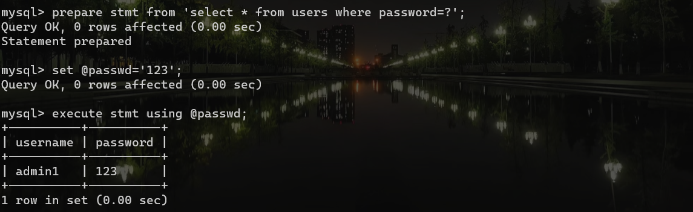

##  JDBC的基础

下载mysql的jar包导入IDEA,然后加载驱动，

下面代码是一个例子：

需要先`Class.forName`jdbc的驱动类，然后在利用`DriverManager`进行`getConnection`

```java
package JDBC;

import java.sql.*;

/**
 * 实现数据库的连接测试操作
 */
public class jdb_1 {
    static final String URL="jdbc:mysql://127.0.0.1:3306/root";
    static final String USERNAME="root";
    static final String PASSWORD="zzy2002";
    static final String JDBC_DRIVER="com.mysql.cj.jdbc.Driver";
    public static void main(String[] args) throws Exception {
        Class.forName(JDBC_DRIVER);
        Connection conn=DriverManager.getConnection(URL,USERNAME,PASSWORD);
        String sql="select * from ctf.users";
        PreparedStatement pre=conn.prepareStatement(sql);
        ResultSet resultSet=pre.executeQuery();
        while(resultSet.next()){
            System.out.println(resultSet.getString("username"));
            System.out.println(resultSet.getString("password"));
        }
        resultSet.close();
        pre.close();
        conn.close();
    }
}

```

##  SQL注入：

```java
// 获取用户传入的用户名
String user = request.getParameter("user");

// 定义最终执行的SQL语句，这里会将用户从请求中传入的host字符串拼接到最终的SQL
// 语句当中，从而导致了SQL注入漏洞。
String sql = "select host,user from mysql.user where user = '" + user + "'";

// 创建预编译对象
PreparedStatement pstt = connection.prepareStatement(sql);

// 执行SQL语句并获取返回结果对象
ResultSet rs = pstt.executeQuery();
```

这样就直接可以进行`字符型的注入`

##  防御措施

进行参数预编译的方式，来防止SQL注入

利用`?`作为占位符，进行参数预编译

```java
// 获取用户传入的用户ID
String id = request.getParameter("id");

// 定义最终执行的SQL语句，这里会将用户从请求中传入的host字符串拼接到最终的SQL
// 语句当中，从而导致了SQL注入漏洞。
String sql = "select id, username, email from sys_user where id =? ";

// 创建预编译对象
PreparedStatement pstt = connection.prepareStatement(sql);

// 设置预编译查询的第一个参数值
pstt.setObject(1, id);

// 执行SQL语句并获取返回结果对象
ResultSet rs = pstt.executeQuery();
```

##  JDBC预编译

`JDBC`预编译查询分为客户端预编译和服务器端预编译，对应的URL配置项是:`useServerPrepStmts`，当`useServerPrepStmts`为`false`时使用客户端(驱动包内完成SQL转义)预编译，`useServerPrepStmts`为`true`时使用数据库服务器端预编译。

### JDBC数据库服务端预编译

JDBC URL配置示例:

```text
jdbc:mysql://localhost:3306/mysql?autoReconnect=true&zeroDateTimeBehavior=round&useUnicode=true&characterEncoding=UTF-8&useOldAliasMetadataBehavior=true&useOldAliasMetadataBehavior=true&useSSL=false&useServerPrepStmts=true
```

```
String sql = "select host,user from mysql.user where user = ? ";
PreparedStatement pstt = connection.prepareStatement(sql);
pstt.setObject(1, user);
```


### 客户端预编译

```
jdbc:mysql://localhost:3306/mysql?autoReconnect=true&zeroDateTimeBehavior=round&useUnicode=true&characterEncoding=UTF-8&useOldAliasMetadataBehavior=true&useOldAliasMetadataBehavior=true&useSSL=false&useServerPrepStmts=false
```

```java
String sql = "select host,user from mysql.user where user = ? ";
PreparedStatement pstt = connection.prepareStatement(sql);
pstt.setObject(1, user);
```


对单引号实现了一个转义

###  	Mysql预编译

mysql默认提供了预编译命令:`prepare`,使用`prepare`命令可以在Mysql数据库服务端实现预编译查询

```mysql
# 创建一个预编译对象
prepare stmt from 'select * from users where password=?';
# 设置一个变量
set @passwd='123';
# 执行语句
execute stmt using @passwd;
```

