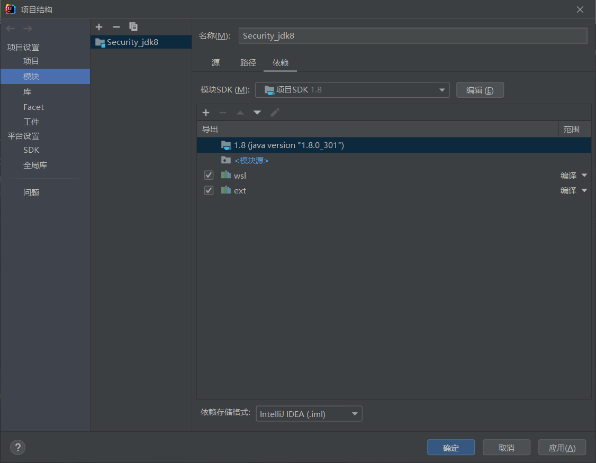
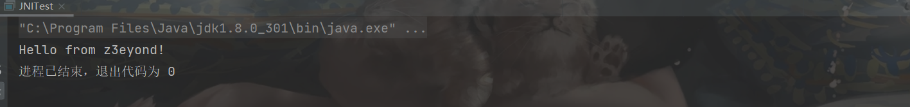

##  JNI基础

`JNI(java native interface)`java原生接口，就是java和java底层c或者c++之间的接口

下面是JNI调用动态链接库ddl(windows)，利用g++直接编译生成ddl的过程

###  demo1--hello,world的实现

写一个java类（里面不能有中文注释，否则会出现问题）。

首先在Java中如果想要调用native方法那么需要在类中先定义一个`native`方法。

```java
package JNI;

public class JNITest {
    public native void hello();
    public static void main(String[] args) {
        System.loadLibrary("cmd");
        new JNITest().hello();
    }
}

```

然后**生成头文件**：

编写DLL需要引用这个头文件，在Java项目的src目录下运行：

```
javah -classpath . -jni JNI.JNITest
```

JDK10移除了`javah`,需要改为`javac`加`-h`参数的方式生产头文件


头文件具有严格的格式：

- 文件为完整类名，以下划线分割
- 接口命名为以Java_为前缀、中间是完整类名、最后加上_方法名

注意需要改一下`JNI.JNITest.h`中`#include "jni.h"`

然后直接利用windows的gcc编译：

`MacOSX编译`:

```bash
g++ -fPIC -I"$JAVA_HOME/include" -I"$JAVA_HOME/include/darwin" -shared -o libcmd.jnilib com_anbai_sec_cmd_CommandExecution.cpp
```

`Linux编译`:

```bash
g++ -fPIC -I"$JAVA_HOME/include" -I"$JAVA_HOME/include/linux" -shared -o libcmd.so com_anbai_sec_cmd_CommandExecution.cpp
```

`Windows编译`:

```
1.Visual Studio/cl命令编译dll

2. 使用min-gw/cygwin安装gcc/g++，如: 
x86_64-w64-mingw32-g++ -I"%JAVA_HOME%\include" -I"%JAVA_HOME%\include\win32" -shared -o JNITest.dll com_anbai_sec_cmd_CommandExecution.cpp
```

这儿注意一下生成的`dll的命名`和java中引入的`System.loadLibrary`命名需要相同

最后就是在IDEA项目结构->模块中加载






###  demo2--本地命令执行

利用自定义的类加载器

java类：

```java
package JNI;

public class JNICmd {
    public static native String exec(String cmd);
}

```

cpp

```cpp
#include <iostream>
#include <stdlib.h>
#include <cstring>
#include <string>
#include "JNI_JNICmd.h"

using namespace std;

JNIEXPORT jstring

JNICALL Java_com_anbai_sec_cmd_CommandExecution_exec
        (JNIEnv *env, jclass jclass, jstring str) {

    if (str != NULL) {
        jboolean jsCopy;
        // ��jstring����ת��charָ��
        const char *cmd = env->GetStringUTFChars(str, &jsCopy);

        // ʹ��popen����ִ��ϵͳ����
        FILE *fd  = popen(cmd, "r");

        if (fd != NULL) {
            // ���ؽ���ַ���
            string result;

            // �����ַ�������
            char buf[128];

            // ��ȡpopen������ִ�н��
            while (fgets(buf, sizeof(buf), fd) != NULL) {
                // ƴ�Ӷ�ȡ���Ľ����result
                result +=buf;
            }

            // �ر�popen
            pclose(fd);

            // ��������ִ�н����Java
            return env->NewStringUTF(result.c_str());
        }

    }

    return NULL;
}

```

Test类

```java
package JNI;

import java.io.File;
import java.lang.reflect.Method;

public class JNICmdMain {
    private static final String COMMAND_CLASS_NAME="JNI.JNICmd";
    private static final byte[] COMMAND_CLASS_BYTES = new byte[]{
            -54, -2, -70, -66, 0, 0, 0, 49, 0, 15, 10, 0, 3, 0, 12, 7, 0, 13, 7, 0, 14, 1,
            0, 6, 60, 105, 110, 105, 116, 62, 1, 0, 3, 40, 41, 86, 1, 0, 4, 67, 111, 100,
            101, 1, 0, 15, 76, 105, 110, 101, 78, 117, 109, 98, 101, 114, 84, 97, 98, 108,
            101, 1, 0, 4, 101, 120, 101, 99, 1, 0, 38, 40, 76, 106, 97, 118, 97, 47, 108, 97,
            110, 103, 47, 83, 116, 114, 105, 110, 103, 59, 41, 76, 106, 97, 118, 97, 47, 108,
            97, 110, 103, 47, 83, 116, 114, 105, 110, 103, 59, 1, 0, 10, 83, 111, 117, 114,
            99, 101, 70, 105, 108, 101, 1, 0, 21, 67, 111, 109, 109, 97, 110, 100, 69, 120,
            101, 99, 117, 116, 105, 111, 110, 46, 106, 97, 118, 97, 12, 0, 4, 0, 5, 1, 0, 34,
            99, 111, 109, 47, 97, 110, 98, 97, 105, 47, 115, 101, 99, 47, 99, 109, 100, 47, 67,
            111, 109, 109, 97, 110, 100, 69, 120, 101, 99, 117, 116, 105, 111, 110, 1, 0, 16,
            106, 97, 118, 97, 47, 108, 97, 110, 103, 47, 79, 98, 106, 101, 99, 116, 0, 33, 0,
            2, 0, 3, 0, 0, 0, 0, 0, 2, 0, 1, 0, 4, 0, 5, 0, 1, 0, 6, 0, 0, 0, 29, 0, 1, 0, 1,
            0, 0, 0, 5, 42, -73, 0, 1, -79, 0, 0, 0, 1, 0, 7, 0, 0, 0, 6, 0, 1, 0, 0, 0, 7, 1,
            9, 0, 8, 0, 9, 0, 0, 0, 1, 0, 10, 0, 0, 0, 2, 0, 11
    };

    public static void main(String[] args) throws Exception {
        String cmd="whoami";
        //定义一个类加载器
        ClassLoader classLoader=new ClassLoader(JNICmd.class.getClassLoader()) {
            @Override
            //重写findClass
            protected Class<?> findClass(String name) throws ClassNotFoundException{
                try{
                    return super.findClass(name);
                }catch (ClassNotFoundException e){
                    //defineClass,定义一个类的名字，然后将字节码解析成虚拟机识别的Class对象
                    return defineClass(COMMAND_CLASS_NAME, COMMAND_CLASS_BYTES, 0, COMMAND_CLASS_BYTES.length);
                }
            }
        };
        File path=new File("D:\\wsl\\flag.jnilib");
        //加载一个类，获取一个Class实例
        Class commandClass =classLoader.loadClass("JNI.JNICmd");
        //获取一个loadLibrary0方法,加载动态链接库
        Method loadLibrary0Method = ClassLoader.class.getDeclaredMethod("loadLibrary0", Class.class, File.class);
        loadLibrary0Method.setAccessible(true);
        loadLibrary0Method.invoke(classLoader, commandClass, path);
        String content = (String) commandClass.getMethod("exec", String.class).invoke(null, cmd);
        System.out.println(content);
    }
}

```

###  字节数组和字符串的转换

```java
package JNI;

import java.nio.charset.StandardCharsets;

public class tesst {
    public static void main(String[] args) {
        byte[] bytes=new byte[]{
                -54, -2, -70, -66, 0, 0, 0, 49, 0, 15, 10, 0, 3, 0, 12, 7, 0, 13, 7, 0, };
        //将一个字节数组转化为一个字符串
        String str=new String(bytes,java.nio.charset.StandardCharsets.UTF_8);
        //将一个字符串转换为一个字节数组
        byte[] b=str.getBytes(StandardCharsets.UTF_8);
        System.out.println(str);
    }
}
```

