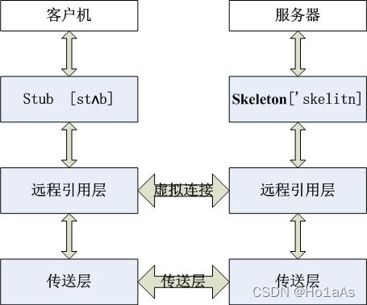
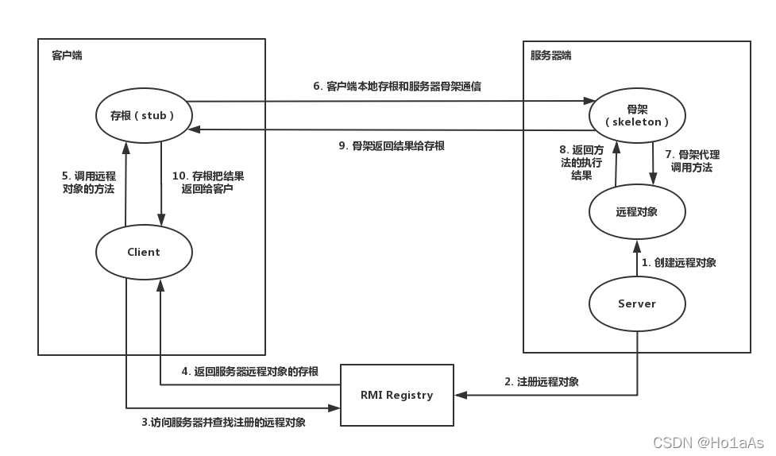
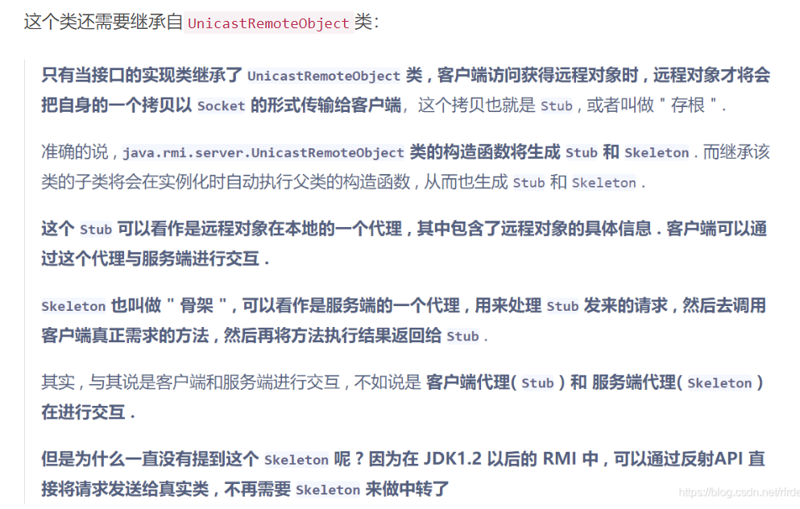

##  RMI机制

Java RMI（Java Remote Method Invocation）用于实现远程过程调用的应用程序编程接口。它使客户机上运行的程序可以调用远程服务器上的对象。RMI使用Java远程消息交换协议JRMP（Java Remote Messaging Protocol）进行通信。


调用步骤：



在传输的过程中，因为要反序列化和序列化，所以会有安全问题

##  入门demo

### Server端

#### 接口

接口需要继承Remote，Remote用以标记一个可以被远程调用的接口，并且此接口内的所有方法必须抛出RemoteException

```java
package RMI;

import java.rmi.Remote;
import java.rmi.RemoteException;

public interface RMIInterface extends Remote {
    String hello(String name) throws RemoteException;
}

```

#### 接口实现类

编写接口实现类，在Server主程序中，skeleton就来源于new一个接口实现类

- 实现接口的抽象方法
- 继承UnicastRemoteObject，此类用以允许JVM创建远程的存根/代理
- 创建serialVersionUID（可选）用以支持序列化

```java
package RMI;

import java.rmi.server.UnicastRemoteObject;
import java.rmi.RemoteException;

public class RMIImpl extends UnicastRemoteObject implements RMIInterface {
    private static final long serialVersionUID = -6619216984896528511L;

    protected RMIImpl() throws RemoteException{
        super();
    }

    @Override
    public String hello(String name) throws RemoteException{
        System.out.println("this is remote server");
        return  "hello "+name;
    }
}

```



#### Server端主程序

- `LocateRegistry.createRegistry()`在指定端口注册服务
- `Registry.bind()`将服务与端口绑定，并且**自定义一个服务的名称**

```java
package RMI;

import java.rmi.registry.LocateRegistry;
import java.rmi.registry.Registry;

public class RMIServer {
    public static void main(String[] args) throws Exception {
        Registry registry= LocateRegistry.createRegistry(8888);
        RMIInterface skeleton=new RMIImpl();
        registry.bind("test",skeleton);
    }
}

```

### Client端

#### 接口

这个包名可以改变，但是接口的名称都不允许变化的

```java
package RMI;

import java.rmi.Remote;
import java.rmi.RemoteException;

public interface RMIInterface extends Remote {
    String hello(String name) throws RemoteException;
}
```

#### 主程序

- `LocateRegistry.createRegistry()`获取远程服务注册，需要指定IP与端口
- `Registry.lookup()`返回注册表中绑定到指定name的远程引用,下面例子的`test`就是上面server自定义的

```java
package RMI;

import RMI.RMIInterface;

import java.rmi.registry.LocateRegistry;
import java.rmi.registry.Registry;

public class RMIClient {
    public static void main(String[] args) throws Exception {
        Registry registry = LocateRegistry.getRegistry("127.0.0.1",8888);
        RMIInterface impl = (RMIInterface) registry.lookup("test");
        System.out.println(impl.hello("z3eyond"));
    }
}
```

### 运行

先运行server端，然后再运行client端

### 使用Naming写主程序

**RMI使用Java远程消息交换协议JRMP（Java Remote Messaging Protocol）进行通信。这里也可以直接指定获取远程注册，协议格式为`rmi://hostname:port/name`**

```java
package RMI;

import java.rmi.Naming;

public class RMIClient2 {
    public static void main(String[] args) throws Exception {
        RMIInterface test=(RMIInterface)Naming.lookup("rmi://127.0.0.1:8889/hello");
        System.out.println(test.hello("123"));
    }
}
```

##  参考文章

https://ho1aas.blog.csdn.net/article/details/121731451?spm=1001.2014.3001.5502

https://javasec.org/javase/JavaDeserialization/