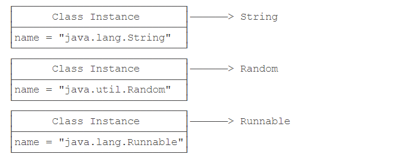
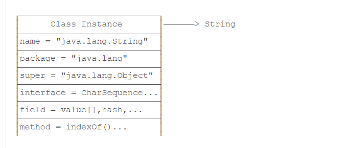
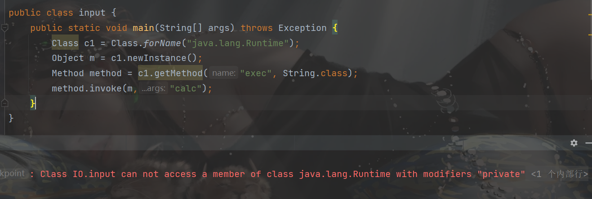
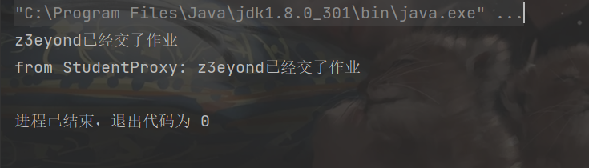

```

```

##  前言

在`java安全`从0到1的学习之路上，慢慢记录一些东西

## 概念与作用

Java反射机制是在`JVM`运行状态时，对于任意一个类，都能够获取到这个类的所有属性和方法，对于任意一个对象，都能够调用它的任意一个方法和属性(包括私有的方法和属性)，这种动态获取的信息以及动态调用对象的方法的功能就称为`java`语言的反射机制。通过使用反射我们不仅可以获取到任何类的成员方法(Methods)、成员变量(Fields)、构造方法(Constructors)等信息，还可以动态创建Java类实例、调用任意的类方法、修改任意的类成员变量值等。

## 原理

`class`是由JVM在执行过程中动态加载的。JVM在第一次读取到一种`class`类型时，将其加载进内存。

每加载一种`class`，JVM就为其创建一个`Class`类型的实例，并关联起来。注意：这里的`Class`类型是JVM中一个名叫`Class`的`class`。

```java
public final class Class {
    private Class() {}
}
```

以`String`类为例，当`JVM`加载`String`类时，它首先读取`String.class`文件到内存，然后，为`String`类创建一个`Class`实例并关联起来：

```
Class cls = new Class(String);
```

这个`Class`实例是JVM内部创建的，而且`Class`类的构造方法是`private`，只有JVM能创建`Class`实例，我们自己的Java程序是无法创建`Class`实例的。

Class实例都指向一个数据类型




且一个实例中包含该class类的所有信息



JVM为每个加载的`class`创建了对应的`Class`实例，在实例中也包含了class类的所有信息。所有我们获取了某个`Class`实例，我们就可以通过这个`Class`实例获取到该实例对应的`class`的所有信息。

##  反射基础知识

###  获取Class实例的三种方法

方法一：直接通过一个`class`类的静态变量`class`获取：

```java
Class c = String.class;
```

方法二：如果我们有一个实例变量，可以通过该实例变量提供的`getClass()`方法获取：

```java
String s = "z3eyond";
Class s = s.getClass();
```

方法三：如果知道一个`class`的完整类名，可以通过静态方法`Class.forName()`获取：

```java
Class cls = Class.forName("java.lang.String");
```

###  访问字段

通过实例获取字段：

- Field getField(name)：根据字段名获取某个类的public的field（包括父类）
- Field getDeclaredField(name)：根据字段名获取当前类的某个field（不包括父类，包括public、private和proteced）
- Field[] getFields()：获取所有public的field（包括父类）
- Field[] getDeclaredFields()：获取当前类的所有field（不包括父类）

```java
package IO;

import java.lang.reflect.Field;

public class input {
    public static void main(String[] args) throws Exception {
        Class c = Student.class;
        // 获取public字段"age":
        System.out.println(c.getField("age"));
        // 获取继承的public字段"name":
        System.out.println(c.getField("name"));
        // 获取private字段"id":
        System.out.println(c.getDeclaredField("id"));
        // 获得值,name.get里面参数需要该类对象，而不是.class
        Field name = c.getField("name");
        System.out.println(name.get(new Student()));
        // 设置值
        Student student= new Student();
        Field money = c.getDeclaredField("id");
        //安全性，需要设置为true，同时set中需要该类对象
        money.setAccessible(true);
        money.set(student,2333333);
        System.out.println(student);
    }
}
class Student extends Person{
    public int age;
    private int id;

    @Override
    public String toString() {
        return "Student{" +
                "name=" + name +
                ", id=" + id +
                '}';
    }
}
class Person{
    public String name = "z3eyond";
}

```

其中，下面相当于`new Student()` 

```java
Class c = Student.class;
c.newInstance();
```

但是有限制：

只能调用`public`的`无参数`构造方法。带参数的构造方法，或者非`public`的构造方法都无法通过`Class.newInstance()`被调用

总结：

通过`Class`实例的方法可以获取`Field`实例：`getField()`，`getFields()`，`getDeclaredField()`，`getDeclaredFields()`；

通过Field实例可以获取字段信息：`getName()`，`getType()`，`getModifiers()`； 

通过Field实例可以读取或设置某个对象的字段，如果存在访问限制，要首先调用`setAccessible(true)`来访问非`public`字段。

###  访问方法

通过实例获取类的方法

- `Method getMethod(name, Class...)`：获取某个`public`的`Method`（包括父类）

- `Method getDeclaredMethod(name, Class...)`：获取当前类的某个`Method`（不包括父类，包括private，protected，public）

- `Method[] getMethods()`：获取所有`public`的`Method`（包括父类）

- `Method[] getDeclaredMethods()`：获取当前类的所有`Method`（不包括父类）

  

一个`Method`对象包含一个方法的所有信息：

- `getName()`：返回方法名称，例如：`"getScore"`；
- `getReturnType()`：返回方法返回值类型，也是一个Class实例，例如：`String.class`；
- `getParameterTypes()`：返回方法的参数类型，是一个Class数组，例如：`{String.class, int.class}`；
- `getModifiers()`：返回方法的修饰符，它是一个`int`，不同的bit表示不同的含义

**调用方法**

先通过class实例，获取方法的Method实例，然后利用`invoke`来调用方法

```java
String name = "z3eyond";
Method m = String.class.getMethod("substring", int.class);
System.out.println(m.invoke(name,3));
```

**调用静态方法:**

如果获取到的Method表示一个静态方法，调用静态方法时，由于无需指定实例对象，所以`invoke`方法传入的第一个参数永远为`null`

```java
String name = "z3eyond";
Method m = String.class.getMethod("parseInt", String.class);
System.out.println(m.invoke(null,"12345"));
```

**调用非public方法**

```java
public class Main {
    public static void main(String[] args) throws Exception {
        Person p = new Person();
        Method m = p.getClass().getDeclaredMethod("setName", String.class);
        m.setAccessible(true);
        m.invoke(p, "Bob");
        System.out.println(p.name);
    }
}

class Person {
    String name;
    private void setName(String name) {
        this.name = name;
    }
}

```

补充：反射调用方法，符合多态原则

###  访问构造方法

通过Class实例获取Constructor的方法如下：

- `getConstructor(Class...)`：获取某个`public`的`Constructor`；
- `getDeclaredConstructor(Class...)`：获取某个`Constructor`；
- `getConstructors()`：获取所有`public`的`Constructor`；
- `getDeclaredConstructors()`：获取所有`Constructor`。

通过`Constructor`实例可以创建一个实例对象：`newInstance(Object... parameters)`； 通过设置`setAccessible(true)`来访问非`public`构造方法。

```java
 Constructor cons1 = Integer.class.getConstructor(int.class);
  // 调用构造方法:
 Integer n1 = (Integer) cons1.newInstance(123);
 System.out.println(n1);
```

###  获取继承关系

通过`Class`对象可以获取继承关系：

- `Class getSuperclass()`：获取父类类型；
- `Class[] getInterfaces()`：获取当前类实现的所有接口。

通过`Class`对象的`isAssignableFrom()`方法可以判断一个向上转型是否可以实现

```java
Class s = Integer.class;
Class[] is = s.getInterfaces();
for (Class i : is) {
    System.out.println(i);
}
```

##   反射关于的java安全

###  利用反射构造Runtime类执行命令

直接利用`Runtime`类的`getRuntime`方法去执行命令

```java
//获取Runtime类的实例
Class c1 = Class.forName("java.lang.Runtime");
//通过实例，获取exec方法的Method实例
Method method = c1.getMethod("exec", String.class);
//获取getRuntime方法的Method实例
Method RuntimeMethod = c1.getMethod("getRuntime");
Object m= RuntimeMethod.invoke(c1);
method.invoke(m,"calc");
```

一个语句

```java
Class.forName("java.lang.Runtime").getMethod("exec", String.class).invoke(Class.forName("java.lang.Runtime").getMethod("getRuntime").invoke(Class.forName("java.lang.Runtime")),"calc");

```

###  设置setAccessible(true)暴力访问权限

在这串代码中，我们直接利用`newInstance`构造对象




报错，因为Runtime构造函数的修饰符是`private`,所以不能调用构造方法

一般反射机制不能对类的私有`private`字段进行操作，绕过私有权限的访问。但是一些时候，我们进行序列化操作的时候，需要去访问这些受限的私有字段，这时我们可以通过调用`AccessibleObject`上的`setAccessible()`方法来允许访问。

当然，上面的例子我们也可以通过这个方法去访问`private`

```java
//获取实例
Class c1= Class.forName("java.lang.Runtime");
//获取实例的构造方法
Constructor m = c1.getDeclaredConstructor();
//修改构造方法的权限
m.setAccessible(true);
//执行命令
c1.getMethod("exec", String.class).invoke(m.newInstance(), "calc");
```

### 利用forName特性执行命令

```java
Class.forName(className)
// 等于
Class.forName(className, true, currentLoader)
```

第⼆个参数表示是否初始化，在 forName 的时候，构造函数并不会执⾏，而是执⾏类初始化。他会执行`static{}`静态块里面的内容

例子：

```java
public class test {
    public static void main(String[] args) throws Exception {
        Class.forName("IO.Calc");
    }
}
class Calc{
    static {
        try {
            Runtime.getRuntime().exec("calc");
        } catch (IOException e) {
            e.printStackTrace();
        }
    }
}
```

###  其他

对于修改权限，利用反射修改被`static final`关键字修饰的成员变量

```java
// 反射获取Field类的modifiers
Field modifiers = field.getClass().getDeclaredField("modifiers");

// 设置modifiers修改权限
modifiers.setAccessible(true);

// 修改成员变量的Field对象的modifiers值
modifiers.setInt(field, field.getModifiers() & ~Modifier.FINAL);

// 修改成员变量值
field.set(类实例对象, 修改后的值);
```

`y4`的例子

```java
Class aClass = Class.forName("bcell.Test");
//Test对象
Test Test = (Test) aClass.newInstance();
Field field = aClass.getDeclaredField("TEST");
// 反射获取Field类的modifiers
Field modifiers = field.getClass().getDeclaredField("modifiers");
// 设置modifiers修改权限
modifiers.setAccessible(true);
// 修改成员变量的Field对象的modifiers值
modifiers.setInt(field,field.getModifiers()&~Modifier.FINAL);//final标志位置0
// 修改成员变量值,这里成员变量值就是Field获取的字段的值
field.set(Test,"wocao");
//输出字段信息
System.out.println(field.get(Test));
```

###  总结

重要的方法：

1. 获取类的方法：forName
2. 获取类的对象：newInstance(有条件)
3. 执行函数的方法:invoke

在java安全中，利用反射机制，可以去绕过安全权限，命令执行，当然也对服务端模板引擎注入也有一定的作用。


##  动态代理

###  代理模式

简介：

>代理模式是常用的java设计模式，他的特征是代理类与委托类有同样的接口，代理类主要负责为委托类预处理消息、过滤消息、把消息转发给委托类，以及事后处理消息等。代理类与委托类之间通常会存在关联关系，一个代理类的对象与一个委托类的对象关联，代理类的对象本身并不真正实现服务，而是通过调用委托类的对象的相关方法，来提供特定的服务。

代理模式分为静态代理和动态代理。

> 静态代理已经在.class文件中实现了我们不能修改，而动态代理是在运行时才代理的。动态代理和静态代理的区别在于静态代理我们需要手动的去实现目标对象的代理类，而动态代理可以在运行期间动态的生成。

###  静态代理

定义接口：

```java
package proxy;

public interface Person {
    void homework();
}
```

编写被代理的类

```java
package proxy;

public class Student implements Person{
    private String name;

    public Student(String name) {
        this.name = name;
    }

    @Override
    public void homework() {
        System.out.println(name + "已经交了作业");
    }
}


```

代理的类

```java
package proxy;

public class StuentProxy implements Person{
    Student stu;

    public StuentProxy(Student stu) {
        this.stu = stu;
    }

    @Override
    public void homework() {
        System.out.print("from StudentProxy: ");
        stu.homework();
    }
}

```

```java
package proxy;

public class ProxyTest {
    public static void main(String[] args) {
        Person student = new Student("z3eyond");
        student.homework();

        Person stuentProxy = new StuentProxy((Student)student);
        stuentProxy.homework();
    }

}

```



可以看到，可以通过代理类去传达信息，这就是静态代理的作用

###  动态代理

建动态代理类会使用到`java.lang.reflect.Proxy`类和`java.lang.reflect.InvocationHandler`接口

直接给例子：

```java
package proxy;

public interface Person {
    void homework();
}
```

被代理的类

```java
package proxy;

public class Student implements Person{
    private String name;

    public Student(String name) {
        this.name = name;
    }

    @Override
    public void homework() {
        try {
            Thread.sleep(1000);
        } catch (InterruptedException e) {
            e.printStackTrace();
        }
        System.out.println(name + "已经交了作业");
    }
}


```

定义个执行时间的类

```java
package proxy;

public class Time {
    private static ThreadLocal<Long> tl = new ThreadLocal<>();

    public static void start() {
        tl.set(System.currentTimeMillis());
    }

    //结束时打印耗时
    public static void finish(String methodName) {
        long finishTime = System.currentTimeMillis();
        System.out.println(methodName + "方法耗时" + (finishTime - tl.get()) + "ms");
    }
}

```

与被代理对象有关的一个类

```java
package proxy;

import java.lang.reflect.InvocationHandler;
import java.lang.reflect.Method;

public class StuInvocationHandler implements InvocationHandler {
        //invocationHandler持有的被代理对象
        Student target;

        public StuInvocationHandler(Student target) {
            this.target = target;
        }

        /**
         * proxy:代表动态代理对象
         * method：代表正在执行的方法
         * args：代表调用目标方法时传入的实参
         */
        @Override
        public Object invoke(Object proxy, Method method, Object[] args) throws Throwable {
            System.out.println("代理执行" +method.getName() + "方法");
            //代理过程中插入监测方法,计算该方法耗时
            Time.start();
            Object result = method.invoke(target, args);
            Time.finish(method.getName());
            return result;
        }
}


```

代理测试类

```java
package proxy;

import java.lang.reflect.InvocationHandler;
import java.lang.reflect.Proxy;

public class Test {
    public static void main(String[] args) {
        Student z3eyond = new Student("z3eyond");

        //创建一个与代理对象相关联的InvocationHandler
        InvocationHandler stuHandler = new StuInvocationHandler(z3eyond);

        //创建一个代理对象stuProxy来代理z3eyond，代理对象的每个执行方法都会替换执行Invocation中的invoke方法
        Person stuProxy = (Person) Proxy.newProxyInstance(Person.class.getClassLoader(), new Class<?>[]{Person.class}, stuHandler);

        stuProxy.homework();
    }
}

```

在动态代理中，所有被代理执行的方法，都是通过在`InvocationHandler`中的invoke方法调用的，所以我们只要在invoke方法中统一处理，就可以对所有被代理的方法进行相同的操作了。所以动态代理方便对代理类函数的处理。

###  通过反射获取代理对象来执行

替换上面的Test类

```java
package proxy;
import java.lang.reflect.Constructor;
import java.lang.reflect.InvocationHandler;
import java.lang.reflect.InvocationTargetException;
import java.lang.reflect.Proxy;

public class Test {
    public static void main(String[] args) {
        Student z3eyond = new Student("z3eyond");

        //创建一个与代理对象相关联的InvocationHandler
        InvocationHandler stuHandler = new StuInvocationHandler(z3eyond);
        //获取代理类的Class实例
        Class cls = Proxy.getProxyClass(Person.class.getClassLoader(), Person.class);
        //获取实例的构造方法
        Constructor constructor = null;
        try {
            constructor = cls.getDeclaredConstructor(InvocationHandler.class);
        } catch (NoSuchMethodException e) {
            e.printStackTrace();
        }
        //创建一个被代理类的对象
        Person monitor = null;
        try {
            monitor = (Person) constructor.newInstance(stuHandler);
        } catch (InstantiationException e) {
            e.printStackTrace();
        } catch (IllegalAccessException e) {
            e.printStackTrace();
        } catch (InvocationTargetException e) {
            e.printStackTrace();
        }
        //执行方法
       monitor.homework();

    }
}

```

### 步骤

1. 实例化被代理的类，该类实现了一定的功能接口。
2. 定义`InvocationHandler`类，该类要实现`InvocationHandler`接口的invoke方法
3. 实例化InvocationHandler类，传入被代理的类对象
4. 定义代理类，传入功能接口的构造器、功能接口类型、InvocationHandler
5. 调用代理类的方法、会调用代理类的invoke方法，也调用了被代理类的同名方法。

##  参考文章

https://www.liaoxuefeng.com/wiki/1252599548343744/1264799402020448

https://www.cnblogs.com/whirly/p/10154887.html

