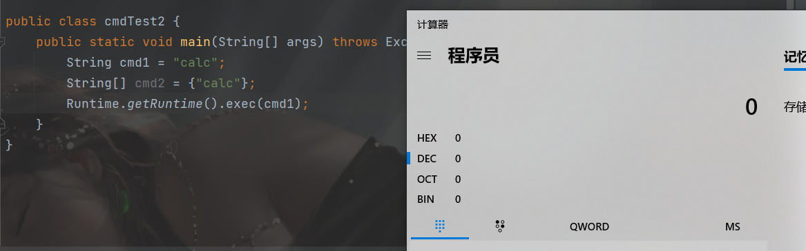
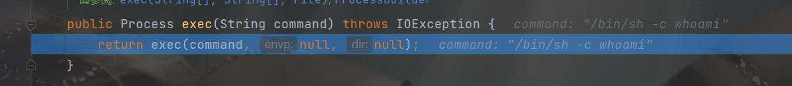
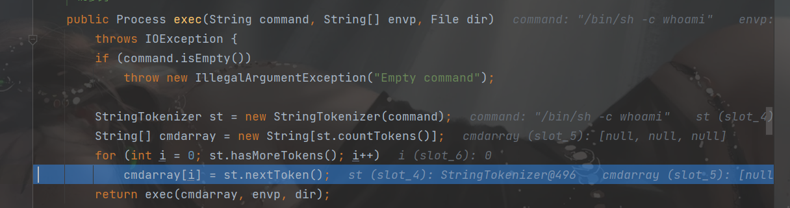
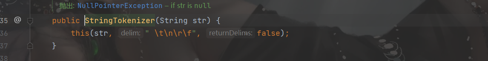
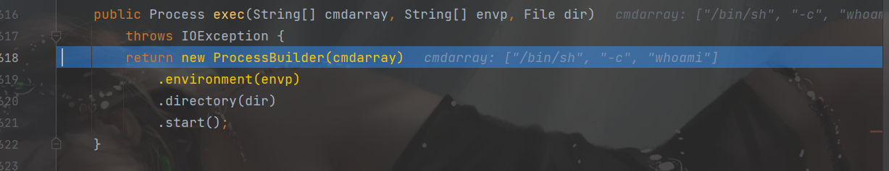
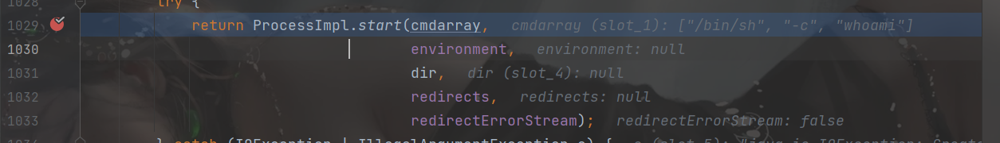

##  执行命令的有回显和无回显

**由于系统对命令的空格分隔符会截断错误，因此对长指令如`ls -al /`最好不要用String传入，而是使用`String[] cmd = {"ls", "-al", "/"}`用字符串数组的形式传入**

`String数组来表示命令`

##  直接调用cmd，shell命令

###  无回显

简单的命令

```java
String cmd ="calc";
Runtime.getRuntime().exec(cmd);
```

长命令：

```java
String[] cmd ={"ls","-al","/"};
Runtime.getRuntime().exec(cmd);
```

###  有回显

```java
String[] cmd ={"ls","-al","/"};
InputStream is=Runtime.getRuntime().exec(cmd).getInputStream();
InputStreamReader isr=new InputStreamReader(is,"UTF-8");
BufferedReader br=new BufferedReader(isr);
String line=br.readLine();
while(line!=null){
    System.out.println(line);
    line=br.readLine();
}
```

##  反射执行命令

上面是直接调用`Runtime.getRuntime().exe()`,下面是通过反射获取实例来调用方法。

###  无回显

```java
String cmd="calc";
Class cls=Class.forName("java.lang.Runtime");
//private
Constructor constructor=cls.getDeclaredConstructor();
constructor.setAccessible(true);
Object obj=constructor.newInstance();
Method method=cls.getMethod("exec",String.class);
method.invoke(obj,cmd);
```

###  有回显

```java
String[] cmd ={"ls","-al","/"};
Class cls=Class.forName("java.lang.Runtime");
//private
Constructor constructor=cls.getDeclaredConstructor();
constructor.setAccessible(true);
Object obj=constructor.newInstance();
Method method=cls.getMethod("exec",String.class);
Process p = (Process) method.invoke(obj, (Object) cmd);
InputStream is=p.getInputStream();
InputStreamReader isr=new InputStreamReader(is,"UTF-8");
BufferedReader br=new BufferedReader(isr);
String line=br.readLine();
while(line!=null){
    System.out.println(line);
    line=br.readLine();
}
```

链接：

https://ho1aas.blog.csdn.net/article/details/121349736?spm=1001.2014.3001.5502


##  执行命令的几种方式

### Runtime.exec()

直接调用`Runtime.getRuntime().exec(cmd)`来执行命令




调用exec的方法时，有许多自带的重载方法

```java
public Process exec(String command)
public Process exec(String command, String[] envp)
public Process exec(String command, String[] envp, File dir)
public Process exec(String cmdarray[])
public Process exec(String[] cmdarray, String[] envp)
public Process exec(String[] cmdarray, String[] envp, File dir)

```

调试exec的方法

进入`Runtime.java`的`exec`方法，其中的`envp`可以指定环境,`dir`可以指定目录




继续处理命令



先判断命令是否为空，然后`StringTokenzer`类处理长字符串命令，利用间隔符，将字符串变为字符串数组

间隔符默认为`空格、tab、回车换行、换行、换页符`



继续：Runtime中的`exec`调用`ProcessBuilder`类的`start`方法



调用`ProcessImpl`的`start`方法




所以`Runtime.exec()`方法的整个调用过程

```
java.lang.Runtime.exec(String command)
java.lang.Runtime.exec(String command, String[] envp, File dir)
java.lang.Runtime.exec(String[] cmdarray, String[] envp, File dir)
java.lang.ProcessBuilder.start();
java.lang.ProcessImpl.start();
java.lang.UNIXProcess.<init>;
java.lang.forkAndExec();
```

###  ProcessBuilder.start()

因为Runtime.exec直接调用的是`ProcessBuilder.start()`

直接调用：

```
String[] cmd = {"/bin/sh", "-c", "ls"};
InputStream is = new ProcessBuilder(cmd).start().getInputStream();
```

###  ProcessImpl与UNIXProcess类

直接利用反射调用执行命令

```java
package Test;

import java.io.BufferedReader;
import java.io.InputStream;
import java.io.InputStreamReader;
import java.lang.reflect.Constructor;
import java.lang.reflect.Method;

public class ReflectionUNIXProcess {
    public static void main(String[] args) throws Exception {
        Class<?> cls = Class.forName("java.lang.UNIXProcess");

        Constructor<?> constructor = cls.getDeclaredConstructors()[0];
        constructor.setAccessible(true);

        String[] cmd = {"/bin/sh", "-c", "ls"};

        byte[] prog = toCString(cmd[0]);
        byte[] argBlock = getArgBlock(cmd);
        int argc = argBlock.length;
        int[] fds = {-1, -1, -1};

        Object obj = constructor.newInstance(prog, argBlock, argc, null, 0, null, fds, false);

        Method method = cls.getDeclaredMethod("getInputStream");
        method.setAccessible(true);

        InputStream is = (InputStream) method.invoke(obj);
        InputStreamReader isr = new InputStreamReader(is);
        BufferedReader br = new BufferedReader(isr);
        String line = br.readLine();
        while (line != null){
            System.out.println(line);
            line = br.readLine();
        }
    }

    private static byte[] toCString(String str) {
        byte[] bytes  = str.getBytes();
        byte[] result = new byte[bytes.length + 1];
        System.arraycopy(bytes, 0, result, 0, bytes.length);
        result[result.length - 1] = (byte) 0;
        return result;
    }

    private static byte[] getArgBlock(String[] cmdarray){
        byte[][] args = new byte[cmdarray.length-1][];
        int size = args.length;
        for (int i = 0; i < args.length; i++) {
            args[i] = cmdarray[i+1].getBytes();
            size += args[i].length;
        }
        byte[] argBlock = new byte[size];
        int i = 0;
        for (byte[] arg : args) {
            System.arraycopy(arg, 0, argBlock, i, arg.length);
            i += arg.length + 1;
        }
        return argBlock;
    }
}

```

## Runtime.exec()本地命令执行漏洞调用分析

由于String转String[]的过程中是以`\t\n\r\f`截断的，只要绕过这五类分隔符就能拼接指令执行：


###  Linux测试

```java
package cmd;

import java.io.BufferedReader;
import java.io.InputStream;
import java.io.InputStreamReader;

public class cmdTest3 {
    public static void main(String[] args) throws  Exception {
        String hacker = ";cat${IFS}resource/rw.txt";
        String cmd = "/bin/sh -c whoami" + hacker;
        InputStream is = Runtime.getRuntime().exec(cmd).getInputStream();
        InputStreamReader isr = new InputStreamReader(is);
        BufferedReader br = new BufferedReader(isr);
        String line = br.readLine();
        while (line != null) {
            System.out.println(line);
            line = br.readLine();
        }
    }
}

```

如果是空格，会把`cat`和`resource/rw.txt`分隔开，就无法执行命令

###  windows测试

Windows平台这边则无需绕过空格，直接拼接命令即可运行

```java
package cmd;

import java.io.BufferedReader;
import java.io.InputStream;
import java.io.InputStreamReader;

public class cmdTest3 {
    public static void main(String[] args) throws  Exception {
        String ip="/&type 1.txt";
        String cmd="cmd /c ls "+ip;
        InputStream is=Runtime.getRuntime().exec(cmd).getInputStream();
        InputStreamReader isr = new InputStreamReader(is);
        BufferedReader br = new BufferedReader(isr);
        String line = br.readLine();
        while (line != null) {
            System.out.println(line);
            line = br.readLine();
        }
    }
}j
```

链接：

https://ho1aas.blog.csdn.net/article/details/121438079?spm=1001.2014.3001.5502

