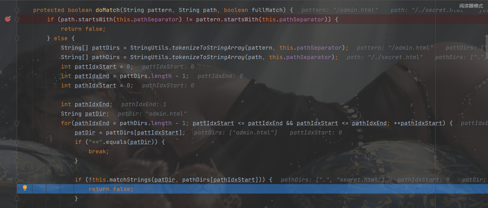

##  前言

影响的shiro版本

环境配置：

```xml
<dependency>
    <groupId>org.apache.shiro</groupId>
    <artifactId>shiro-spring</artifactId>
    <version>1.0.0-incubating</version>
</dependency>
```

##  分析

从PathMatchingFilterChainResolver#getChain开始分析

```java
public FilterChain getChain(ServletRequest request, ServletResponse response, FilterChain originalChain) {
        FilterChainManager filterChainManager = this.getFilterChainManager();//从shiro初始化中获取filter过滤器链
        if (!filterChainManager.hasChains()) {
            return null;
        } else {
            String requestURI = this.getPathWithinApplication(request);//获取请求的URL
            Iterator i$ = filterChainManager.getChainNames().iterator();//获取迭代器，准备对过滤链进行遍历

            String pathPattern;
            ///进行遍历
            do {
                if (!i$.hasNext()) {
                    return null;
                }

                pathPattern = (String)i$.next();
            } while(!this.pathMatches(pathPattern, requestURI));//这个位置是重点进入

            if (log.isTraceEnabled()) {
                log.trace("Matched path pattern [" + pathPattern + "] for requestURI [" + requestURI + "].  " + "Utilizing corresponding filter chain...");
            }

            return filterChainManager.proxy(originalChain, pathPattern);
        }
    }
```

跟踪到`AntPathMatcher`的domach方法：

在`matchStrings`保证`/`分割后的字符数组除了`**`以外的部分都必须相等

所以返回一个false



访问 `/./secret.html`，由于其不能与filter过滤器链匹配，导致进入了 `/**` 的匹配范围，导致可以越权访问。

所以`/./admin`或者`/abc/../admin`之类的，就可以绕过`/admin`的验证了


注意：是对`filterMap.put`设置的拦截器依次进行迭代匹配，最后是进入`/**`的匹配范围，从而导致越权访问

`/abc/../admin`，匹配时也匹配不到，最后访问时进行目录穿越访问到`serect.html`