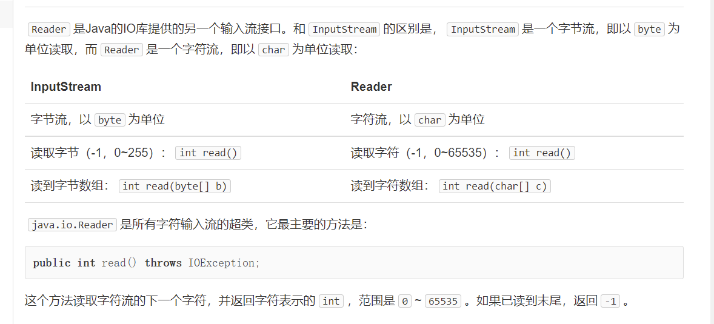
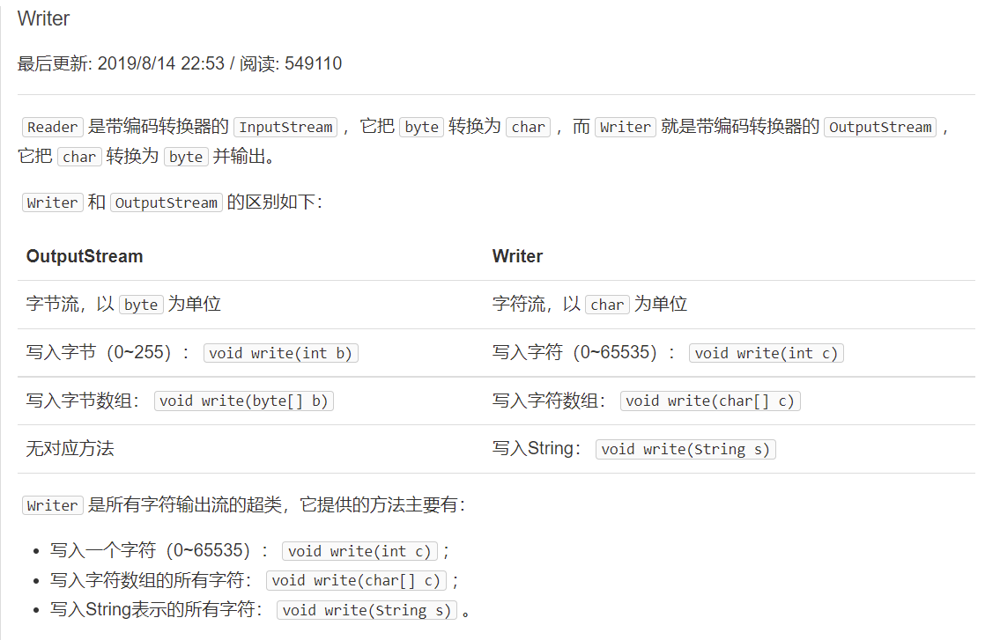

##  File对象

Java的标准库`java.io`提供了`File`对象来操作文件和目录

需要传入文件路径，绝对路径和相对路径都可以

```java
File f = new File("C:\\Windows\\notepad.exe");
System.out.println(f);
```

注意Windows平台使用`\`作为路径分隔符，在Java字符串中需要用`\\`表示一个`\`。Linux平台使用`/`作为路径分隔符：

```java
File f = new File("/usr/bin/javac");
```

用`.`表示当前目录，`..`表示上级目录

```java
// 假设当前目录是C:\Docs
File f1 = new File("sub\\javac"); // 绝对路径是C:\Docs\sub\javac
File f3 = new File(".\\sub\\javac"); // 绝对路径是C:\Docs\sub\javac
File f3 = new File("..\\sub\\javac"); // 绝对路径是C:\sub\javac
```

File对象有3种形式表示的路径，一种是`getPath()`，返回构造方法传入的路径，一种是`getAbsolutePath()`，返回绝对路径，一种是`getCanonicalPath`，它和绝对路径类似，但是返回的是规范路径。

绝对路径可以表示成`C:\Windows\System32\..\notepad.exe`，而规范路径就是把`.`和`..`转换成标准的绝对路径后的路径：`C:\Windows\notepad.exe`


表示当前平台的系统分隔符

```java
System.out.println(File.separator); // 根据当前平台打印"\"或"/"
```

`File`对象既可以表示文件，也可以表示目录。特别要注意的是，构造一个`File`对象，即使传入的文件或目录不存在，代码也不会出错，因为构造一个`File`对象，并不会导致任何磁盘操作。只有当我们调用`File`对象的某些方法的时候，才真正进行磁盘操作。


方法：

调用`isFile()`，判断该`File`对象是否是一个已存在的文件，调用`isDirectory()`，判断该`File`对象是否是一个已存在的目录

当File对象表示一个文件时，可以通过`createNewFile()`创建一个新文件，用`delete()`删除该文件。

当File对象表示一个目录时，可以使用`list()`和`listFiles()`列出目录下的文件和子目录名。`listFiles()`提供了一系列重载方法，可以过滤不想要的文件和目录

```java
public class Main {
    public static void main(String[] args) throws IOException {
        File f = new File("C:\\Windows");
        File[] fs1 = f.listFiles(); // 列出所有文件和子目录
        printFiles(fs1);
        File[] fs2 = f.listFiles(new FilenameFilter() { // 仅列出.exe文件
            public boolean accept(File dir, String name) {
                return name.endsWith(".exe"); // 返回true表示接受该文件
            }
        });
        printFiles(fs2);
    }

    static void printFiles(File[] files) {
        System.out.println("==========");
        if (files != null) {
            for (File f : files) {
                System.out.println(f);
            }
        }
        System.out.println("==========");
    }
}
```

##  InputStream

`InputStream`就是Java标准库提供的最基本的输入流，并不是一个接口，而是一个抽象类，它是所有输入流的超类

其中`read`方法会读取输入流的下一个字节，并返回字节表示的`int`值（0~255）。如果已读到末尾，返回`-1`表示不能继续读取了

```java
InputStream input = new FileInputStream("src/readme.txt");
for (;;) {
    int n = input.read(); // 反复调用read()方法，直到返回-1
    if (n == -1) {
        break;
    }
    System.out.println(n); // 打印byte的值
}
input.close(); // 关闭流，释放底层资源
```

`try ... finally`来保证`InputStream`在无论是否发生IO错误的时候都能够正确地关闭

```java
InputStream input = null;
try {
    input = new FileInputStream("src/readme.txt");
    int n;
    while ((n = input.read()) != -1) { // 利用while同时读取并判断
        System.out.println(n);
    }
} finally {
    if (input != null) { input.close(); }
}
```

也可以

```java
try (InputStream input = new FileInputStream("src/readme.txt")) {
        int n;
        while ((n = input.read()) != -1) {
            System.out.println(n);
        }
    } // 编译器在此自动为我们写入finally并调用close()
```

缓冲：

两个重载方法来支持读取多个字节：

- `int read(byte[] b)`：读取若干字节并填充到`byte[]`数组，返回读取的字节数
- `int read(byte[] b, int off, int len)`：指定`byte[]`数组的偏移量和最大填充数

一次读取多个字节时，需要先定义一个`byte[]`数组作为缓冲区，`read()`方法会尽可能多地读取字节到缓冲区， 但不会超过缓冲区的大小。`read()`方法的返回值不再是字节的`int`值，而是返回实际读取了多少个字节。如果返回`-1`，表示没有更多的数据了

```java
try (InputStream input = new FileInputStream("src/readme.txt")) {
        // 定义1000个字节大小的缓冲区:
        byte[] buffer = new byte[1000];
        int n;
        while ((n = input.read(buffer)) != -1) { // 读取到缓冲区
            System.out.println("read " + n + " bytes.");
        }
    }
```

`用FileInputStream`可以从文件获取输入流,`ByteArrayInputStream`可以在内存中模拟一个`InputStream`：

```java
 public static void main(String[] args) throws IOException {
        byte[] data = { 72, 101, 108, 108, 111, 33 };
        try (InputStream input = new ByteArrayInputStream(data)) {
            String s = readAsString(input);
            System.out.println(s);
        }
    }

    public static String readAsString(InputStream input) throws IOException {
        int n;
        StringBuilder sb = new StringBuilder();
        while ((n = input.read()) != -1) {
            sb.append((char) n);
        }
        return sb.toString();
    }
```

## OutputStream

类似的，其中write方法，会写入一个字节到输出流，close()，释放资源

`flush()`方法，它的目的是将缓冲区的内容真正输出到目的地。

为什么要有`flush()`？因为向磁盘、网络写入数据的时候，出于效率的考虑，操作系统并不是输出一个字节就立刻写入到文件或者发送到网络，而是把输出的字节先放到内存的一个缓冲区里（本质上就是一个`byte[]`数组），等到缓冲区写满了，再一次性写入文件或者网络。对于很多IO设备来说，一次写一个字节和一次写1000个字节，花费的时间几乎是完全一样的，所以`OutputStream`有个`flush()`方法，能强制把缓冲区内容输出。


**FileOutputStream**

```java
OutputStream output = new FileOutputStream("out/readme.txt");
output.write("Hello".getBytes("UTF-8")); // Hello
output.close();
```

避免IO错误不能正常close

```java
public void writeFile() throws IOException {
    try (OutputStream output = new FileOutputStream("out/readme.txt")) {
        output.write("Hello".getBytes("UTF-8")); // Hello
    } // 编译器在此自动为我们写入finally并调用close()
}
```

`ByteArrayOutputStream`可以在内存中模拟一个`OutputStream`：

```java
 public static void main(String[] args) throws IOException {
        byte[] data;
        try (ByteArrayOutputStream output = new ByteArrayOutputStream()) {
            output.write("Hello ".getBytes("UTF-8"));
            output.write("world!".getBytes("UTF-8"));
            data = output.toByteArray();
        }
        System.out.println(new String(data, "UTF-8"));
    }
```

##  Filter模式


##  序列化

https://ho1aas.blog.csdn.net/article/details/121275898?spm=1001.2014.3001.5502

##  Reader




##  Writer

