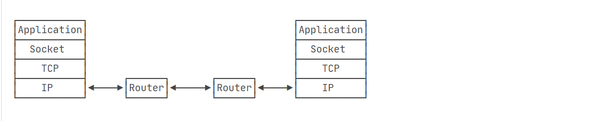

## TCP编程

一个Socket就是由IP地址和端口号（范围是0～65535）组成，可以把Socket简单理解为IP地址加端口号



服务器编程

```java
package com.example.basic.TCP;

import java.io.*;
import java.net.ServerSocket;
import java.net.Socket;
import java.nio.charset.StandardCharsets;

public class Server {
    public static void main(String[] args) throws IOException {
        ServerSocket ss = new ServerSocket(6666); // 监听指定端口
        System.out.println("server is running...");
        for (;;) {
            Socket sock = ss.accept();
            System.out.println("connected from " + sock.getRemoteSocketAddress());
            Thread t = new Handler(sock);
            t.start();
        }
    }
}

class Handler extends Thread {
    Socket sock;

    public Handler(Socket sock) {
        this.sock = sock;
    }

    @Override
    public void run() {
        try (InputStream input = this.sock.getInputStream()) {
            try (OutputStream output = this.sock.getOutputStream()) {
                handle(input, output);
            }
        } catch (Exception e) {
            try {
                this.sock.close();
            } catch (IOException ioe) {
            }
            System.out.println("client disconnected.");
        }
    }

    private void handle(InputStream input, OutputStream output) throws IOException {
        var writer = new BufferedWriter(new OutputStreamWriter(output, StandardCharsets.UTF_8));
        var reader = new BufferedReader(new InputStreamReader(input, StandardCharsets.UTF_8));
        writer.write("hello\n");
        writer.flush();
        for (;;) {
            String s = reader.readLine();
            if (s.equals("bye")) {
                writer.write("bye\n");
                writer.flush();
                break;
            }
            writer.write("ok: " + s + "\n");
            writer.flush();
        }
    }
}


```

客户端

```java
package com.example.basic.TCP;

import java.io.*;
import java.net.Socket;
import java.nio.charset.StandardCharsets;
import java.util.Scanner;

public class Client {
    public static void main(String[] args) throws IOException {
        Socket sock = new Socket("localhost", 6666); // 连接指定服务器和端口
        try (InputStream input = sock.getInputStream()) {
            try (OutputStream output = sock.getOutputStream()) {
                handle(input, output);
            }
        }
        sock.close();
        System.out.println("disconnected.");
    }

    private static void handle(InputStream input, OutputStream output) throws IOException {
        var writer = new BufferedWriter(new OutputStreamWriter(output, StandardCharsets.UTF_8));
        var reader = new BufferedReader(new InputStreamReader(input, StandardCharsets.UTF_8));
        Scanner scanner = new Scanner(System.in);
        System.out.println("[server] " + reader.readLine());
        for (;;) {
            System.out.print(">>> "); // 打印提示
            String s = scanner.nextLine(); // 读取一行输入
            writer.write(s);
            writer.newLine();
            writer.flush();
            String resp = reader.readLine();
            System.out.println("<<< " + resp);
            if (resp.equals("bye")) {
                break;
            }
        }
    }
}


```

## UDP编程

服务端：

```java
package com.example.basic.UDP;

import java.io.IOException;
import java.net.DatagramPacket;
import java.net.DatagramSocket;
import java.nio.charset.StandardCharsets;

public class Server {
    public static void main(String[] args) throws IOException {
        DatagramSocket ds=new DatagramSocket(6666);
        for(;;){
            byte[] buffer=new byte[1024];
            DatagramPacket packet=new DatagramPacket(buffer, buffer.length);
            ds.receive(packet);
            String s = new String(packet.getData(), packet.getOffset(), packet.getLength(), StandardCharsets.UTF_8);
            // 发送数据:
            System.out.println(s);
            byte[] data = "ACK".getBytes(StandardCharsets.UTF_8);
            packet.setData(data);
            ds.send(packet);
        }
    }
}

```

客户端：

```java
package com.example.basic.UDP;

import java.io.IOException;
import java.net.DatagramPacket;
import java.net.DatagramSocket;
import java.net.InetAddress;

public class Client {
    public static void main(String[] args) throws IOException {
        DatagramSocket ds = new DatagramSocket();
        ds.setSoTimeout(1000);
        ds.connect(InetAddress.getByName("localhost"), 6666); // 连接指定服务器和端口
// 发送:
        byte[] data = "Hello".getBytes();
        DatagramPacket packet = new DatagramPacket(data, data.length);
        ds.send(packet);
// 接收:
        byte[] buffer = new byte[1024];
        packet = new DatagramPacket(buffer, buffer.length);
        ds.receive(packet);
        String resp = new String(packet.getData(), packet.getOffset(), packet.getLength());
        System.out.println(resp);
        ds.disconnect();
    }
}

```

## HTTP编程

早期利用`HttpURLConnection`来处理`http`

```java
URL url = new URL("http://www.example.com/path/to/target?a=1&b=2");
HttpURLConnection conn = (HttpURLConnection) url.openConnection();
conn.setRequestMethod("GET");
conn.setUseCaches(false);
conn.setConnectTimeout(5000); // 请求超时5秒
// 设置HTTP头:
conn.setRequestProperty("Accept", "*/*");
conn.setRequestProperty("User-Agent", "Mozilla/5.0 (compatible; MSIE 11; Windows NT 5.1)");
// 连接并发送HTTP请求:
conn.connect();
// 判断HTTP响应是否200:
if (conn.getResponseCode() != 200) {
    throw new RuntimeException("bad response");
}		
// 获取所有响应Header:
Map<String, List<String>> map = conn.getHeaderFields();
for (String key : map.keySet()) {
    System.out.println(key + ": " + map.get(key));
}
// 获取响应内容:
InputStream input = conn.getInputStream();
```

java11后利用`HttpClient`来处理http

```java
import java.net.URI;
import java.net.http.*;
import java.net.http.HttpClient.Version;
import java.time.Duration;
import java.util.*;

public class Main {
    // 全局HttpClient:
    static HttpClient httpClient = HttpClient.newBuilder().build();

    public static void main(String[] args) throws Exception {
        String url = "https://www.sina.com.cn/";
        HttpRequest request = HttpRequest.newBuilder(new URI(url))
            // 设置Header:
            .header("User-Agent", "Java HttpClient").header("Accept", "*/*")
            // 设置超时:
            .timeout(Duration.ofSeconds(5))
            // 设置版本:
            .version(Version.HTTP_2).build();
        HttpResponse<String> response = httpClient.send(request, HttpResponse.BodyHandlers.ofString());
        // HTTP允许重复的Header，因此一个Header可对应多个Value:
        Map<String, List<String>> headers = response.headers().map();
        for (String header : headers.keySet()) {
            System.out.println(header + ": " + headers.get(header).get(0));
        }
        System.out.println(response.body().substring(0, 1024) + "...");
    }
}
```

